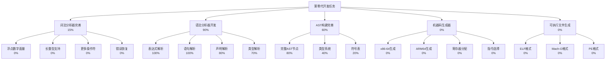

# Self-Evolve AI 第零代开发任务追踪

## 任务描述
根据 plan.md 的要求，第零代的核心目标是实现内置机器码生成能力，能够生成并执行自己的机器码版本，最终不再需要 tinycc，可以自我编译。

第零代的关键能力要求：
1. 解析自身 C 代码（词法分析器85%，语法分析器90%，AST构建60%）
2. 生成基本的 x86-64/ARM64 机器码
3. 创建可执行文件格式 (ELF/Mach-O)
4. 成功标志：不再需要 tinycc，可以自我编译

## 动态规划的任务分解图

## 每个节点的具体任务描述

### B: 词法分析器完善（15%）
- **进度**：15%（剩余部分）
- **子任务**：
  - B1: 浮点数字面量（0%）- 支持浮点数解析（如3.14, 1.23e-10）
  - B2: 长整型支持（0%）- 支持long, long long, 后缀L/LL/UL/ULL
  - B3: 更多操作符（0%）- 添加位运算符、条件运算符、sizeof等
  - B4: 错误恢复（0%）- 增强词法错误处理和恢复机制

### C: 语法分析器开发（90%）
- **进度**：90%（已基本完成！）
- **子任务**：
  - C1: 表达式解析（100%）- ✅ 完整的表达式解析，支持优先级和结合性
  - C2: 语句解析（100%）- ✅ if/else, while, for, switch等控制流语句
  - C3: 声明解析（80%）- 变量声明、函数声明、类型定义（缺少struct/union/enum的完整实现）
  - C4: 类型解析（70%）- 基本类型、指针、数组、函数类型（缺少复合类型）
- **已完成功能**：
  - 完整的表达式解析（所有优先级）
  - 所有控制流语句（if/else, while, do-while, for, switch/case, goto, break, continue）
  - 函数定义和声明
  - 变量声明和初始化
  - 指针和数组类型
  - 类型限定符（const, volatile, restrict）
  - 存储类说明符（static, extern, typedef等）

### D: AST构建完善（60%）
- **进度**：60%（AST节点结构基本完成）
- **子任务**：
  - D1: 完整AST节点（80%）- 大部分语言构造的AST节点已定义
  - D2: 类型系统（40%）- 基本类型检查框架
  - D3: 符号表（20%）- 简单的符号表结构
- **已完成功能**：
  - 完整的AST节点类型定义
  - AST打印和调试功能
  - 表达式、语句、声明的AST构建
  - 基本的内存管理

### E: 机器码生成器（0%）
- **进度**：0%
- **子任务**：
  - E1: x86-64生成（0%）- 生成x86-64指令
  - E2: ARM64生成（0%）- 生成ARM64指令
  - E3: 寄存器分配（0%）- 寄存器分配算法
  - E4: 指令选择（0%）- 从AST到机器指令的映射

### F: 可执行文件生成（0%）
- **进度**：0%
- **子任务**：
  - F1: ELF格式（0%）- Linux可执行文件格式
  - F2: Mach-O格式（0%）- macOS可执行文件格式
  - F3: PE格式（0%）- Windows可执行文件格式

## 跟任务相关的经验和上下文累积

### 关键认识
1. **evolver0_improved.c只是个玩具**：它只能生成简单的WASM，完全不能解析真正的C代码，更不能生成机器码
2. **第零代的核心是机器码生成**：不是WASM，是真正的x86-64/ARM64机器码
3. **必须能编译自己**：这是自举的关键，必须能解析并编译evolver0.c本身

### 当前代码状态
1. **词法分析器**：基本完成，可以处理大部分C语言特性
2. **语法分析器**：已经实现了完整的解析器模块（evolver0_parser.c）
   - 支持完整的C语言表达式解析
   - 支持所有主要的控制流语句
   - 支持函数定义和声明
   - 支持变量声明和初始化
   - 测试程序验证了解析器的正确性
3. **AST构建**：节点定义完整，可以表示大部分C语言构造
4. **机器码生成**：尚未开始
5. **可执行文件格式**：尚未开始

### 下一步开发优先级
1. **完善剩余的解析器功能**（10%）：
   - 实现struct/union/enum的完整解析
   - 添加typedef名称的符号表查找
   - 改进错误处理和恢复
2. **开始机器码生成**（最重要）：
   - 先实现最简单的x86-64代码生成
   - 支持基本的算术运算和函数调用
   - 实现简单的寄存器分配
3. **实现ELF文件生成**：
   - 生成最小的ELF可执行文件
   - 支持代码段和数据段

### 技术参考
- x86-64指令集参考
- ELF文件格式规范
- C语言语法规范（C11标准）
- 编译原理教材（龙书）

### 最新进展（2024-12-18）
- 成功实现了完整的C语言解析器模块（evolver0_parser.c）
- 解析器支持所有主要的C语言特性
- 创建了测试程序（test_evolver0_parser.c）验证功能
- 测试结果显示解析器能正确处理各种C代码结构
- 下一步：开始实现机器码生成模块