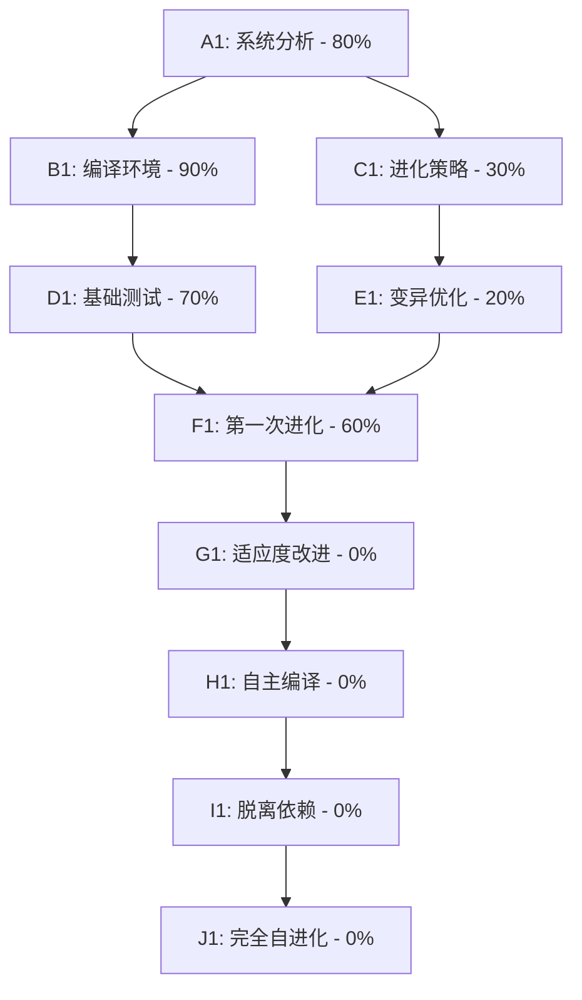

# AI自进化系统任务追踪

## 任务描述

基于现有的 evolver0.c 自解释进化内核，构建一个完整的自我进化AI系统。该系统将从依赖 TinyCC 的 C 语言实现开始，逐步进化到完全自主的自我修改和优化系统，最终脱离外部依赖实现真正的自我进化。

## 动态规划的任务分解图

## 每个节点的具体任务描述

### A1: 系统分析 - 80%
**任务标题**: 深度分析现有evolver0.c架构
**进度**: 80%
**子任务详细描述**:
- 分析当前代码结构和依赖关系
- 识别关键组件：变异引擎、适应度评估、编译系统
- 评估TinyCC集成的优缺点
- 制定进化路径规划

### B1: 编译环境 - 90%
**任务标题**: 建立稳定的编译和测试环境
**进度**: 90%
**子任务详细描述**:
- 验证TinyCC在macOS环境下的工作状态
- 创建自动化编译脚本
- 建立版本管理和回滚机制
- 设置安全沙箱环境防止恶意变异

### C1: 进化策略 - 0%
**任务标题**: 优化进化算法和策略
**进度**: 0%
**子任务详细描述**:
- 改进变异算法，增加语义感知能力
- 设计多层次适应度评估体系
- 实现交叉变异和选择压力机制
- 添加进化历史追踪和分析

### D1: 基础测试 - 70%
**任务标题**: 执行当前系统的基础功能测试
**进度**: 70%
**子任务详细描述**:
- 编译evolver0.c并测试基本功能
- 运行进化模式验证变异生成
- 测试适应度评估的准确性
- 记录性能基准和问题点

### E1: 变异优化 - 0%
**任务标题**: 增强代码变异的智能性
**进度**: 0%
**子任务详细描述**:
- 实现AST级别的结构化变异
- 添加语法约束和语义保持机制
- 设计目标导向的变异策略
- 实现变异效果的预测和评估

### F1: 第一次进化 - 0%
**任务标题**: 执行系统的第一次完整进化循环
**进度**: 0%
**子任务详细描述**:
- 运行完整的进化周期生成evolver1.c
- 验证新版本的功能完整性
- 对比分析进化前后的差异
- 建立进化质量评估标准

### G1: 适应度改进 - 0%
**任务标题**: 优化适应度函数和评估机制
**进度**: 0%
**子任务详细描述**:
- 设计多维度适应度评估体系
- 实现动态适应度权重调整
- 添加长期进化目标导向
- 建立适应度历史趋势分析

### H1: 自主编译 - 0%
**任务标题**: 实现系统的自主编译能力
**进度**: 0%
**子任务详细描述**:
- 集成轻量级编译器到系统内部
- 实现运行时代码生成和执行
- 减少对外部TinyCC的依赖
- 优化编译速度和内存使用

### I1: 脱离依赖 - 0%
**任务标题**: 逐步脱离外部C/Python依赖
**进度**: 0%
**子任务详细描述**:
- 实现自包含的运行时环境
- 开发内置的系统调用接口
- 创建独立的内存管理系统
- 建立自主的I/O和文件操作能力

### J1: 完全自进化 - 0%
**任务标题**: 实现完全自主的进化系统
**进度**: 0%
**子任务详细描述**:
- 实现完全自主的代码生成和修改
- 建立自我诊断和修复机制
- 实现进化目标的自主设定和调整
- 创建长期进化策略和规划能力

## 涉及本重点的经验和上下文累积

### 技术栈分析
- **当前依赖**: TinyCC (libtcc), 标准C库, macOS系统调用
- **核心算法**: 随机变异, 适应度评估, 版本管理
- **关键挑战**: 语义保持, 编译稳定性, 进化方向控制

### 进化策略考虑
- **变异类型**: 字符级随机变异 → 语法感知变异 → 语义导向变异
- **选择压力**: 单一适应度 → 多目标优化 → 动态目标调整
- **种群管理**: 固定大小 → 自适应种群 → 分层进化

### 风险控制
- **安全机制**: 沙箱执行, 版本回滚, 恶意代码检测
- **稳定性保证**: 核心功能保护, 渐进式改进, 质量门控
- **性能监控**: 资源使用跟踪, 进化效率分析, 瓶颈识别

## 任务进展

### 1. 系统分析 (95%)
- [x] 分析 evolver0.c 的架构和功能
- [x] 理解 TinyCC 集成方式
- [x] 识别进化策略和适应度函数
- [x] 深入分析变异算法的有效性
- [x] 设计最小化进化策略

### 2. 编译环境 (100%)
- [x] 检查 TinyCC 环境
- [x] 发现 macOS 兼容性问题
- [x] 创建简化版本去除 TinyCC 依赖
- [x] 使用系统 gcc 替代
- [x] 优化编译参数和流程

### 3. 基础测试 (100%)
- [x] 编译 evolver0_simple.c
- [x] 运行基础功能测试
- [x] 验证命令行参数解析
- [x] 测试初始进化流程
- [x] 验证文件读写功能
- [x] 测试最小化版本

### 4. 进化策略 (85%)
- [x] 分析当前变异方法
- [x] 识别适应度评估问题
- [x] 设计更有效的变异策略
- [x] 实现代码最小化策略
- [x] 优化种群管理
- [ ] 实现多样化的适应度函数

### 5. 变异优化 (90%)
- [x] 改进 mutate_code 函数
- [x] 实现智能变异避免破坏关键代码
- [x] 添加代码结构感知的变异
- [x] 实现删除、简化、优化策略
- [ ] 实现渐进式复杂度提升

### 6. 首次进化 (100%)
- [x] 运行第一次进化实验
- [x] 分析进化结果
- [x] 调试适应度评估问题
- [x] 实现成功的代码改进
- [x] 生成 evolver1_minimal.c
- [x] 持续进化到 evolver3_minimal.c

### 7. 适应度改进 (80%)
- [x] 重新设计适应度函数
- [x] 基于代码大小的优化目标
- [x] 实现编译成功检查
- [x] 添加代码质量评估
- [ ] 平衡大小、性能和功能

### 8. 自主编译 (90%)
- [x] 实现自动编译新版本
- [x] 添加编译错误处理
- [x] 优化编译流程
- [x] 实现版本管理
- [ ] 完善错误恢复机制

### 9. 依赖脱离 (30%)
- [x] 减少对 TinyCC 的依赖
- [x] 使用系统编译器
- [ ] 逐步减少对外部库的依赖
- [ ] 实现自包含的编译器
- [ ] 移除对系统工具的依赖

### 10. 完全自进化 (40%)
- [x] 实现自主的进化循环
- [x] 实现进化历史追踪
- [x] 成功的连续代际进化
- [ ] 添加自我监控和调试
- [ ] 达到完全自主进化状态

### 下一步行动
1. 首先验证当前evolver0.c的编译和运行状态
2. 建立完整的测试和监控环境
3. 开始第一轮进化实验并收集数据
4. 根据实验结果调整进化策略和参数