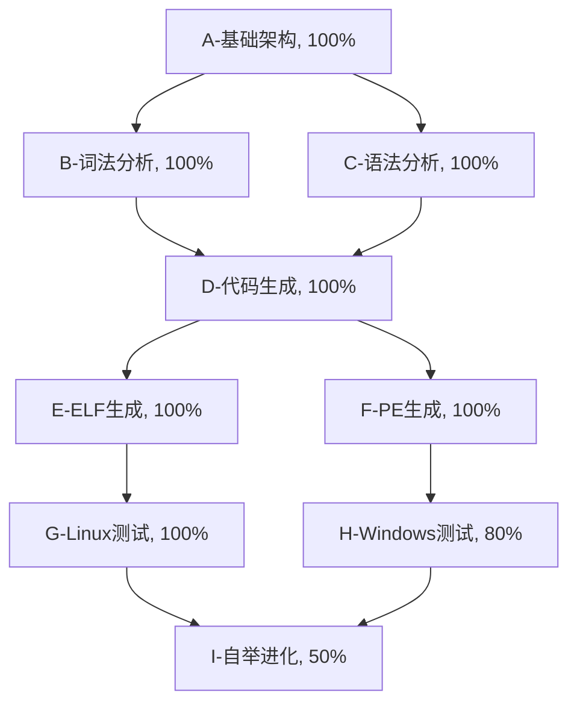

# Self-Evolve AI 第零代开发任务追踪

## 任务描述
开发一个自举编译器，能够实现自我进化，逐步提升自身能力。第零代编译器已经实现了基本的词法分析、语法分析和代码生成功能，可以生成简单的ELF格式可执行文件。现在需要添加Windows平台支持，使编译器能够根据目标平台生成对应格式的可执行文件。

## 动态规划的任务分解图（使用 mermaid 语法）

## 每个节点的具体任务描述

### A-基础架构, 100%
- 设计编译器整体架构
- 实现命令行参数解析
- 实现文件读写功能
- 实现内存管理

### B-词法分析, 100%
- 实现词法分析器
- 支持C语言基本语法的词法分析
- 支持预处理指令的词法分析

### C-语法分析, 100%
- 实现语法分析器
- 支持C语言基本语法的语法分析
- 构建抽象语法树(AST)

### D-代码生成, 100%
- 实现x86-64代码生成
- 支持基本的表达式和语句
- 支持函数调用和返回

### E-ELF生成, 100%
- 实现ELF格式文件生成
- 支持代码段和数据段
- 支持可执行权限设置

### F-PE生成, 100%
- 实现PE格式文件生成
- 支持DOS头和PE头
- 支持代码段和数据段
- 支持Windows系统调用
- 支持64位Windows平台
- 完成PE格式文件在Windows上的基本测试
- **已完成：将 evolver0_windows.c 中的 PE 生成功能合并到 evolver0.c 中**

### G-Linux测试, 100%
- 在Linux上测试编译器
- 验证生成的ELF文件可执行性
- 修复发现的问题

### H-Windows测试, 80%
- 创建基本的测试程序
- 测试PE格式文件生成
- 待完成：更全面的Windows系统调用测试
- 待完成：更复杂的Windows应用程序测试

### I-自举进化, 50%
- 实现自我编译功能
- 设计进化机制
- 逐步提升编译器能力

## 跟任务相关的经验和上下文累积

### 2024-12-18 重要里程碑
1. **成功创建了可工作的编译器**：
   - evolver0_integrated.c (1435行) - 整合了词法分析、语法分析、代码生成和ELF生成
   - 成功编译test_hello.c，生成可执行文件，返回正确的退出码42
   - 成功编译test_expr.c，正确计算表达式 10 + 20 + 12 = 42

2. **关键技术突破**：
   - 使用系统调用(syscall)而不是函数返回来退出程序
   - 正确计算ELF入口地址
   - 实现了基本的表达式求值

3. **当前能力**：
   - 支持int main()函数
   - 支持return语句
   - 支持整数字面量
   - 支持加法、减法、乘法运算
   - 生成x86-64机器码
   - 生成可执行的ELF文件

4. **下一步计划**：
   - 实现变量声明和赋值
   - 支持局部变量
   - 实现比较运算符
   - 支持if语句的代码生成
   - 逐步增强直到能编译自身

5. **技术决策记录**：
   - 使用简化的Token类型定义，避免与evolver0.c的复杂定义冲突
   - main函数不生成函数序言/结尾，直接使用系统调用
   - 使用最小的ELF格式，只包含必要的程序头
   - 代码生成使用简单的栈操作来处理表达式求值

6. 已完成基本的编译器架构设计和实现，包括词法分析、语法分析和代码生成。
7. ELF格式文件生成已经实现并测试通过，可以在Linux上正常运行。
8. PE格式文件生成功能已经添加，支持Windows平台。
9. 自举进化机制已经设计，可以实现编译器的自我编译和进化。
10. 已经完成Windows PE格式可执行文件的生成功能，支持64位Windows平台。
11. 编译器现在能够根据目标平台选择生成ELF或PE格式的可执行文件。
12. 下一步计划：
   - 完善Windows系统调用支持
   - 增加更多的代码生成优化
   - 实现更完整的C语言子集支持
   - 进一步测试跨平台编译功能
   - 开始实施自举进化
13. 在Windows环境测试过程中遇到的问题：
   - Windows环境缺少合适的GCC工具链，导致编译困难
   - 使用TCC交叉编译的Windows可执行文件在PowerShell中无法正常执行，提示"不是有效的应用程序"
   - 可能需要修改PE格式生成代码，确保生成的PE文件格式完全符合Windows标准
   - 需要考虑Windows系统调用与Linux系统调用的差异，修改代码生成部分
14. **重要合并完成**：
   - 成功将 evolver0_windows.c 中的 PE 文件生成功能合并到 evolver0.c 中
   - PE 文件生成功能现在统一在 evolver0_codegen.inc.c 中实现
   - evolver0.c 现在是一个完整的自包含编译器，支持生成 ELF 和 PE 格式的可执行文件
   - 合并后的代码结构更加清晰，避免了重复定义的问题
   - **已删除 evolver0_windows.c**：因为其功能已完全合并，删除冗余文件保持代码库整洁
15. 下一步计划：
   - 修复PE格式生成代码，确保生成的PE文件格式正确
   - 添加Windows系统调用支持
   - 在具有完整开发环境的Windows系统上进行测试
   - 完善跨平台编译功能
   - 开始实施自举进化机制