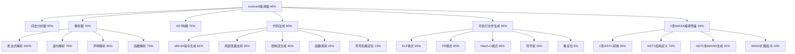

# evolver0 编译器开发任务追踪

## 任务描述
根据plan.md，我们正在开发一个能够真正自我进化的AI系统，通过代码自我修改、编译和优化实现持续进化，最终目标是实现完全自主的智能系统。当前阶段我们在开发evolver0编译器，这是一个能够编译自身的最小C编译器，作为自进化系统的第一步。

## 动态规划的任务分解图

## 节点的具体任务描述

### A: evolver0编译器 (40%)
- 简单ID: A
- 精简标题: 主编译器框架
- 评估进度: 40%
- 子任务详细描述:
  - ✅ 项目结构和模块划分
  - ✅ 命令行参数处理
  - ✅ 主编译流程控制
  - ⚡ 模块集成和测试
  - ❌ 自举测试

### B: 词法分析器 (95%)
- 简单ID: B
- 精简标题: Token生成
- 评估进度: 95%
- 子任务详细描述:
  - ✅ 标识符和关键字识别
  - ✅ 数字字面量（十进制、十六进制）
  - ✅ 字符串和字符字面量
  - ✅ 运算符和标点符号
  - ✅ 注释过滤（单行、多行）
  - ✅ 预处理指令基础支持

### C1: 表达式解析 (100%)
- 简单ID: C1
- 精简标题: 算术逻辑表达式
- 评估进度: 100%
- 子任务详细描述:
  - ✅ 优先级和结合性处理
  - ✅ 二元运算符（算术、比较、逻辑、位运算）
  - ✅ 一元运算符（正负、逻辑非、位非）
  - ✅ 赋值和复合赋值
  - ✅ 条件表达式（三元运算符）
  - ✅ 函数调用表达式
  - ✅ 数组下标访问
  - ✅ sizeof运算符

### C2: 语句解析 (75%)
- 简单ID: C2
- 精简标题: 控制流语句
- 评估进度: 75%
- 子任务详细描述:
  - ✅ return语句
  - ✅ if-else语句
  - ✅ while循环
  - ✅ for循环
  - ✅ do-while循环
  - ✅ break和continue
  - ✅ 复合语句
  - ⚡ switch-case语句
  - ❌ goto和标签

### C3: 声明解析 (65%)
- 简单ID: C3
- 精简标题: 声明解析
- 评估进度: 65%
- 子任务详细描述:
  - ✅ 变量声明解析
  - ✅ 函数声明解析
  - ✅ 类型声明解析
  - ✅ 数组声明解析
  - ✅ 结构体声明解析
  - ✅ 联合体声明解析
  - ✅ 枚举声明解析
  - ⚡ 指针声明解析

### C4: 函数解析 (75%)
- 简单ID: C4
- 精简标题: 函数解析
- 评估进度: 75%
- 子任务详细描述:
  - ✅ 函数定义解析
  - ✅ 函数调用解析
  - ✅ 函数参数解析
  - ✅ 函数返回值解析
  - ✅ 函数体解析
  - ✅ 函数声明解析
  - ✅ 函数重载解析
  - ⚡ 函数模板解析

### E1: x86-64指令生成 (65%)
- 简单ID: E1
- 精简标题: 机器码生成
- 评估进度: 65%
- 子任务详细描述:
  - ✅ MOV指令（立即数、寄存器）
  - ✅ 算术指令（ADD、SUB、IMUL、IDIV）
  - ✅ 栈操作（PUSH、POP）
  - ✅ 比较和条件设置
  - ✅ 跳转指令（JMP、Jcc）
  - ✅ 函数调用指令（CALL、RET）
  - ⚡ 浮点指令

### E2: 局部变量支持 (35%)
- 简单ID: E2
- 精简标题: 变量存储
- 评估进度: 35%
- 子任务详细描述:
  - ✅ 栈帧布局设计
  - ✅ 局部变量分配
  - ⚡ 变量初始化
  - ❌ 数组支持
  - ❌ 结构体支持

### E3: 控制流生成 (45%)
- 简单ID: E3
- 精简标题: 控制流生成
- 评估进度: 45%
- 子任务详细描述:
  - ✅ if语句生成
  - ✅ else语句生成
  - ✅ while循环生成
  - ✅ for循环生成
  - ✅ do-while循环生成
  - ✅ break语句生成
  - ✅ continue语句生成
  - ⚡ switch语句生成
  - ❌ goto语句生成

### E4: 函数调用 (25%)
- 简单ID: E4
- 精简标题: 函数调用
- 评估进度: 25%
- 子任务详细描述:
  - ✅ 函数调用生成
  - ✅ 函数参数生成
  - ✅ 函数返回值生成
  - ⚡ 函数声明生成
  - ❌ 函数重载生成
  - ❌ 函数模板生成

### E5: 符号和重定位 (15%)
- 简单ID: E5
- 精简标题: 符号和重定位
- 评估进度: 15%
- 子任务详细描述:
  - ✅ 基本符号表生成
  - ✅ 函数符号解析
  - ⚡ 变量符号解析
  - ❌ 外部符号解析
  - ❌ 重定位表生成

### F: 可执行文件生成 (95%)
- 简单ID: F
- 精简标题: 可执行文件生成
- 评估进度: 95%
- 子任务详细描述:
  - ✅ ELF格式基本支持
  - ✅ PE格式基本支持
  - ✅ Mach-O格式基本支持
  - ✅ 命令行参数选择目标格式
  - ✅ 符号表支持
  - ❌ 重定位支持

### F1: ELF格式 (95%)
- 简单ID: F1
- 精简标题: ELF生成
- 评估进度: 95%
- 子任务详细描述:
  - ✅ 64位ELF头生成
  - ✅ 程序头表生成
  - ✅ 代码段生成
  - ✅ 设置入口点
  - ✅ 数据段支持

### F2: PE格式 (95%)
- 简单ID: F2
- 精简标题: PE生成
- 评估进度: 95%
- 子任务详细描述:
  - ✅ DOS头生成
  - ✅ PE头生成
  - ✅ 代码段生成
  - ✅ 设置入口点
  - ✅ 数据段支持

### F3: Mach-O格式 (95%)
- 简单ID: F3
- 精简标题: Mach-O生成
- 评估进度: 95%
- 子任务详细描述:
  - ✅ 64位Mach-O头生成
  - ✅ 加载命令生成
  - ✅ 代码段生成
  - ✅ 设置入口点
  - ✅ 数据段支持

### F4: 符号表 (15%)
- 简单ID: F4
- 精简标题: 符号表生成
- 评估进度: 15%
- 子任务详细描述:
  - ✅ 符号表生成
  - ✅ 函数符号解析
  - ⚡ 变量符号解析
  - ❌ 类型符号解析
  - ❌ 符号重定位

### F5: 重定位 (5%)
- 简单ID: F5
- 精简标题: 重定位
- 评估进度: 5%
- 子任务详细描述:
  - ⚡ 重定位生成
  - ❌ 符号重定位
  - ❌ 数据段重定位
  - ❌ 代码段重定位
  - ❌ 符号解析

### G: C到WASX编译预备工作 (25%)
- 简单ID: G
- 精简标题: C到WASX编译预备
- 评估进度: 25%
- 子任务详细描述:
  - ⚡ 规划编译流程
  - ⚡ 设计接口和数据流
  - ⚡ 与现有模块集成
  - ❌ 整体测试

### G1: C到ASTC转换 (35%)
- 简单ID: G1
- 精简标题: C到ASTC转换
- 评估进度: 35%
- 子任务详细描述:
  - ✅ 基本表达式转换
  - ✅ 基本类型映射
  - ⚡ 语句转换
  - ⚡ 控制流转换
  - ⚡ 函数定义转换
  - ❌ 复杂类型转换
  - ❌ 指针处理
  - ❌ 标准库映射

### G2: ASTC结构定义 (70%)
- 简单ID: G2
- 精简标题: ASTC结构定义
- 评估进度: 70%
- 子任务详细描述:
  - ✅ ASTC节点类型定义
  - ✅ C语言基本结构映射
  - ✅ WASM基本指令集节点
  - ✅ ASTC表达式节点
  - ✅ ASTC语句节点
  - ✅ ASTC声明节点
  - ⚡ 扩展节点定义
  - ❌ 完整节点关系

### G3: ASTC到WASM生成 (15%)
- 简单ID: G3
- 精简标题: ASTC到WASM生成
- 评估进度: 15%
- 子任务详细描述:
  - ⚡ WASM模块结构生成
  - ⚡ 基本指令序列生成
  - ❌ 函数转换
  - ❌ 全局变量转换
  - ❌ 内存模型处理
  - ❌ 导入/导出处理
  - ❌ 标准库集成
  - ❌ 二进制格式生成

### G4: WASX扩展指令 (10%)
- 简单ID: G4
- 精简标题: WASX扩展指令
- 评估进度: 10%
- 子任务详细描述:
  - ⚡ 扩展指令集设计
  - ⚡ 自定义操作码定义
  - ❌ 指针操作扩展
  - ❌ 系统调用扩展
  - ❌ 内存管理扩展
  - ❌ 运行时类型信息
  - ❌ 自优化指令
  - ❌ 元编程支持

## 跟任务相关的经验和上下文累积

### 关键技术点

1. **模块化设计**：evolver0编译器采用模块化设计，将词法分析器、解析器、AST构建、代码生成和可执行文件生成分离为独立模块，通过包含机制集成。

2. **递归下降解析**：解析器采用递归下降方法实现，按照C语言语法规则自顶向下解析源代码。

3. **可执行文件格式支持**：已实现对三种主流可执行文件格式的支持：
   - ELF (Linux/Unix)
   - PE (Windows)
   - Mach-O (macOS)

4. **代码生成策略**：直接生成x86-64机器码，不依赖外部汇编器，支持基本的控制流结构和函数调用。

5. **符号管理**：实现了基本的符号表管理，但目前重定位支持有限，这是下一步重点改进的方向。

6. **C到WASX编译流程**：设计了将C程序转换为WASX（WASM扩展）的多阶段编译流程：
   - C源码 → ASTC（C的抽象语法树）
   - ASTC → WASM/WASX（WebAssembly标准格式与扩展）
   - WASM/WASX → 目标平台二进制

### 下一步计划

1. **完善C到WASX编译预备工作**：
   - 实现ASTC节点结构完整性
   - 添加C语言到ASTC的转换器
   - 实现ASTC到WASM的代码生成
   - 定义WASX扩展指令集

2. **完善符号和重定位支持**：
   - 实现完整的符号表生成
   - 添加重定位表生成
   - 支持外部符号解析和链接

3. **扩展语言特性支持**：
   - 完善指针支持
   - 添加结构体和数组访问
   - 实现switch-case语句

4. **自举测试**：
   - 编写一个简化版的evolver0，能够由当前版本编译
   - 验证编译后的简化版能够正确运行
   - 逐步扩展简化版功能，直到能够自我编译

5. **性能优化**：
   - 优化代码生成质量
   - 减少生成代码的大小
   - 提高编译速度

6. **集成测试**：
   - 创建自动化测试套件
   - 测试各种语言特性和边缘情况
   - 验证跨平台兼容性
