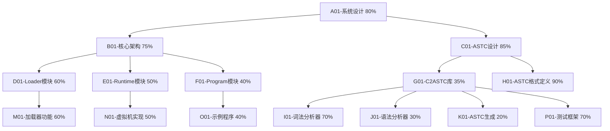

# 自进化AI系统任务追踪

## 任务描述
开发Self-Evolve AI系统，该系统基于三层架构（Loader、Runtime和Program），其核心是ASTC数据结构。当前任务是完成c2astc模块和完善Loader+Runtime+Program架构。

## 动态规划的任务分解图

## 每个节点的具体任务描述

### A01-系统设计 (80%)
- 完成Self-Evolve AI系统的整体设计
- 确定系统的三层架构：Loader、Runtime和Program
- 定义各模块之间的交互接口
- 建立系统演进路径

### B01-核心架构 (75%)
- 定义Loader、Runtime和Program三层架构的具体实现方式
- 确定各模块的职责和边界
- 设计模块间的通信机制

### C01-ASTC设计 (85%)
- 设计ASTC（Abstract Syntax Tree for Compilation）数据结构
- 整合WASM/IR/AST的概念
- 确定ASTC的表示方法和二进制格式

### G01-C2ASTC库 (35%)
- 实现C语言到ASTC的转换库
- 支持基本的C语言语法特性
- 提供序列化和反序列化功能
- 实现ASTC二进制生成

### H01-ASTC格式定义 (90%)
- 完成ASTC节点类型的定义
- 定义ASTC的内存表示形式
- 设计二进制序列化格式

### I01-词法分析器 (70%)
- 实现C语言词法分析器
- 支持标识符、关键字、操作符等token的识别
- 处理注释和预处理指令

### J01-语法分析器 (30%)
- 实现C语言语法分析器
- 构建语法树
- 支持表达式、语句和声明的解析

### K01-ASTC生成 (20%)
- 从语法树生成ASTC表示
- 处理类型信息
- 转换C语言结构到ASTC结构

### L01-ASTC生成 (10%)
- 实现类型映射

### P01-测试框架 (70%)
- 建立C2ASTC测试框架
- 创建测试用例
- 实现自动化测试和验证机制

## 跟任务相关的经验和上下文
- 系统采用ASTC作为核心数据结构，它整合了WASM、IR和AST的概念
- 通过TCC（Tiny C Compiler）工具来编译和测试
- C2ASTC库将C语言源代码转换为ASTC表示
- 测试框架放在./tests/c2astc_tests/目录下
- 已完成astc.h头文件和基本测试用例
- 当前正在开发c2astc.c和相关测试工具
