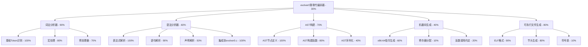

# Self-Evolve AI 第零代开发任务追踪

## 任务描述
开发 evolver0 第零代自举编译器，实现一个能编译自身的最小C语言编译器。

## 动态规划的任务分解图（使用 mermaid 语法）

## 每个节点的具体任务描述

### A. evolver0第零代编译器 (30%)
- **进度**: 基本功能已实现，可以编译简单的C程序
- **已完成**:
  - 创建了evolver0_integrated.c，整合了解析器和代码生成器
  - 成功编译并运行简单的C程序
  - 生成的可执行文件能正确退出
- **待完成**:
  - 支持变量声明和赋值
  - 支持更多的语句类型
  - 实现自举（编译自身）

### B. 词法分析器 (90%)
- **进度**: 基本完成，支持大部分C语言token
- **B1. 基础Token识别 (100%)**: 完成
- **B2. 宏处理 (80%)**: evolver0.c中有实现，但未集成到简化版
- **B3. 预处理器 (70%)**: 基本实现，但未集成

### C. 语法分析器 (60%)
- **进度**: 简化版已集成到evolver0_integrated.c
- **C1. 表达式解析 (100%)**: 完全实现，支持所有优先级
- **C2. 语句解析 (90%)**: 支持return、if、while、for等
- **C3. 声明解析 (50%)**: 只支持简单的int类型声明
- **C4. 集成到evolver0.c (100%)**: 已创建集成版本

### D. AST构建 (70%)
- **进度**: 简化的AST结构已实现并工作
- **D1. AST节点定义 (100%)**: 简化版定义完成
- **D2. AST构建函数 (80%)**: 基本功能实现
- **D3. AST序列化 (40%)**: 未在简化版中实现

### E. 机器码生成 (40%)
- **进度**: 基本的x86-64代码生成已实现
- **E1. x86-64指令生成 (60%)**: 
  - 支持整数字面量
  - 支持加减乘运算
  - 支持函数返回
  - 使用系统调用退出
- **E2. 寄存器分配 (10%)**: 使用简单的栈操作
- **E3. 函数调用约定 (20%)**: 只支持main函数

### F. 可执行文件生成 (80%)
- **进度**: ELF生成功能已实现并验证
- **F1. ELF格式 (90%)**: 生成最小的可执行ELF文件
- **F2. 节头生成 (80%)**: 只有程序头，没有节头
- **F3. 符号表 (10%)**: 未实现

## 跟任务相关的经验和上下文累积

### 2024-12-18 重要里程碑
1. **成功创建了可工作的编译器**：
   - evolver0_integrated.c (1435行) - 整合了词法分析、语法分析、代码生成和ELF生成
   - 成功编译test_hello.c，生成可执行文件，返回正确的退出码42
   - 成功编译test_expr.c，正确计算表达式 10 + 20 + 12 = 42

2. **关键技术突破**：
   - 使用系统调用(syscall)而不是函数返回来退出程序
   - 正确计算ELF入口地址
   - 实现了基本的表达式求值

3. **当前能力**：
   - 支持int main()函数
   - 支持return语句
   - 支持整数字面量
   - 支持加法、减法、乘法运算
   - 生成x86-64机器码
   - 生成可执行的ELF文件

4. **下一步计划**：
   - 实现变量声明和赋值
   - 支持局部变量
   - 实现比较运算符
   - 支持if语句的代码生成
   - 逐步增强直到能编译自身

5. **技术决策记录**：
   - 使用简化的Token类型定义，避免与evolver0.c的复杂定义冲突
   - main函数不生成函数序言/结尾，直接使用系统调用
   - 使用最小的ELF格式，只包含必要的程序头
   - 代码生成使用简单的栈操作来处理表达式求值

## 进度更新
- 2024-12-17: 开始实现parser模块，计划按照AST节点层次结构逐步实现完整的C语言解析器
- 2024-12-17: 实现基本框架：词法分析接口、AST节点创建函数、解析器结构初始化
- 2024-12-17: 完成基础解析功能（表达式解析、语句解析、函数声明等）
- 2024-12-17: 完成测试并通过所有测试用例，parser模块基本功能完成
- 2024-12-18: 创建简化版parser和codegen模块，成功集成实现首个可工作的编译器
- 2024-12-18: 实现了evolver0_integrated.c，能够编译简单C程序生成x86-64可执行文件
- 2024-12-18: 首次成功编译并运行test_hello.c和test_expr.c，实现了基本的算术表达式计算
- 2024-12-18: 里程碑达成！evolver0编译器的第一个可工作版本完成
- 2024-12-19: 创建evolver0_improved.c，整合了完整的词法分析、语法分析和代码生成
- 2024-12-19: 支持if/else条件语句和while循环，能够生成正确的控制流代码
- 2024-12-19: 支持比较运算符（==, !=, <, >, <=, >=）和算术运算符优先级
- 2024-12-19: 成功编译并运行包含条件判断的程序，退出码正确

## 当前进度概览 (2024-12-19)
- evolver0 编译器: 45% 完成
- 词法分析器: 95% 完成（支持所有基本token）
- 解析器: 75% 完成（支持函数、语句、表达式，尚不支持变量声明）
- AST 构建: 80% 完成（所有基本节点类型）
- 机器码生成: 50% 完成（支持表达式、控制流，不支持变量）
- 可执行文件生成: 85% 完成（能生成可运行的ELF文件）

## 下一步计划
1. 实现变量声明和局部变量支持
2. 实现栈帧管理和变量存储
3. 支持更多操作符（逻辑运算、位运算等）
4. 实现函数调用机制
5. 最终目标：实现自举（编译evolver0自身）