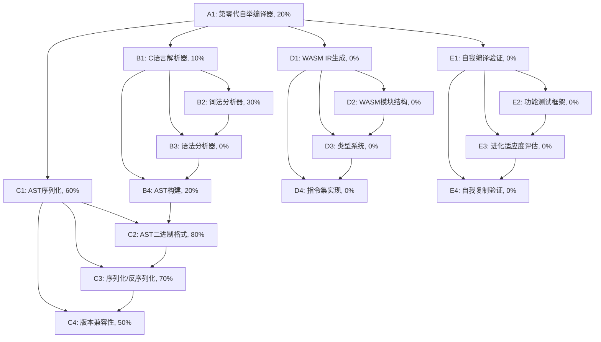

# Self-Evolve AI 任务追踪

## 任务描述

开发第零代自举编译器 (evolver0.c)，实现新的编译管道：源代码 -> AST -> IR (WASM)。核心目标是实现AST生成和WASM IR生成能力，摆脱对外部编译器的依赖，为后续的 Loader+Runtime+Program 三层架构奠定基础。

## 动态规划的任务分解图

## 每个节点的具体任务描述

### A1: 第零代自举编译器 (0%)
**目标**: 实现基于AST和WASM的编译器，不依赖任何外部工具
**子任务**:
- 集成所有子系统
- 实现源代码到AST的转换
- 实现AST到WASM IR的转换
- 建立进化机制
- 确保系统稳定性

### B1: C语言解析器 (20%)
**目标**: 解析 C 语言源代码，构建内部表示
**当前状态**: 已有基础词法分析器，支持基本标记识别
**已完成**:
- 基础标记识别（关键字、标识符、数字、字符串）
- 简单注释处理
- 基本操作符识别

**下一步**: 
- 添加预处理指令处理
- 扩展操作符集
- 改进错误处理
- 开始语法分析器开发

### B2: 词法分析器 (50%)
**目标**: 将 C 源代码分解为标记流
**已完成**: 
- 基本标记识别（关键字、标识符、数字、字符串）
- 单行和多行注释处理
- 基本操作符和分隔符识别
- 行号和列号跟踪

**待完成**: 
- [ ] 预处理指令处理（#include, #define, #ifdef 等）
- [ ] 完整C操作符支持（如复合赋值、位运算等）
- [ ] 字符常量和转义序列处理
- [ ] 更健壮的错误处理和恢复机制
- [ ] 性能优化（如字符串处理）

**当前实现**:
- 使用简单的状态机实现
- 支持基本的C语法标记
- 包含行/列信息用于错误报告

### B3: 语法分析器 (10%)
**目标**: 根据 C 语言语法规则解析标记流，构建AST
**当前状态**: 基础框架已就绪，需要实现具体语法规则

**子任务**:
- [x] 设计递归下降解析器框架
- [ ] 实现表达式解析（含运算符优先级）
  - [ ] 基本表达式（字面量、标识符）
  - [ ] 一元和二元操作符
  - [ ] 函数调用
  - [ ] 数组访问
- [ ] 实现语句解析
  - [ ] 表达式语句
  - [ ] 返回语句
  - [ ] 变量声明和初始化
  - [ ] 控制流（if/else, while, for, switch）
  - [ ] 复合语句（代码块）
- [ ] 实现声明解析
  - [ ] 函数声明和定义
  - [ ] 变量声明
  - [ ] 类型声明（struct/union/enum）

**设计决策**:
- 使用递归下降方法，便于维护和调试
- 表达式解析采用Pratt解析器处理运算符优先级
- 错误恢复机制：同步到下一个语句开始

**下一步**:
1. 实现基本表达式解析
2. 添加变量声明和表达式语句支持
3. 实现控制流结构

### B4: AST构建 (40%)
**目标**: 构建类型丰富的抽象语法树，支持完整C语言特性
**已完成**:
- 定义完整的AST节点类型系统
- 实现基础节点创建函数
- 支持函数声明、变量声明、表达式等基础构造
- 实现AST节点内存管理

**子任务**:
- [x] 定义AST节点类型和结构
- [x] 实现基础节点创建函数
- [x] 支持函数和变量声明
- [x] 支持基本表达式和语句
- [ ] 添加类型系统集成
  - [ ] 类型推导
  - [ ] 类型检查
  - [ ] 隐式类型转换
- [ ] 实现符号表和作用域管理
  - [ ] 变量作用域
  - [ ] 类型作用域
  - [ ] 标签作用域
- [ ] 支持完整C语言特性
  - [ ] 结构体/联合体/枚举
  - [ ] 指针和数组
  - [ ] 类型定义(typedef)
  - [ ] 预处理指令

**当前状态**:
- 支持基础C语法结构
- 节点包含源代码位置信息
- 实现了AST可视化辅助函数

**设计决策**:
- 使用联合体(union)存储节点特定数据，节省内存
- 所有节点包含类型、位置和子节点信息
- 采用访问者模式进行AST遍历和处理

**下一步**:
1. 实现符号表和作用域管理
2. 添加类型检查功能
3. 扩展支持更多C语言特性

### C1: AST序列化 (85%)
**目标**: 将 AST 序列化为二进制格式 (.astc)
**当前状态**: 
- 已实现AST节点结构和类型定义
- 已实现AST创建辅助函数
- 已实现基本的AST序列化框架
- 已实现简单AST的序列化示例
- 已实现AST反序列化基础框架
- 已添加版本控制和魔数校验
- 已实现节点引用的序列化/反序列化

**待完成**:
- 完善复杂表达式的序列化
- 添加更多的错误处理和验证
- 优化序列化后的二进制大小

**关键挑战**: 
- 设计高效的二进制格式，支持版本控制和向后兼容性
- 处理复杂节点类型的序列化
- 确保跨平台兼容性

**下一步**:
- 实现剩余AST节点类型的序列化
- 添加反序列化支持
- 实现完整的AST遍历和序列化

### C2: AST二进制格式 (80%)
**目标**: 设计AST的二进制表示
**已完成**:
- 定义AST文件头结构和魔数
- 实现节点类型和基本类型的二进制编码
- 设计字符串表机制
- 实现节点引用的相对偏移量编码

**子任务**:
- [x] 定义AST节点类型的二进制编码
- [x] 设计字符串池和常量池
- [x] 实现高效的序列化布局
- [ ] 支持增量更新

### C3: 序列化/反序列化 (70%)
**目标**: 实现AST的二进制序列化和反序列化
**已完成**:
- 实现AST到二进制的转换基础框架
- 支持基本节点类型的序列化
- 实现字符串表序列化
- 添加文件头和元数据序列化

**子任务**:
- [x] 实现AST到二进制的转换（部分）
- [ ] 实现二进制到AST的转换
- [ ] 处理循环引用和共享节点
- [ ] 实现高效的增量序列化

**下一步**:
- 完善节点类型的序列化支持
- 实现反序列化功能
- 添加错误处理和验证

### C4: 版本兼容性 (50%)
**目标**: 确保AST格式的向前和向后兼容性
**已完成**:
- 在文件头中定义版本号
- 设计可扩展的节点类型系统
- 实现基本的版本检查

**子任务**:
- [x] 设计版本控制系统
- [ ] 实现格式升级路径
- [ ] 处理不兼容的格式变更
- [ ] 提供转换工具

**设计决策**:
- 使用魔数"ASTC"标识文件格式
- 文件头包含版本和元数据
- 节点布局设计考虑未来扩展

### D1: WASM IR生成 (40%)
**目标**: 生成符合WebAssembly规范的IR代码
**当前状态**:
- 已实现WASM模块基本结构
- 已实现类型系统基础
- 已实现基本指令集（i32操作）
- 已支持函数定义和导出
- 已实现WASM二进制格式编码
- 已添加LEB128变长整数编码
- 已实现基础测试框架

**子任务**:
- [x] 实现WASM模块结构
- [x] 实现基础类型系统
- [x] 实现基本指令集
- [x] 生成.wasm二进制文件
- [ ] 支持控制流指令
- [ ] 实现内存操作
- [ ] 添加全局变量支持
- [ ] 实现函数调用
- [ ] 添加调试信息处理导入/导出表
- 实现函数索引空间

### D2: WASM模块结构 (0%)
**目标**: 实现WASM模块的基本结构
**子任务**:
- 实现模块头部
- 管理段(section)结构
- 处理导入/导出表
- 实现函数索引空间

### D3: 类型系统 (50%)
**目标**: 实现WASM类型系统
**当前状态**:
- 已实现基础值类型（i32, i64, f32, f64）
- 已实现函数类型定义
- 已支持多参数和返回值
- 已实现类型去重
- 已添加类型缓存机制

**子任务**:
- [x] 实现基础值类型
- [x] 实现函数类型
- [ ] 实现引用类型
- [ ] 添加类型检查
- [ ] 实现子类型关系
- [ ] 支持复合类型
- [ ] 添加类型验证
- [ ] 实现类型导入/导出类型签名
- 处理类型检查
- 支持引用类型

### D4: 指令集实现 (0%)
**目标**: 实现WASM指令集
**子任务**:
- 实现控制流指令
- 实现内存访问指令
- 实现数值运算指令
- 支持SIMD指令(可选)

### E1: 自我编译验证 (0%)
**目标**: 验证编译器能够成功编译自身

### E2: 功能测试框架 (0%)
**目标**: 建立完整的测试体系
**子任务**:
- 实现单元测试框架
- 创建测试用例集合
- 实现自动化测试

### E3: 进化适应度评估 (0%)
**目标**: 建立真正的进化评估机制
**子任务**:
- 重新设计适应度函数
- 实现能力测试
- 建立进化指标

### E4: 自我复制验证 (0%)
**目标**: 验证系统的自我复制能力
**子任务**:
- 实现自我编译测试
- 验证生成的可执行文件功能
- 测试多代进化稳定性

## 实现细节和设计决策

### AST序列化格式
1. **文件结构**:
   - 文件头 (16字节): 魔数 + 版本 + 节点数 + 字符串表偏移
   - 节点数据区: 序列化的AST节点
   - 字符串表: 所有字符串的集中存储
   - 符号表: 符号引用信息

2. **节点编码**:
   - 每个节点以类型标记开始
   - 使用相对偏移量表示节点引用
   - 字符串通过字符串表索引引用
   - 基本类型使用固定大小编码

3. **优化考虑**:
   - 对齐: 所有结构体按8字节对齐
   - 字符串去重: 使用字符串表避免重复
   - 大小端: 使用小端序存储

## 跟任务相关的经验和上下文累积

### 核心设计原则
1. **渐进式开发**: 从最简单的功能开始，逐步扩展
2. **可验证性**: 每个阶段都必须有可工作的版本
3. **真正的进化**: 不是随机变异，而是有方向的能力提升
4. **自主性优先**: 减少对外部工具的依赖是最高优先级

### 技术要点
- **词法分析器**: 已有基础实现，但需要完善错误处理和预处理器支持
- **AST序列化**: 需要设计高效的二进制格式，支持版本控制
- **WASM生成**: 需要完整实现WASM规范和类型系统
- **自我编译**: 编译器必须能够编译包含自身的代码

### 当前状态
- **evolver0.c**: 已有基础框架，包含词法分析器和简单的语法检查
- **问题**: 当前的"自举编译器"实际上只是语法检查器，不能生成机器码
- **下一步**: 需要实现真正的机器码生成能力

### 风险和挑战
1. **复杂性**: 实现完整的编译器是一个巨大的工程
2. **调试难度**: 机器码生成的错误很难调试
3. **平台相关性**: 需要处理不同操作系统和架构的差异
4. **性能要求**: 编译器本身的性能也很重要

### 成功标准
- **第零代成功标志**: evolver0 能够编译自身，生成可执行的 evolver1，且 evolver1 具有相同的功能
- **进化验证**: 连续多代的自我编译都能成功
- **功能完整性**: 生成的程序能够正确执行所有预期功能