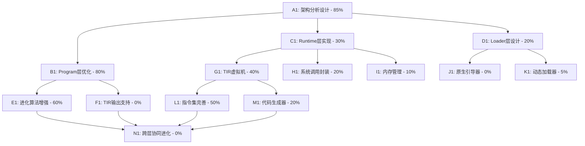

# 自进化AI系统任务规划与追踪

## 任务描述

基于Loader+Runtime+Program三层架构设计，构建完整的自进化计算机软件系统。当前已有evolver系列程序作为Program层实现（已进化到第6代），现需要从设计角度系统性地完善三层架构，特别是Runtime层的.tir平台无关IR实现，以及Loader层的原生化，最终实现完全自主的智能进化系统。

## 动态规划的任务分解图

## 每个节点的具体任务描述

### A1: 架构分析设计 - 85%
**任务标题**: 深度分析并完善三层架构设计
**进度**: 85%
**子任务详细描述**:
- [x] 分析现有evolver系列Program层实现
- [x] 理解三层架构的职责边界和接口设计
- [x] 评估当前TASM工具链的实现状态
- [ ] 设计跨层协同进化的通信协议
- [ ] 制定渐进式实现策略

### B1: Program层优化 - 80%
**任务标题**: 完善Program层的自进化能力
**进度**: 80%
**子任务详细描述**:
- [x] evolver系列已实现6代成功进化
- [x] 代码大小优化策略（9999→9884字节，1.15%优化）
- [x] 智能变异算法和适应度评估
- [ ] 增加性能指标和功能完整性评估
- [ ] 实现向TIR格式输出的能力

### C1: Runtime层实现 - 30%
**任务标题**: 构建平台无关的Runtime执行环境
**进度**: 30%
**子任务详细描述**:
- [x] 基础TIR指令集定义（opcodes.inc）
- [x] runtime.tasm框架实现（1143行）
- [ ] 完善TIR虚拟机指令处理
- [ ] 实现内存管理和栈管理
- [ ] 系统调用抽象层设计
- [ ] 跨平台兼容性保证

### D1: Loader层设计 - 20%
**任务标题**: 设计原生Loader替代Python实现
**进度**: 20%
**子任务详细描述**:
- [x] loader0.py基础功能实现
- [x] 内存管理和动态加载机制
- [ ] 原生C/Assembly Loader设计
- [ ] PE/MachO/ELF头处理能力
- [ ] Runtime+Program动态组合加载
- [ ] 操作系统接口抽象

### E1: 进化算法增强 - 60%
**任务标题**: 增强自进化算法的智能性和效率
**进度**: 60%
**子任务详细描述**:
- [x] 结构感知变异策略
- [x] 多种变异类型（删除、简化、重命名）
- [ ] 多目标适应度函数（大小+性能+功能）
- [ ] 遗传算法和交叉变异
- [ ] 进化历史分析和方向预测

### F1: TIR输出支持 - 0%
**任务标题**: 使Program层能够输出TIR格式
**进度**: 0%
**子任务详细描述**:
- [ ] 在evolver中集成TIR编译器
- [ ] 设计C到TIR的编译映射
- [ ] 实现自进化程序的TIR输出
- [ ] 验证TIR程序的正确性
- [ ] 优化TIR代码生成质量

### G1: TIR虚拟机 - 40%
**任务标题**: 完善TIR指令的执行引擎
**进度**: 40%
**子任务详细描述**:
- [x] 基础指令处理框架
- [x] 寄存器和内存模型定义
- [ ] 完整指令集实现
- [ ] 函数调用和返回机制
- [ ] 异常处理和错误恢复
- [ ] 性能优化和JIT编译

### H1: 系统调用封装 - 20%
**任务标题**: 实现跨平台的系统调用抽象
**进度**: 20%
**子任务详细描述**:
- [x] 基础系统调用框架
- [ ] Windows/Linux/macOS系统调用映射
- [ ] 文件I/O操作抽象
- [ ] 网络和进程管理接口
- [ ] 动态库加载能力

### I1: 内存管理 - 10%
**任务标题**: 实现高效的内存管理系统
**进度**: 10%
**子任务详细描述**:
- [x] 基础内存布局设计
- [ ] 堆内存分配器实现
- [ ] 垃圾回收机制
- [ ] 内存保护和安全检查
- [ ] 跨架构内存对齐处理

### J1: 原生引导器 - 0%
**任务标题**: 实现原生的系统引导器
**进度**: 0%
**子任务详细描述**:
- [ ] 设计原生引导器架构
- [ ] 实现PE/ELF文件格式处理
- [ ] 操作系统API接口抽象
- [ ] 多平台编译和部署
- [ ] 性能优化和体积最小化

### K1: 动态加载器 - 5%
**任务标题**: 实现Runtime和Program的动态加载
**进度**: 5%
**子任务详细描述**:
- [x] 基础动态加载概念验证
- [ ] 内存映射和重定位处理
- [ ] 符号解析和链接
- [ ] 版本兼容性检查
- [ ] 热加载和更新机制

### L1: 指令集完善 - 50%
**任务标题**: 完善TIR指令集的功能和性能
**进度**: 50%
**子任务详细描述**:
- [x] 基础算术和逻辑指令
- [x] 控制流指令（跳转、调用）
- [ ] 浮点数处理指令
- [ ] 向量化和SIMD指令
- [ ] 原子操作和同步指令
- [ ] 调试和性能分析指令

### M1: 代码生成器 - 20%
**任务标题**: 实现高质量的机器码生成
**进度**: 20%
**子任务详细描述**:
- [x] 基础代码生成框架
- [ ] 寄存器分配优化
- [ ] 指令调度和流水线优化
- [ ] 循环优化和向量化
- [ ] 跨平台机器码生成

### N1: 跨层协同进化 - 0%
**任务标题**: 实现三层架构的协同进化
**进度**: 0%
**子任务详细描述**:
- [ ] 设计跨层通信协议
- [ ] 实现层间性能反馈机制
- [ ] 协同优化策略设计
- [ ] 全系统自适应调整
- [ ] 元进化能力实现

## 跟任务相关的经验和上下文累积

### 技术架构理解
**三层架构职责边界**:
- **Loader层**: 系统引导、内存管理、操作系统接口，处理PE/ELF/MachO头
- **Runtime层**: 平台抽象、TIR虚拟机、系统调用封装，类似libc/dotnet
- **Program层**: 业务逻辑、自进化算法，编译为.tir平台无关IR

**当前实现状态**:
- Program层: evolver系列已实现6代成功进化，代码优化效果显著
- Runtime层: TASM工具链基础框架完整，但TIR执行引擎需要完善
- Loader层: Python实现功能完备，但需要原生化实现

### 设计原则和约束
**设计哲学**:
- 最小复杂性原则：每层只做必要的事情，复杂性向上传递
- 平台无关性：Program层完全平台无关，Runtime层封装平台差异
- 自进化优先：系统设计必须支持各层的自我进化能力
- 渐进式实现：保证每一步都能工作，避免大爆炸式重构

**关键约束**:
- Runtime不包含PE/ELF头（由Loader处理）
- Program编译为.tir IR，Runtime编译为平台二进制
- 支持分离和合并打包两种部署模式
- 必须保持向后兼容性

### 实现经验积累
**进化算法经验**:
- 结构感知变异比随机变异效果更好
- 多种变异策略组合使用效果最佳
- 适应度函数需要平衡多个目标（大小、性能、功能）
- 变异率需要动态调整，避免过度破坏

**编译器实现经验**:
- 词法分析器和语法解析器架构清晰，易于扩展
- TIR指令集设计需要考虑多平台兼容性
- 代码生成需要优化寄存器使用和指令调度
- 错误处理和调试信息对开发效率至关重要

**系统集成经验**:
- 内存管理是跨层协作的关键
- 动态加载需要仔细处理重定位和符号解析
- 性能监控和调试能力必须从设计初期就考虑
- 测试用例和验证机制是质量保证的基础

### 当前优先级和下一步行动
**立即行动项**:
1. 完善TIR虚拟机的指令处理能力
2. 实现Program层到TIR的编译输出
3. 设计跨层协同进化的通信机制
4. 开始原生Loader的架构设计

**中期目标**:
1. 实现完整的三层架构集成
2. 验证跨层协同进化能力
3. 性能优化和稳定性提升
4. 多平台兼容性验证

**长期愿景**:
1. 完全自主的智能进化系统
2. 跨硬件架构的自适应能力
3. 元进化和创新突破能力
4. 大规模分布式进化网络