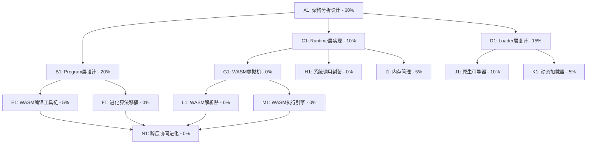

# 自进化AI系统任务规划与追踪

## 任务描述

基于Loader+Runtime+Program三层架构设计，构建完整的自进化计算机软件系统。使用WebAssembly(WASM)作为标准化的中间表示层，实现跨平台、高性能的自进化系统。当前需要从设计角度系统性地构建三层架构，特别是Runtime层的WASM虚拟机实现，以及Loader层的原生化，最终实现完全自主的智能进化系统。

## 动态规划的任务分解图

## 每个节点的具体任务描述

### A1: 架构分析设计 - 60%
**任务标题**: 深度分析并完善三层架构设计
**进度**: 60%
**子任务详细描述**:
- [x] 确定使用WASM作为标准中间表示
- [x] 理解三层架构的职责边界和接口设计
- [x] 评估tinycc作为第零代启动器的可行性
- [ ] 设计跨层协同进化的通信协议
- [ ] 制定渐进式实现策略

### B1: Program层设计 - 20%
**任务标题**: 设计基于WASM的Program层
**进度**: 20%
**子任务详细描述**:
- [x] 确定使用标准WASM格式
- [ ] 设计C/C++/Rust到WASM的编译流程
- [ ] 规划自进化程序的WASM实现
- [ ] 设计性能指标和功能评估方法
- [ ] 实现WASM格式的自进化程序

### C1: Runtime层实现 - 10%
**任务标题**: 构建WASM虚拟机运行时
**进度**: 10%
**子任务详细描述**:
- [x] 研究WASM规范和实现方法
- [ ] 设计WASM虚拟机架构
- [ ] 实现WASM指令解释器
- [ ] 实现内存管理和栈管理
- [ ] 系统调用抽象层设计
- [ ] 跨平台兼容性保证

### D1: Loader层设计 - 15%
**任务标题**: 设计原生Loader替代C语言实现
**进度**: 15%
**子任务详细描述**:
- [x] 确定使用tinycc作为第零代编译器
- [x] 设计loader0.c基础架构
- [ ] 实现WASM模块加载机制
- [ ] PE/MachO/ELF头处理能力
- [ ] Runtime+Program动态组合加载
- [ ] 操作系统接口抽象

### E1: WASM编译工具链 - 5%
**任务标题**: 构建高效的WASM编译工具链
**进度**: 5%
**子任务详细描述**:
- [x] 研究现有WASM编译工具
- [ ] 设计简化的WASM编译流程
- [ ] 实现C到WASM的编译器
- [ ] 优化生成的WASM代码
- [ ] 实现WASM模块链接功能

### F1: 进化算法移植 - 0%
**任务标题**: 将进化算法移植到WASM环境
**进度**: 0%
**子任务详细描述**:
- [ ] 分析现有evolver系列算法
- [ ] 设计WASM环境下的进化策略
- [ ] 实现代码变异和选择机制
- [ ] 设计适应度评估函数
- [ ] 测试和优化进化效率

### G1: WASM虚拟机 - 0%
**任务标题**: 实现WASM虚拟机核心
**进度**: 0%
**子任务详细描述**:
- [ ] 设计虚拟机架构
- [ ] 实现WASM指令集解释器
- [ ] 实现函数调用和栈管理
- [ ] 实现控制流指令处理
- [ ] 异常处理和错误恢复
- [ ] 性能优化和JIT编译

### H1: 系统调用封装 - 0%
**任务标题**: 实现跨平台的系统调用抽象
**进度**: 0%
**子任务详细描述**:
- [ ] 设计系统调用接口
- [ ] Windows/Linux/macOS系统调用映射
- [ ] 文件I/O操作抽象
- [ ] 网络和进程管理接口
- [ ] 动态库加载能力

### I1: 内存管理 - 5%
**任务标题**: 实现高效的内存管理系统
**进度**: 5%
**子任务详细描述**:
- [x] 基础内存布局设计
- [ ] 实现WASM线性内存模型
- [ ] 堆内存分配器实现
- [ ] 垃圾回收机制
- [ ] 内存保护和安全检查
- [ ] 跨架构内存对齐处理

### J1: 原生引导器 - 10%
**任务标题**: 实现原生的系统引导器
**进度**: 10%
**子任务详细描述**:
- [x] 确定使用C语言实现第零代引导器
- [ ] 设计原生引导器架构
- [ ] 实现PE/ELF文件格式处理
- [ ] 操作系统API接口抽象
- [ ] 多平台编译和部署
- [ ] 性能优化和体积最小化

### K1: 动态加载器 - 5%
**任务标题**: 实现Runtime和Program的动态加载
**进度**: 5%
**子任务详细描述**:
- [x] 基础动态加载概念验证
- [ ] WASM模块动态加载机制
- [ ] 内存映射和重定位处理
- [ ] 符号解析和链接
- [ ] 版本兼容性检查
- [ ] 热加载和更新机制

### L1: WASM解析器 - 0%
**任务标题**: 实现WASM二进制格式解析
**进度**: 0%
**子任务详细描述**:
- [ ] 实现WASM二进制格式解析
- [ ] 解析模块、类型和函数段
- [ ] 解析导入和导出段
- [ ] 解析代码和数据段
- [ ] 验证WASM模块有效性
- [ ] 优化解析性能

### M1: WASM执行引擎 - 0%
**任务标题**: 实现WASM指令执行引擎
**进度**: 0%
**子任务详细描述**:
- [ ] 实现WASM操作码解释器
- [ ] 实现控制流指令
- [ ] 实现数值和内存指令
- [ ] 实现函数调用和表操作
- [ ] 优化执行性能
- [ ] 实现JIT编译功能

### N1: 跨层协同进化 - 0%
**任务标题**: 实现三层架构的协同进化
**进度**: 0%
**子任务详细描述**:
- [ ] 设计跨层通信协议
- [ ] 实现层间性能反馈机制
- [ ] 协同优化策略设计
- [ ] 全系统自适应调整
- [ ] 元进化能力实现

## 跟任务相关的经验和上下文累积

### 技术架构理解
**三层架构职责边界**:
- **Loader层**: 系统引导、内存管理、操作系统接口，处理PE/ELF/MachO头
- **Runtime层**: 平台抽象、WASM虚拟机、系统调用封装
- **Program层**: 业务逻辑、自进化算法，编译为标准WASM格式

**WASM架构优势**:
- 标准化：WebAssembly是W3C标准，有完整的规范文档
- 生态系统：有大量工具支持WASM的生成和执行
- 性能：设计为高性能的二进制格式
- 跨平台：可在多种环境中执行
- 安全性：提供内存安全和沙箱执行环境

### 设计原则和约束
**设计哲学**:
- 最小复杂性原则：每层只做必要的事情，复杂性向上传递
- 平台无关性：Program层完全平台无关，Runtime层封装平台差异
- 自进化优先：系统设计必须支持各层的自我进化能力
- 渐进式实现：保证每一步都能工作，避免大爆炸式重构

**关键约束**:
- Runtime不包含PE/ELF头（由Loader处理）
- Program编译为标准WASM格式，Runtime实现WASM虚拟机
- 支持分离和合并打包两种部署模式
- 必须保持向后兼容性

### 实现经验积累
**WASM实现经验**:
- WASM是一个基于栈的虚拟机，指令设计简洁
- WASM二进制格式采用LEB128编码，节省空间
- WASM模块包含多个段（section），每个段有特定用途
- WASM内存模型是线性内存，便于实现和优化

**编译器实现经验**:
- C/C++/Rust等语言可通过工具链编译到WASM
- WASM支持的基本类型有i32、i64、f32、f64
- WASM不直接支持字符串和复杂数据结构，需要通过内存操作实现
- 错误处理和调试信息对开发效率至关重要

**系统集成经验**:
- 内存管理是跨层协作的关键
- 动态加载需要仔细处理重定位和符号解析
- 性能监控和调试能力必须从设计初期就考虑
- 测试用例和验证机制是质量保证的基础

### 当前优先级和下一步行动
**立即行动项**:
1. 设计并实现基础的WASM解析器
   - 解析WASM二进制格式
   - 验证模块有效性
   - 提取模块信息（函数、内存、导入导出等）

2. 实现简单的WASM执行引擎
   - 支持基本数值和控制流指令
   - 实现函数调用机制
   - 提供基本内存操作

3. 创建loader0.c原型
   - 使用tinycc编译
   - 实现WASM模块加载
   - 提供基本系统调用接口

4. 设计C到WASM的编译流程
   - 研究现有工具链
   - 设计简化的编译流程
   - 测试基本功能

**中期目标**:
1. 实现完整的三层架构集成
2. 将evolver系列移植到WASM环境
3. 性能优化和稳定性提升
4. 多平台兼容性验证

**长期愿景**:
1. 完全自主的智能进化系统
2. 跨硬件架构的自适应能力
3. 元进化和创新突破能力
4. 大规模分布式进化网络