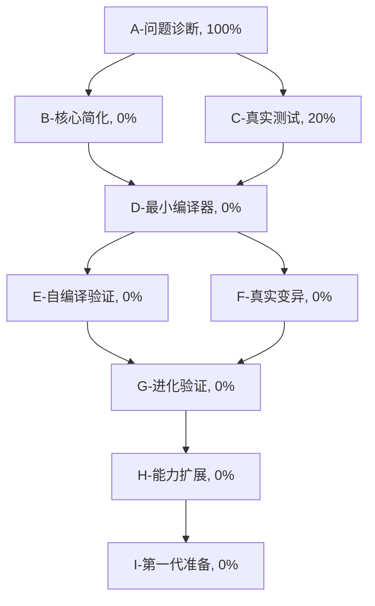

# Self-Evolve AI 第零代开发任务追踪

## 任务描述
开发一个真正能够自我进化的编译器。经过深度代码审查，发现当前实现存在重大问题：自举进化机制是伪进化，只是简单的代码修改而非真正的能力提升。需要重新聚焦核心目标，实现真正的自我进化。

## 🚨 重要发现：当前状态的真实评估

### 关键问题
1. **伪进化机制**：`mutate_for_bootstrap` 只是在代码末尾添加空行，这不是真正的进化
2. **复杂度过高**：5610行单文件包含过多功能，导致核心功能不够扎实
3. **缺乏验证**：没有充分测试验证各模块的实际工作能力
4. **目标分散**：同时追求WASM、AST、ELF、PE等多种功能，偏离了自举进化的核心目标

### 进度重新评估
- **基础架构**：70%（过于复杂，需要简化）
- **词法分析**：80%（实现较完整）
- **语法分析**：60%（框架完整但功能有限）
- **代码生成**：40%（基本功能但支持有限）
- **自举进化**：**10%**（存在根本性问题）

## 重新规划的任务分解图

## 重新制定的优先任务

### 🎯 **立即行动项（最高优先级）**

#### 1. 核心功能验证 (C-真实测试, 20% → 80%)
**任务描述**：验证当前编译器的真实能力
**具体行动**：
- 测试编译器能否编译最简单的C程序
- 验证生成的可执行文件是否真的能运行
- 测试自编译：编译器能否编译自己的简化版本
- 记录所有失败的案例和原因

#### 2. 功能简化重构 (B-核心简化, 0% → 60%)
**任务描述**：移除非核心功能，专注于基本的C编译器
**具体行动**：
- 移除WASM生成功能（与自举进化无关）
- 移除复杂的AST序列化功能
- 保留最基本的ELF生成（Linux环境）
- 简化词法分析器，只支持编译器自身需要的C特性
- 将5610行代码缩减到2000行以内

#### 3. 最小可工作编译器 (D-最小编译器, 0% → 80%)
**任务描述**：创建一个能编译自身的最小编译器
**具体行动**：
- 实现能编译包含main函数、基本运算、函数调用的C程序
- 确保能处理自身源代码的子集
- 实现最基本的变量声明和赋值
- 支持if/while等基本控制流

### 🔧 **中期目标**

#### 4. 真实进化机制 (F-真实变异, 0% → 70%)
**任务描述**：实现真正的代码进化而非表面修改
**具体行动**：
- 设计智能变异策略：
  - 函数重构（改变算法实现）
  - 代码优化（提高效率）
  - 功能扩展（增加新特性）
- 实现有意义的适应度函数：
  - 编译成功率
  - 生成代码的正确性
  - 编译速度
  - 生成代码的效率

#### 5. 自编译验证 (E-自编译验证, 0% → 90%)
**任务描述**：确保编译器能稳定地编译自己
**具体行动**：
- 实现多代自编译测试
- 验证编译器的编译器仍然能正常工作
- 建立自编译的回归测试

### 🚀 **长期规划**

#### 6. 进化验证系统 (G-进化验证, 0% → 80%)
**任务描述**：建立完善的进化质量保证机制
**具体行动**：
- 自动化测试每一代的功能
- 进化历史追踪和分析
- 进化失败的回滚机制

## 技术债务清理计划

### 立即清理
1. **删除冗余功能**：
   - 移除WASM相关的1000+行代码
   - 移除复杂的AST序列化功能
   - 移除PE格式支持（专注Linux环境）

2. **代码结构重组**：
   - 将解析器、代码生成器、进化机制分离到独立文件
   - 建立清晰的模块边界
   - 减少全局状态

3. **测试建立**：
   - 创建基本的单元测试
   - 建立自编译测试套件
   - 添加回归测试

## 成功标准重新定义

### 第零代成功标准
1. **基本编译能力**：能编译包含main函数、变量、基本运算的C程序
2. **自编译能力**：能编译自身的简化版本（~1000行）
3. **真实进化**：能生成在功能上有意义改进的下一代编译器
4. **稳定性**：连续3代自编译都能成功

### 进化质量标准
1. **功能保持**：新一代保持前一代的所有核心功能
2. **能力提升**：在编译速度、代码质量或支持特性上有改进
3. **自主性增强**：减少对外部工具的依赖

## 行动计划时间表

### 第1周：诊断和简化
- 完成真实能力测试
- 开始功能简化重构
- 移除非核心代码

### 第2周：最小编译器
- 实现基本的C语言子集编译
- 测试自编译能力
- 建立基础测试套件

### 第3-4周：真实进化
- 实现智能变异机制
- 建立进化验证系统
- 完成第一次真正的进化

## 关键决策

1. **专注原则**：放弃"大而全"，专注"小而精"
2. **验证优先**：每个功能都要有充分的测试验证
3. **渐进演化**：每次进化都要是小步骤的改进
4. **质量保证**：宁可功能少，也要确保质量高

## 学到的教训

1. **复杂性是敌人**：过早的复杂化导致核心功能不稳定
2. **验证是关键**：没有充分测试的功能等于没有功能
3. **真实性重要**：表面的进化不如真实的改进
4. **专注致胜**：明确的目标比广泛的功能更重要
