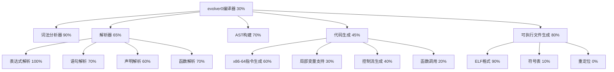

# evolver0 编译器开发任务追踪

## 任务描述
开发第零代自举编译器 evolver0.c，能够编译自身的最小C编译器，逐步增强到支持C语言主要特性。

## 动态规划的任务分解图

## 每个节点的具体任务描述

### A: evolver0编译器 (30%)
- 简单ID: A
- 精简标题: 主编译器框架
- 评估进度: 30%
- 子任务详细描述:
  - ✅ 项目结构和模块划分
  - ✅ 命令行参数处理
  - ✅ 主编译流程控制
  - ⚡ 模块集成和测试
  - ❌ 自举测试

### B: 词法分析器 (90%)
- 简单ID: B
- 精简标题: Token生成
- 评估进度: 90%
- 子任务详细描述:
  - ✅ 标识符和关键字识别
  - ✅ 数字字面量（十进制、十六进制）
  - ✅ 字符串和字符字面量
  - ✅ 运算符和标点符号
  - ✅ 注释过滤（单行、多行）
  - ⚡ 预处理指令基础支持

### C1: 表达式解析 (100%)
- 简单ID: C1
- 精简标题: 算术逻辑表达式
- 评估进度: 100%
- 子任务详细描述:
  - ✅ 优先级和结合性处理
  - ✅ 二元运算符（算术、比较、逻辑、位运算）
  - ✅ 一元运算符（正负、逻辑非、位非）
  - ✅ 赋值和复合赋值
  - ✅ 条件表达式（三元运算符）
  - ✅ 函数调用表达式
  - ✅ 数组下标访问
  - ✅ sizeof运算符

### C2: 语句解析 (70%)
- 简单ID: C2
- 精简标题: 控制流语句
- 评估进度: 70%
- 子任务详细描述:
  - ✅ return语句
  - ✅ if-else语句
  - ✅ while循环
  - ✅ for循环
  - ✅ do-while循环
  - ✅ break和continue
  - ✅ 复合语句
  - ❌ switch-case语句
  - ❌ goto和标签

### E1: x86-64指令生成 (60%)
- 简单ID: E1
- 精简标题: 机器码生成
- 评估进度: 60%
- 子任务详细描述:
  - ✅ MOV指令（立即数、寄存器）
  - ✅ 算术指令（ADD、SUB、IMUL、IDIV）
  - ✅ 栈操作（PUSH、POP）
  - ✅ 比较和条件设置
  - ✅ 跳转指令（JMP、Jcc）
  - ⚡ 函数调用指令（CALL、RET）
  - ❌ 浮点指令

### E2: 局部变量支持 (30%)
- 简单ID: E2
- 精简标题: 变量存储
- 评估进度: 30%
- 子任务详细描述:
  - ✅ 栈帧布局设计
  - ⚡ 局部变量分配
  - ❌ 变量初始化
  - ❌ 数组支持
  - ❌ 结构体支持

## 跟任务相关的经验和上下文累积

### 关键技术点
1. **解析器冲突解决**: 原evolver0.c有多个Token和AST定义冲突，通过创建统一的头文件解决
2. **代码生成策略**: 使用栈式计算模型，所有表达式结果放在RAX中
3. **ELF生成**: main函数使用syscall直接退出，避免依赖C运行时
4. **模块化设计**: 使用.inc.c文件作为包含文件，避免链接问题

### 当前阻塞点
1. evolver0_parser.inc.c中有TypeInfo等未定义类型
2. 局部变量的加载和存储指令还未完全实现
3. 函数调用约定还需要完善

### 下一步计划
1. 修复parser.inc.c中的编译错误
2. 实现完整的局部变量支持
3. 添加更多控制流语句的代码生成
4. 测试更复杂的程序编译