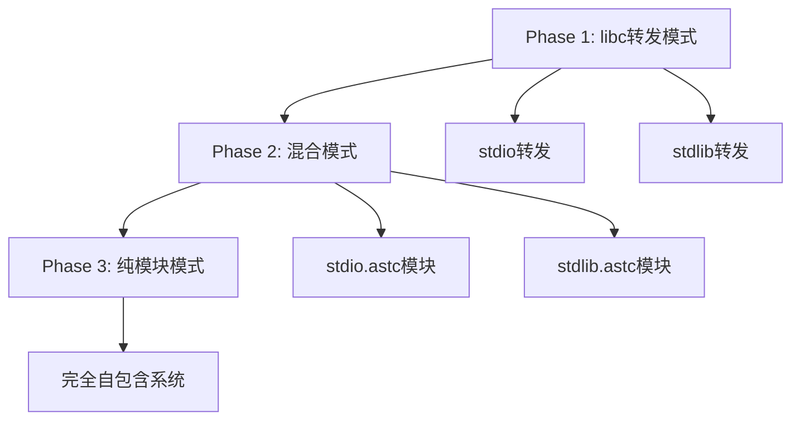

# Self-Evolve AI 项目规划

## 1. 项目愿景

能够自我进化的AI系统，通过代码自我修改、编译和优化实现持续进化，最终目标是实现完全自主的通用智能。

## 来自人类的重要提示

- 跨架构自举 + AI协同进化
- 进化范式：单一Loader + 架构特定Runtime + 通用Program，多代自举和AI驱动进化，逐步构建出完整的系统
- 核心是 【ASTC字节码数据结构】，整合 WASM/IR/AST/JIT 等概念
- 围绕ASTC完成兼容c99编译器和VM运行时
- c2astc.c 把c语言编译成astc的库
- loader.exe （后面参考Cosmopolitan编译的跨架构单一加载器），Runtime(负责识别当前硬件环境并加载对应架构的运行时) 和 Program(架构无关程序字节码)
- runtime_{arch}_{bits}.rt 架构依赖二进制，根据硬件架构区分，封装硬件架构和ABI等，实现ASTC虚拟机
- 最早的运行时先以兼容libc为基准，以后会逐步进化出更多更先进的运行时，包括多架构合一运行时等
- program.astc 平台无关程序（ASTC格式的二进制模块），未来还会支持program.ir、program.js等的编译
- **模块化进化**: libc将从转发模式进化为ASTC字节码标准模块，实现真正的自包含系统

注意：Runtime和Program两种编译的二进制是不一样的。Program编译的是ASTC，Runtime编译的是平台适配的二进制（由ASTC再编译成机器码，且不需要PE/ELF/MACHO头）

其中 loader.exe + runtime{arch}{bits}.rt 或 loader.exe + runtime_{arch}_{bits}.rt 构成了最小化的跨平台执行环境，类似于一个微型的虚拟机，可以执行ASTC格式的程序。

最初的关键在于尽快实现c99兼容的程序(loader+runtime+program_c99）摆脱其它cc依赖

## 2. 三层架构设计

### Layer 1: loader.exe
- 后面要参考Cosmopolitan编译跨架构单一加载器
- 负责识别当前硬件环境并加载对应的运行时
- 提供统一的入口点，简化部署和使用
- 处理命令行参数和初始环境设置
- **模块管理**: 负责加载和管理ASTC模块，包括标准库模块

### Layer 2: {runtimeName}_runtime_{arch}_{bits}.rt
- **ASTC JIT编译器生成的架构特定机器码Runtime**
- 命名规范：`{runtimeName}_runtime_{arch}_{bits}.rt`
  - 示例：`evolver0_runtime_x64_64.rt`、`c99_runtime_x64_64.rt`
- 通过astc2rt JIT编译器从ASTC字节码生成x64/ARM等机器码
- 包含完整的ASTC虚拟机和libc转发功能
- 编译流程：C源码 → (c2astc) → ASTC字节码 → (astc2rt JIT) → 机器码Runtime
- 封装硬件架构和ABI，提供系统调用和运行时支持
- **进化路径**: 从libc转发模式逐步进化到ASTC模块加载模式
- 不需要复杂的符号表机制，只需要最小化的系统接口
- Loader能够根据Program文件名自动选择对应的Runtime文件
- **模块运行时**: 提供ASTC模块的加载、链接和执行环境

### Layer 3: program.astc
- 平台无关程序（ASTC格式的二进制模块）
- 包含可在任何支持的平台上执行的代码
- 未来还会支持program.ir、program.js等其它层的编译
- **模块化设计**: 程序可以导入标准库模块和第三方模块
- 在ASTC/IR层面实现符号表和模块系统
- 包含符号定义和引用、模块导入/导出信息、函数和变量的元数据
- **标准库集成**: 通过模块系统使用libc.astc等标准模块

## 3. 模块化系统设计 (新增)

### 3.1 ASTC模块架构
- **模块定义**: 每个模块是独立的ASTC字节码单元
- **导入/导出**: 基于WASM标准的符号导入导出机制
- **版本管理**: 模块版本兼容性和依赖解析
- **标准模块**: libc、math、string等核心库模块化

### 3.2 标准库模块化路线图

### 3.3 模块接口设计
- **标准接口**: 基于C99标准但以ASTC字节码实现
- **性能优化**: 模块间调用的零拷贝优化
- **安全性**: 模块沙箱和权限控制机制
- **扩展性**: 支持用户自定义模块和第三方模块

## 4. 当前实现状态

### 4.1 技术基础 (85%完成)
- **ASTC架构**: core_astc.h 536行，完美兼容WASM并扩展C99
- **C99编译器**: compiler_c2astc.c 6056行，支持完整C99特性
- **JIT编译器**: compiler_astc2rt.c 803行，支持x64/ARM64架构
- **虚拟机**: vm_astc.c 1694行，完整的ASTC执行环境
- **加载器**: core_loader.c 643行，三层架构加载管理

### 4.2 模块化准备 (15%完成)
- **ASTC节点**: 已有MODULE/IMPORT/EXPORT基础节点
- **符号系统**: 基础符号表机制已实现
- **libc转发**: 当前采用转发模式，为模块化奠定基础
- **待开发**: 模块解析、链接、版本管理等功能

## 5. Roadmap - 实现路线图

### 5.1 Phase 1: 自举完成 (当前优先级)
- 消除TinyCC依赖，建立完全独立的编译循环
- 验证三层架构的端到端功能
- 确保系统能使用自己的工具编译自身

### 5.2 Phase 2: 模块化实现 (下一阶段)
- 扩展ASTC格式支持模块语法
- 实现基础的模块解析和链接
- 将printf等核心函数模块化作为概念验证
- 设计模块版本管理和依赖解析机制

### 5.3 Phase 3: 标准库模块化 (中期目标)
- 将完整libc实现为ASTC模块集合
- 建立标准库模块的测试和验证框架
- 优化模块间调用性能
- 实现模块热加载和动态更新

### 5.4 Phase 4: AI进化集成 (长期目标)
- AI驱动的模块优化和重构
- 自动化的模块依赖分析和优化
- 基于使用模式的智能模块预加载
- 模块级别的自我进化能力

## 6. Pros - 架构优势分析

### 6.1 模块化优势
- **真正自包含**: 不再依赖宿主系统libc，完全自主控制
- **跨平台一致性**: 同一套标准库在所有平台行为完全一致
- **性能可控**: 在ASTC层面进行全局优化，性能可能更好
- **易于进化**: 模块化设计便于AI驱动的增量改进

### 6.2 架构一致性
- **设计统一**: 从程序到标准库都是ASTC模块，架构高度一致
- **工具链复用**: 同一套编译工具链处理所有模块
- **调试友好**: 统一的调试和分析工具
- **版本管理**: 精细化的模块版本控制和依赖管理

## 7. Cons - 技术挑战与解决方案

### 7.1 模块化挑战
- **性能开销**: 模块调用可能引入额外开销
  - *解决方案*: 设计高效的模块间调用机制，JIT优化
- **内存管理**: 模块间内存共享的复杂性
  - *解决方案*: 设计清晰的内存边界和共享协议
- **启动时间**: 多模块加载影响启动性能
  - *解决方案*: 智能预加载和延迟加载策略

### 7.2 兼容性挑战
- **现有代码迁移**: 从转发模式到模块模式的平滑过渡
  - *解决方案*: 设计混合模式，支持渐进式迁移
- **标准兼容**: 确保模块化后仍然兼容C99标准
  - *解决方案*: 严格按照C99规范设计模块接口

# 来自人类的重要提示（请智能助理尽量参考）：

- 尽量让会话延续，如果会话在某个会话要停下来之前试一下重读PRD.md后争取自动延续会话ex
- 记得：要从设计和整体来分析问题，不要老是想着简化方案和搞太多测试来回避问题
- 记得：除了代码中的注释或字符串常量使用英文，其它情况下尽量精简且精准的中文；.bat要用英文；
- 记得：临时或测试类的文件放到./tests/
- 记得：你要停下来之前先执行 checkin.bat 或 checkin.sh 接收人类留言
- 记得：运行命令要采取timeout机制，以免有些命令或程序会卡住工作流！
- 经常正思反思然后才行动；注意自主思考和执行；
- 从设计角度来解决问题，不要乱简化来回避问题；
- **模块化设计**: 优先考虑系统的模块化和可扩展性，为AI进化奠定基础

## 未来增强功能

### 8.1 FFI (Foreign Function Interface) 支持
- **目标**: 实现动态库加载机制，允许运行时加载和调用任意C库函数
- **设计**: 类似Lua/Python的FFI系统，支持动态声明和调用外部函数
- **优势**: 提供更大的灵活性，用户可以调用任意系统库而不需要预先定义
- **实现**: 基于dlopen/dlsym机制，在runtime层提供FFI调用支持
- **模块化集成**: FFI功能也将模块化，支持安全的外部库集成

### 8.2 ASTC模块生态
- **标准库套件**: stdio、stdlib、string、math等核心模块
- **第三方模块**: 支持社区开发的ASTC模块
- **模块仓库**: 类似npm的ASTC模块管理系统
- **安全验证**: 模块签名和安全扫描机制

# 来自智能助理自己总结的经验：

## ⚠️ 开发错误避免指南

### 🚫 **严禁的错误模式**：
1. **逃避核心问题** - 不要创建简化版本(如minimal_test.c)来回避复杂问题
2. **硬编码替代真实实现** - 不要用固定值替代真正的编译/转换结果
3. **忽视现有代码** - 必须理解并使用现有组件的真实作用
4. **过早宣布成功** - 程序能编译/运行≠功能正确实现
5. **忽视模块化设计** - 新功能开发要考虑模块化架构

### ✅ **必须遵循的原则**：
1. **深入理解架构** - 分析每个组件的真实作用和依赖关系
2. **直面技术挑战** - 不逃避复杂的实现问题
3. **验证真实功能** - 确保声称的功能真正工作
4. **诚实评估进度** - 实事求是地评估完成度
5. **模块化思维** - 设计时考虑模块间的接口和依赖关系
