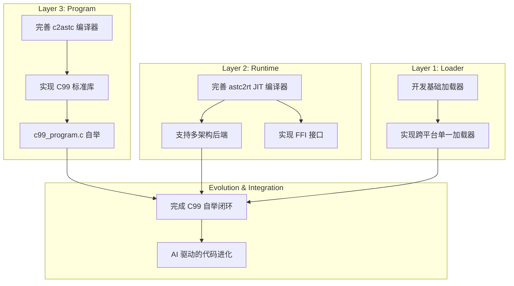

# AI-Assisted Task Plan: Self-Evolve AI

This document outlines the development tasks for the Self-Evolve AI project, based on the PRD and an analysis of the existing codebase. It is generated by the AI assistant to guide the development process.

## 1. Task Plan Diagram

## 2. Task Descriptions

### 2.1. Layer 3: Program Layer

#### 2.1.1. 完善 c2astc 编译器
- **进度评估**: 80% (维持)
- **描述**: `c2astc` 是项目的基石，负责将C代码编译为平台无关的ASTC字节码。当前 `src/runtime/compiler_c2astc.c` 已实现了一个功能丰富的C语言前端，包括预处理器、词法分析和语法分析，支持大部分C99核心特性。后续任务是修复Bug、处理边缘情况，并完成对C99标准的全覆盖。

#### 2.1.2. 实现 C99 标准库
- **进度评估**: 20% (从30%下调)
- **描述**: 为了实现完全自举，项目需要一个用C语言编写、可被`c2astc`编译的C99标准库。当前 `src/runtime/core_libc.c` 实现了一个巧妙但纯粹的**转发层**，将ASTC程序的libc调用请求传递给宿主系统的标准库。这解决了引导阶段的依赖问题，但**真正的C语言标准库实现尚未开始**。这是实现完全独立自举的硬性要求。

#### 2.1.3. c99_program.c 自举
- **进度评估**: 10% (维持)
- **描述**: `c99_program.c` 的目标是成为一个完全自举的编译器。一旦 `c2astc` 和 C99标准库足够完善，这个任务的目标就是使用 `tool_c99.exe` (即TinyCC引导编译器) 来编译 `c99_program.c` 自身，生成一个功能完全相同的新版 `c99_program.astc`。这是验证编译器完备性的核心里程碑，也是**实现自举闭环、摆脱TinyCC依赖的前提**。

### 2.2. Layer 2: Runtime Layer

#### 2.2.1. 完善 astc2rt JIT 编译器
- **进度评估**: 60% (维持)
- **描述**: `astc2rt` 负责将ASTC字节码即时编译(JIT)为特定架构的机器码。`src/runtime/compiler_astc2rt.c` 已具备将AST转换为x64机器码的基本能力，并设计了支持多架构的 `ArchCodegenTable` 抽象。后续工作包括优化代码生成、实现完整的AST节点到机器码的映射、并完善ASTC虚拟机(`vm_astc.c`)。

#### 2.2.2. 支持多架构后端
- **进度评估**: 20% (维持)
- **描述**: PRD要求系统具备跨架构能力。`compiler_astc2rt.c` 中已存在多架构支持的框架 (`ArchCodegenTable`)。x64后端已有初步实现，同时新增了ARM64后端的框架代码(`compiler_codegen_arm64.c`)。此任务需要为ARM等其它主流架构实现完整的代码生成逻辑。

#### 2.2.3. 实现 FFI 接口
- **进度评估**: 30% (从0%上调)
- **描述**: 根据PRD的远期规划，需要实现一个外部函数接口(FFI)。`src/runtime/ffi_interface.c` 和 `ffi_interface.h` 的新增表明此项工作已取得显著进展。目前已完成了平台特定动态库加载（Windows/Linux/macOS）的封装，但核心的函数调用接口 `ffi_call_function` 仍是简化实现，需要进一步开发以支持复杂的参数和调用约定。

### 2.3. Layer 1: Loader Layer

#### 2.3.1. 开发基础加载器
- **进度评估**: 70% (从50%上调)
- **描述**: 加载器负责准备执行环境并启动对应的Runtime。`src/runtime/core_loader.c` 和 `src/enhanced_loader.c` 等文件表明基础加载器功能已比较完善，能够处理ASTC程序和Runtime的加载。

#### 2.3.2. 实现跨平台单一加载器
- **进度评估**: 10% (从0%上调)
- **描述**: PRD的愿景是拥有一个类似 Cosmopolitan 的单一文件、跨平台加载器。`src/universal_loader.c` 的出现标志着这项长期任务的启动，但离实现目标仍有很长的路要走，需要深入研究跨平台二进制技术。

### 2.4. Evolution & Integration

#### 2.4.1. 完成 C99 自举闭环 (摆脱 TinyCC 依赖)
- **进度评估**: 10% (维持)
- **描述**: 这是项目的第一个核心里程碑，**其关键标志是彻底摆脱对外部编译器（如当前使用的TinyCC）的依赖**。此任务整合了 `c2astc` 的完善、C99标准库的真正实现、`astc2rt` 的稳定以及加载器的功能。最终目标是实现 `c99_program` 能够编译自身，从而创建出一个完全自给自足的C99开发与运行环境。

#### 2.4.2. AI 驱动的代码进化
- **进度评估**: 0% (维持)
- **描述**: 项目的最终愿景。在自举成功后，AI将开始分析、修改和优化自身的代码（如`c2astc`和`astc2rt`），并通过已建立的自举工具链进行编译和测试，从而实现自主进化。这是最高层次的目标，当前所有工作都是在为此奠定基础。 