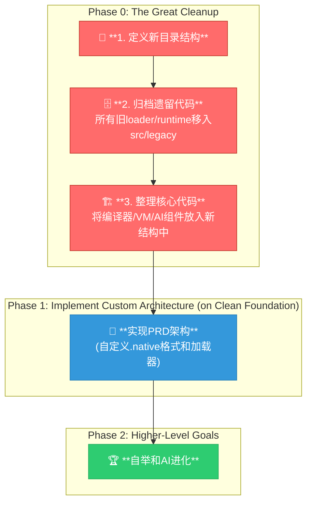

# AI-Assisted Task Plan: A New Foundation

**核心诊断:** 经过对PRD的再次"认真"研读，特别是"**再三强调这不是exe/dll/so**"这一原则，结合对`src`目录现状的分析，得出结论：当前最大的问题是**代码结构的混乱**和**架构实现的停滞**。旧的、冲突的、单体的代码与新的、模块化的、但未实现的代码混杂在一起，导致无法有效推进。

**战略转向:** 必须采取外科手术式的、决定性的行动。**第一步不是写新功能，而是清理和重组**，为实现PRD的真正愿景（自定义模块 + 自定义加载器）扫清障碍。

---
## 🚨 **Phase 0: The Great Cleanup (代码大扫除)**

**目标:** 建立一个清晰、可预测的`src`目录结构。将所有与PRD最终架构无关的遗留代码和实验性代码隔离归档。


---

## 1. 文件整理任务安排 (File Organization Plan)

### **Step 1: 创建新的`src`目录结构**
在`src`下创建以下目录，以反映PRD的组件划分：
- `src/tools/`: 存放`c2astc`和`astc2native`等面向用户的命令行工具的`main`函数源码。
- `src/compiler/`: 存放`c2astc`和`astc2native`的后端实现（词法/语法/代码生成）。
- `src/core/`: 存放构成核心运行时环境的组件。
  - `src/core/loader/`: 存放`universal_loader.c`的源码。
  - `src/core/vm/`: 存放`vm_astc.c`的源码。
  - `src/core/libc/`: 存放`libc_full.c`, `libc_minimal.c`等模块的源码。
  - `src/core/include/`: 存放`.native`格式定义、核心模块接口等内部头文件。
- `src/ai/`: 存放`evolution_engine.c`等AI进化相关代码。
- `src/legacy/`: **归档目录**。用于存放所有被废弃的代码。

### **Step 2: 归档遗留和冲突代码 (执行Move/Delete)**
**目标:** 将以下文件从`src`和`src/runtime`的根目录中**移动到 `src/legacy/`**:
- `loader.c` (旧的、硬编码的loader)
- `loader_unified.c` (另一个loader实验)
- `enhanced_runtime_with_libc.c` (单体式运行时)
- `c99_runtime.c`, `evolver0_runtime.c` (特定程序的旧运行时)
- 所有其它明显属于旧实验或已被取代的文件。
- `src/runtime/` 目录本身可以被删除，其内容被分类移动。

### **Step 3: 整理核心组件源码 (执行Move)**
**目标:** 将仍在使用的、符合PRD思想的核心代码**移动到新的目录结构中**:
- `tool_c2astc.c` -> `src/tools/`
- `tool_astc2native.c` -> `src/tools/`
- `compiler_c2astc.c`, `compiler_astc2rt.c` (需重命名) 等 -> `src/compiler/`
- `universal_loader.c` -> `src/core/loader/`
- `vm_astc.c` -> `src/core/vm/`
- `libc_full.c`, `libc_minimal.c` -> `src/core/libc/`
- `evolution_engine.c`, `code_analyzer.c` 等 -> `src/ai/`

---

## 2. 架构实现任务 (Implementation Plan)

**在完成Phase 0的清理之后**，我们才能在一个干净的基础上开始实现真正的架构。此处的任务计划继承自上次讨论的**正确版本（自定义格式+自定义加载器）**。

| 任务 | 描述 | 进度 | 依赖 |
| --- | --- | --- | --- |
| **定义`.native`格式** | 在`src/core/include/native_format.h`中定义V1版的头和导出表结构。 | **50%** | (已在讨论中定义) |
| **改造`astc2native`** | 实现`compiler`后端，将JIT代码打包成`.native`格式。 | **15%** | (已有代码生成能力) |
| **实现`universal_loader`** | 在`core/loader/`中填充代码，使用`mmap`/`VirtualAlloc`加载`.native`文件。 | **5%** | **关键瓶颈** |
| **实现C99模块化支持** | 使用`__attribute__`实现模块化语法，包括MODULE/EXPORT/IMPORT。 | **0%** | 编译器支持 |
| **扩展ASTC节点** | 完善AST_MODULE/IMPORT/EXPORT节点的数据结构。 | **30%** | (已有基础定义) |
| **模块属性解析** | 在编译器中实现对模块化属性的解析和AST生成。 | **0%** | ASTC节点扩展 |
| **端到端集成** | 编译`vm.native`, `libc.native`并由`loader`成功运行。 | **0%** | loader, astc2native |
| **自举** | 移除TCC依赖。 | **0%** | 端到端集成 |
| **AI进化集成** | 将`ai`目录中的能力集成到编译/运行流程中。 | **5%** | 端到端集成 |

---

## 3. 模块化实现方案 (Module System Design)

为了保持C99兼容性，同时实现PRD中描述的模块化功能，我们采用基于`__attribute__`的方案：

### 3.1 语法设计

```c
// module_attributes.h
#define MODULE(name) __attribute__((annotate("module:" name)))
#define EXPORT __attribute__((annotate("export")))
#define IMPORT(module) __attribute__((annotate("import:" module)))
```

使用示例：
```c
MODULE("math")
void init_math(void) {
    // 模块初始化代码
}

EXPORT
int add(int a, int b) {
    return a + b;
}

IMPORT("libc")
extern void* malloc(size_t size);
```

### 3.2 实现任务分解

1. **属性定义 (Priority: High)**
   - 在`src/core/include/module_attributes.h`中定义属性宏
   - 添加属性验证和错误检查
   - 实现属性组合规则（如EXPORT不能与IMPORT同时使用）

2. **AST节点扩展 (Priority: High)**
   - 在`core_astc.h`中完善模块相关节点的数据结构
   - 添加模块符号表支持
   - 实现模块依赖关系表示

3. **编译器支持 (Priority: High)**
   - 修改词法分析器以识别属性注解
   - 在语法分析器中实现属性解析
   - 生成正确的模块化AST节点

4. **ASTC生成 (Priority: Medium)**
   - 实现模块节点的ASTC字节码生成
   - 添加导入/导出表的序列化
   - 确保与现有ASTC格式兼容

5. **运行时支持 (Priority: Medium)**
   - 在加载器中实现模块符号解析
   - 添加模块初始化顺序管理
   - 实现跨模块调用机制

6. **工具支持 (Priority: Low)**
   - 添加模块依赖分析工具
   - 实现模块接口文档生成
   - 提供模块打包工具

### 3.3 验收标准

1. 能够正确解析和处理模块属性
2. 生成的ASTC包含完整的模块信息
3. 加载器能够正确处理模块间依赖
4. 支持模块的条件编译和版本控制
5. 提供完整的错误处理和诊断信息
6. 向后兼容现有的C99代码

---

**总结:** 这个新的计划将**"整理"**本身作为一个正式的、必须优先完成的阶段。只有在代码库的结构变得清晰、可预测之后，我们才能高效、正确地推进模块化架构的实现，并最终达成自举和AI进化的宏伟目标。 