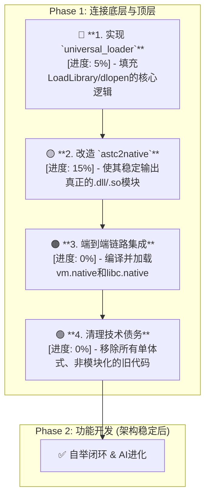

# AI-Assisted Task Plan: Unifying a Divided Architecture

**核心诊断:** 经过对`src`目录的再次全面审查，项目的核心问题依然存在且愈发清晰：项目分裂为**两个未连接的世界**。
- **底层世界 (技术深):** `src/runtime` 目录下充满了强大的底层组件（JIT、多架构后端、优化器、模块加载器逻辑）。技术上非常先进。
- **顶层世界 (架构蓝图):** `src/universal_loader.c` 描绘了PRD所要求的顶层模块化架构，但其核心功能**仍是存根(stub)**，未被实现。

**结论:** 我们拥有所有制造汽车的高级零件，但没有将它们组装起来。**首要任务不变：必须立即开始动手，用代码实现顶层架构，将强大的底层能力真正连接和驱动起来。**

---
## 🚨 **Phase 1: 架构统一 (Architectural Unification) - 紧急**

---

## 1. 进度评估 (Progress Assessment)

| 关键组件 | PRD要求 | 完成度 | 现状分析 |
| --- | --- | --- | --- |
| **`c2astc`** | C到ASTC的编译器 | **85%** | 功能非常完整和强大。 |
| **`astc2native`** | ASTC到原生码的JIT | **75%** | 底层代码生成能力、多架构支持和优化器都非常先进。但输出格式仍需改造。 |
| **`universal_loader`** | 跨平台动态模块加载器 | **5%** | **关键瓶颈。** 仅有框架和存根，核心的加载逻辑完全缺失。 |
| **模块化** | VM/LibC分离 | **10%** | 意图明确（有`vm_x64_64_native.c`等文件），但没有实际的构建和加载流程来支持。 |
| **架构统一** | 各组件协同工作 | **0%** | 系统无法作为一个整体运行。 |

## 2. 行动计划 (Action Plan - Unchanged & Urgent)

此前的行动计划依然完全适用，现在执行它比任何时候都更重要。

### **Step 1: 完成`universal_loader`的模块加载功能 (2-3天)**
- **目标:** 填充`universal_loader.c`中的`load_native_module`函数。
- **任务:**
    1.  使用`#ifdef`区分平台。
    2.  **Windows:** 实现`LoadLibrary(filename)`和`GetProcAddress`的逻辑。
    3.  **Linux/macOS:** 实现`dlopen(filename, RTLD_LAZY)`和`dlsym`的逻辑。
- **验收标准:** `universal_loader.exe`能够加载一个（由外部工具如GCC/Clang/MSVC编译的）简单的测试`.dll`/`.so`文件并调用其中的函数。

### **Step 2: 改造 `astc2native` 以生成标准动态模块 (3-4天)**
- **目标:** 让我们的工具链能生成被`universal_loader`使用的`.dll`/`.so`文件。
- **任务:**
    1.  修改`compiler_astc2rt.c`（`astc2native`的后端），使其可以生成**符合操作系统规范的动态库**而不是可执行文件。
    2.  确保`vm_init_and_run`等函数被正确添加到模块的**导出表**中。
- **验收标准:** `tool_astc2native.exe -shared vm.c -o vm.native`能生成一个可被`universal_loader.exe`加载的`vm.native`文件。

### **Step 3: 端到端集成与链路验证 (1-2天)**
- **目标:** 将改造后的工具链和加载器结合，跑通PRD定义的完整流程。
- **任务:**
    1.  创建统一的构建脚本`build_modular.bat`。
    2.  脚本编译出`vm.native`和`libc.native`。
    3.  编译`universal_loader.exe`。
    4.  运行`universal_loader.exe my_program.astc`进行端到端测试。
- **验收标准:** 系统能够完整、正确地执行一个测试程序。

### **Step 4: 清理技术债务 (1天)**
- **目标:** 移除所有与旧架构冲突的代码和脚本。
- **任务:** 删除`loader.c`, `enhanced_runtime_with_libc.c`等单体式文件和对应的旧构建脚本。
- **验收标准:** `src`目录结构清晰，只包含模块化架构的组件。

---
**总结:** 项目的底层技术积累非常雄厚，但现在所有的资源和注意力都必须集中在**完成顶层架构的实现**上。这是解锁项目全部潜能、进入下一阶段（自举和AI进化）的唯一途径。 