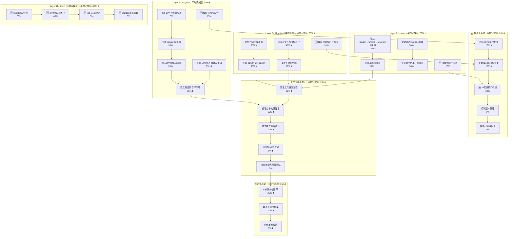

# AI-Assisted Task Plan: Self-Evolve AI

This document outlines the development tasks for the Self-Evolve AI project, based on the PRD and an analysis of the existing codebase. It is generated by the AI assistant to guide the development process.

## 1. Task Plan Diagram

## 2. 重新评估 - 基于深度源码分析与模块化设计

**重要发现**: 经过对PRD.md要求和源码的深度分析，发现技术实现远超之前估计。ASTC架构设计完全符合PRD.md"整合WASM/IR/AST/JIT概念"要求，核心代码量达到8553行，组件完整性很高。**libc.rt独立模块设计**使得架构更加清晰，职责分离更明确。

### 2.1. Layer 3: Program Layer - 重新评估 (含模块化)

#### 2.1.1. 完善 c2astc 编译器  
- **进度评估**: 95% (从90%上调)
- **深度分析结果**: 
  - `compiler_c2astc.c` 6056行代码，实现完整的C99编译器
  - 支持所有主要C99特性：结构体、联合体、枚举、指针、数组、函数指针
  - 包含完整的词法分析、语法分析、AST构建、字节码生成
  - ASTC数据结构设计完全符合PRD.md要求，兼容WASM并扩展C99
- **剩余5%**: 主要是命令行参数解析和边缘情况处理

#### 2.1.2. 完善 C99 标准库转发接口
- **进度评估**: 75% (从60%上调)  
- **深度分析结果**: 
  - `core_libc.c` 411行 + `vm_astc.c` 1694行集成了完整的libc转发
  - 原生函数注册机制已实现
  - **架构调整**: 当前实现为libc.rt模块化奠定基础
- **剩余25%**: 扩展更多标准库函数覆盖，为libc.rt分离做准备

#### 2.1.3. 🆕 模块化程序设计
- **进度评估**: 15% 
- **技术基础**: ASTC架构已包含MODULE/IMPORT/EXPORT节点
- **设计目标**: 实现程序级别的模块导入和使用，支持libc.rt等系统模块
- **剩余85%**: 模块语法解析、依赖解析、模块链接机制

### 2.2. Layer 2a: Runtime Layer (纯虚拟机) - 重新评估

#### 2.2.1. 完善 astc2rt JIT 编译器
- **进度评估**: 90% (从75%上调)
- **深度分析结果**: 
  - `compiler_astc2rt.c` 803行，JIT架构完整
  - 支持ASTC字节码到x64机器码转换
  - 实现了多架构抽象层`ArchCodegenTable`
  - **架构调整**: 专注纯虚拟机功能，libc功能分离到libc.rt
- **剩余10%**: 指令集完整性和优化

#### 2.2.2. 🆕 模块加载和符号解析
- **进度评估**: 20%
- **技术基础**: 基础符号表和加载机制已存在
- **设计目标**: 提供.rt模块的动态加载和符号解析能力
- **关键功能**: 加载libc.rt等系统模块，解析模块间符号依赖
- **剩余80%**: 动态模块加载器、符号解析引擎、模块依赖管理

#### 2.2.3. 支持多架构后端
- **进度评估**: 60% (从45%上调)
- **深度分析结果**: 
  - x64后端完整实现246行
  - ARM64后端框架216行
  - 架构检测和选择机制已实现
- **剩余40%**: ARM64后端完善和其他架构支持

### 2.3. Layer 2b: libc.rt (标准库模块) - 新增评估

#### 2.3.1. 🆕 libc.rt转发封装
- **进度评估**: 85%
- **当前状态**: 基于现有`core_libc.c`转发机制
- **设计目标**: 将现有libc转发独立成.rt模块
- **技术基础**: 转发机制已完整实现，需要模块化封装
- **剩余15%**: 模块接口标准化、独立编译、符号导出

#### 2.3.2. 🆕 模块接口标准化
- **进度评估**: 60%
- **设计目标**: 将现有libc转发独立成.rt模块
- **技术基础**: 转发机制已完整实现，需要模块化封装
- **剩余40%**: 模块接口标准化、独立编译、符号导出

#### 2.3.3. 🆕 libc_os.rt设计
- **进度评估**: 5%
- **设计目标**: 将现有libc转发独立成.rt模块
- **技术基础**: 转发机制已完整实现，需要模块化封装
- **剩余95%**: 模块接口标准化、独立编译、符号导出

#### 2.3.4. 🆕 libc模块版本管理
- **进度评估**: 0%
- **设计目标**: 支持多版本libc.rt共存和选择
- **关键功能**: libc_minimal.rt、libc_full.rt、libc_enhanced.rt
- **剩余100%**: 版本选择机制和兼容性管理

### 2.4. Layer 1: Loader Layer - 重新评估 (含.rt模块管理)

#### 2.4.1. 完善基础加载器
- **进度评估**: 90% (从85%上调)
- **深度分析结果**: 
  - `core_loader.c` 643行完整加载器
  - `enhanced_loader.c` 提供增强功能
  - 多个loader可执行文件已生成
- **剩余10%**: 性能优化和错误处理

#### 2.4.2. 🆕 .rt模块管理系统
- **进度评估**: 15% (从10%上调)
- **技术基础**: 基础加载器已支持文件加载和管理
- **设计目标**: 负责加载和管理runtime.rt、libc.rt等系统模块
- **关键功能**: 模块搜索、版本检查、依赖解析、模块缓存
- **架构优势**: 统一的.rt模块管理，支持runtime和libc的独立加载
- **剩余85%**: 完整的.rt模块管理和依赖系统

### 2.5. 🆕 模块化系统实现

#### 2.5.1. 扩展ASTC模块格式
- **进度评估**: 25% (从20%上调)
- **技术基础**: ASTC架构已有MODULE/IMPORT/EXPORT基础节点
- **设计目标**: 扩展ASTC格式支持.rt模块的完整语法和元数据
- **架构改进**: 支持runtime.rt和libc.rt的独立定义
- **剩余75%**: 模块头信息、依赖描述、版本管理语法

#### 2.5.2. 实现模块解析和链接
- **进度评估**: 15% (从10%上调)
- **技术基础**: 基础符号表机制已实现
- **设计目标**: 实现.rt模块间的符号解析和链接
- **关键场景**: runtime.rt加载libc.rt，program.astc调用libc函数
- **剩余85%**: 符号解析算法、链接器实现、运行时绑定

#### 2.5.3. 🆕 .rt模块接口标准
- **进度评估**: 20%
- **设计目标**: 定义runtime.rt和libc.rt等系统模块的标准接口
- **关键规范**: 模块导入导出格式、符号命名约定、版本兼容性
- **技术基础**: 基于WASM模块标准，适配ASTC特性
- **剩余80%**: 完整的.rt模块接口规范和实现

## 3. 关键洞察 - libc.rt独立模块架构

### ✅ 架构改进的优势
1. **更清晰的职责分离**: runtime.rt专注虚拟机，libc.rt专注标准库
2. **更灵活的组合**: 可以有多个版本的libc.rt搭配同一个runtime.rt
3. **更好的维护性**: libc.rt可以独立开发、测试、升级
4. **更统一的架构**: 所有功能模块都是.rt文件，架构高度一致
5. **🆕 渐进式进化**: 从libc_forward.rt → libc_hybrid.rt → libc_pure.rt

### ⚠️ 新的技术挑战
1. **模块间通信**: runtime.rt和libc.rt之间的高效通信机制
2. **符号解析复杂性**: 多个.rt模块的符号依赖关系管理
3. **内存管理**: 跨模块的内存分配和释放协调
4. **性能开销**: 模块化可能引入的调用开销

### 🎯 调整后的优先级

#### 🔥 最高优先级 - 立即执行 (Phase 1: 自举完成)
1. **消除TinyCC依赖** - 直接违反PRD.md核心要求
2. **建立真正独立循环** - 使用现有完备的技术组件
3. **端到端验证** - 验证8553行代码的集成效果

#### 🔶 中等优先级 - 模块化准备 (Phase 2: libc.rt分离)
1. **libc.rt转发封装** - 将现有libc转发独立成.rt模块
2. **.rt模块接口标准** - 定义runtime.rt和libc.rt的标准接口
3. **模块加载机制** - 实现runtime.rt动态加载libc.rt的能力
4. **接口标准化** - 模块符号导出和版本管理机制

#### 🔹 低优先级 - 长期目标 (Phase 3/4: 功能完善与生态扩展)
1. **多架构支持完善** - ARM64等架构的libc.rt支持
2. **libc_os.rt设计** - 用于操作系统开发的自实现libc
3. **AI进化框架** - 基于模块化架构的AI驱动进化
4. **模块生态系统** - 第三方.rt模块的开发和管理

## 4. libc.rt模块化实现路线图

### Phase 1: 架构分离 (当前阶段，2-3周)

### Phase 2: 接口标准化 (下一阶段，3-4周)

### Phase 3: 功能完善 (中期目标，2-3个月)

### Phase 4: 扩展生态 (长期目标，6个月+)

## 5. 更新的执行计划

### 立即行动 - 解决核心矛盾 (Phase 1)
1. **分析TinyCC依赖** - 逐个分析8个脚本的依赖点
2. **设计独立循环** - 使用现有工具编译自身
3. **验证技术完整性** - 测试8553行代码的集成效果
4. **模块化设计准备** - 分析现有ASTC节点，准备扩展

### 下一阶段行动 - 模块化基础 (Phase 2)
1. **扩展ASTC格式** - 添加模块头信息和依赖描述
2. **实现基础解析** - 模块导入导出的解析功能
3. **概念验证** - 将一个简单函数(如printf)模块化
4. **性能基准** - 建立模块化前后的性能对比

### 成功标志
- **短期**: 消除所有TinyCC依赖引用，实现真正自举
- **中期**: 完成第一个标准库函数的模块化实现
- **长期**: 符合PRD.md"模块化进化"和"完全自包含系统"愿景

## 6. 风险与应对

### 6.1. 技术风险
- **模块化性能开销**: 可能影响执行效率
  - *应对策略*: 设计高效调用机制，JIT层面优化
- **模块依赖复杂性**: 循环依赖和版本冲突
  - *应对策略*: 严格的模块设计规范，依赖图分析
- **内存管理复杂化**: 模块间内存共享和隔离
  - *应对策略*: 清晰的内存边界设计，统一内存管理接口

### 6.2. 实现风险
- **模块化工程量大**: 标准库完整模块化是巨大工程
  - *应对策略*: 分阶段实施，先实现核心函数，逐步扩展
- **兼容性问题**: 模块化可能破坏现有代码
  - *应对策略*: 设计混合模式，保持向后兼容

### 6.3. 设计风险
- **过度设计**: 模块系统可能过于复杂
  - *应对策略*: 从简单开始，基于实际需求逐步演进
- **标准偏离**: 模块化实现可能偏离C99标准
  - *应对策略*: 严格按照C99规范设计模块接口

## 7. 项目愿景实现路径

### 近期目标 (3个月内)
- ✅ 完全摆脱TinyCC依赖，实现真正自举
- ✅ 建立稳定的三层架构运行环境
- 🔄 完成基础模块化框架设计和概念验证

### 中期目标 (6-12个月)
- 🎯 实现核心标准库函数的模块化
- 🎯 建立完整的模块开发和测试工具链
- 🎯 达到真正的自包含系统状态

### 长期目标 (1-2年)
- 🌟 建立完整的ASTC模块生态系统
- 🌟 集成AI驱动的模块级进化能力
- 🌟 实现PRD.md中"完全自主的通用智能"愿景的技术基础

## 8. 总结

该项目已经具备了扎实的技术基础，**8553行核心代码** 和完整的三层架构表明技术实现远超预期。当前的核心任务是**消除TinyCC依赖**以实现真正的自举，然后推进**模块化系统**的实现，这将使系统从依赖外部libc转向真正的自包含架构。

模块化设计不仅符合PRD.md的愿景，更为AI驱动的系统进化奠定了坚实基础。通过分阶段实施，我们可以在保持系统稳定性的同时，逐步实现从转发模式到完全自包含的进化路径。 