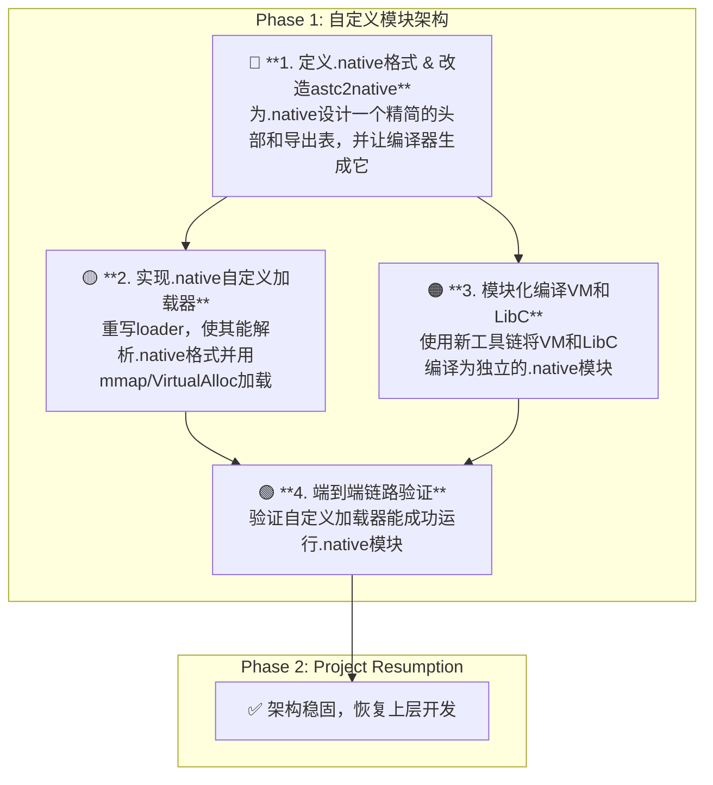

# AI-Assisted Task Plan: A Custom, Self-Reliant Modular Architecture

**核心理念澄清:** 经过深入讨论，明确`.native` **不是**一个标准的`.dll`/`.so`文件，而是一个**自定义的、可重用的、平台无关的二进制模块格式**。这极大地降低了编译工具链的复杂度，并与项目独立自主的哲学保持一致。

**战略核心:** `astc2native` (原`astc2rt`) 的职责是生成带有自定义头的`.native`模块。`loader`的职责是成为一个**针对`.native`格式的自定义加载器**，负责解析该格式并使其在内存中可执行。

---
## 🚨 **Phase 1: 实现自定义模块架构 (The True Vision)**


---

## 1. 技术方案 (The "Custom Loader" Approach)

放弃兼容PE/ELF的复杂路线。新方案将复杂度合理地分配到工具链和加载器中。

| 组件 | 新职责 | 优点 |
| --- | --- | --- |
| **`astc2native`** | **轻量级打包器**：将JIT生成的原始机器码，用自定义的`.native`头和导出表进行"包装"。 | **简单、快速、跨平台**。无需处理PE/ELF的复杂规范。 |
| **`.native`格式** | **自定义二进制格式**：一个极简的规范，仅包含魔数、架构标识、代码节位置、导出表等项目所需信息。 | **完全自主可控**，可随AI进化需求扩展。 |
| **`loader`** | **自定义加载器**：负责解析`.native`格式，请求可执行内存，将代码载入，并解析导出函数地址以供调用。 | **将平台相关性隔离**在唯一需要与OS交互的`loader`中。 |

## 2. 新行动计划 (New Action Plan)

### **Step 1: 定义`.native`格式并改造`astc2native` (2-3天)**
- **目标:** 设计一个V1版的`.native`格式，并让`astc2native`可以生成它。
- **`.native`格式V1定义:**
    ```c
    struct NativeHeader {
        char magic[4]; // "NATV"
        uint32_t version;
        uint32_t target_arch;
        uint32_t code_section_offset;
        uint32_t code_section_size;
        uint32_t export_table_offset;
        uint32_t export_table_count;
        // ... a_entry_point_offset ...
    };
    struct NativeExport {
        char function_name[56];
        uint32_t function_offset; // 相对于代码节起始位置的偏移
    };
    ```
- **`astc2native`改造任务:**
    1.  实现上述结构体。
    2.  修改其主流程，在JIT生成机器码后，不是直接写入文件，而是：
        a.  创建一个`NativeHeader`实例并填充。
        b.  创建一个`NativeExport`数组。
        c.  将Header、Export Table和机器码顺序写入到一个新文件中。
    3.  正式更名为 `tool_astc2native.exe`。
- **产出:** 一个能将`.astc`编译为`.native`文件的`tool_astc2native.exe`。

### **Step 2: 实现`.native`自定义加载器 (3-4天)**
- **目标:** 重写`loader.c`，使其能够加载并执行`.native`文件。
- **`loader`加载流程:**
    1.  `fopen`/`fread`将整个`.native`文件读入内存缓冲区。
    2.  解析`NativeHeader`，检查`magic`和`target_arch`。
    3.  **向OS请求可执行内存**:
        -   Windows: `VirtualAlloc(NULL, header.code_section_size, MEM_COMMIT, PAGE_EXECUTE_READWRITE);`
        -   Linux/macOS: `mmap(NULL, header.code_section_size, PROT_READ | PROT_WRITE | PROT_EXEC, MAP_PRIVATE | MAP_ANONYMOUS, -1, 0);`
    4.  `memcpy`将缓冲区中的机器码部分复制到新分配的可执行内存中。
    5.  解析缓冲区中的导出表，找到`vm_init_and_run`的函数偏移量。
    6.  计算绝对地址：`void* entry_point = (void*)((char*)executable_memory + export.function_offset);`
    7.  将地址转换为函数指针并调用。
- **产出:** 一个可以独立加载并运行`.native`模块的`loader.exe`。

### **Step 3: 模块化编译与集成 (2-3天)**
- **目标:** 使用新工具链生成并集成`vm.native`和`libc.native`。
- **任务:**
    1.  使用`tool_astc2native.exe`将VM核心代码编译为`vm_x64_64.native`。
    2.  使用`tool_astc2native.exe`将LibC核心代码编译为`libc_x64_64.native`。
    3.  改造VM的实现，使其在需要调用LibC函数时，也使用`loader`提供的类似加载流程（或由`loader`在启动时注入函数指针），来加载并使用`libc.native`。
- **产出:** `bin`目录下的`vm.native`和`libc.native`，以及一个能够协同工作的VM。

### **Step 4: 端到端链路验证 (1天)**
- **目标:** 确保整个自定义架构可以跑通一个完整的程序。
- **任务:** 运行`loader.exe my_program.astc`，确认`loader`加载`vm.native`，`vm.native`加载`libc.native`，并最终正确执行程序。
- **产出:** 一个通过集成测试的、架构正确的、符合项目哲学的系统。

---
**总结:** 此方案完美契合了"`.native`是可重用binary"的设计思想，避免了过度工程化，并将平台相关性严格限制在`loader`中，为后续的跨平台和自主进化奠定了坚实、简洁、正确的基础。 