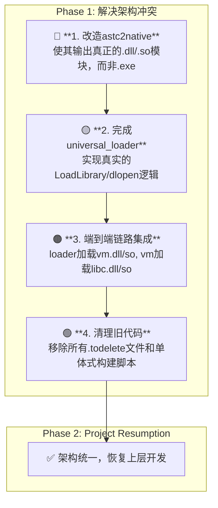

# AI-Assisted Task Plan: Resolving the Architectural Conflict

**核心诊断:** 对`src`目录的深度审查确认了项目的巨大进展，但也揭示了一个根本性的**架构冲突**。
- **工具链 (`astc2native`)**: 已具备生成完整PE可执行文件的能力，倾向于**单体式(Monolithic)**架构。
- **加载器 (`universal_loader.c`)**: 被设计为动态加载`.native`模块，遵循**模块化(Modular)**架构，但其实现是一个**尚未完成的存根**。

项目正同时朝两个相反的架构方向发展。必须立即解决此冲突，统一到一个清晰的、符合PRD的设计上。

**战略决策:** 鉴于`universal_loader.c`已为模块化打下良好基础，我们将**坚定不移地走模块化道路**。我们将改造`astc2native`，使其生成真正的动态模块（DLL/SO），并完成`universal_loader`的实现来加载它们。

---
## 🚨 **Phase 1: 统一并实现PRD的模块化架构**

---

## 1. 现状评估 (Current Status)

- **[70%] `tool_astc2native`**: 功能强大，能将C/ASTC编译为多平台机器码。已包含一个`generate_pe_executable`函数，证明其有能力输出带OS头的二进制文件。
- **[40%] `universal_loader.c`**: 设计优秀，正确地规划了平台检测、模块名构建等逻辑。但核心的`load_native_module`函数是空的。
- **[10%] 模块化**: `vm_x64_64_native.c`和`libc_x64_64_native.c`等文件的存在表明模块化的意图，但没有一个能将它们构建为独立模块并加载的流程。
- **[0%] 架构一致性**: 工具链和加载器的目标不匹配，导致整个系统无法工作。

## 2. 新行动计划 (New Action Plan)

### **Step 1: 改造 `astc2native` 以生成真正的动态模块 (3-4天)**
- **目标:** 修改`compiler_astc2rt.c`中的`generate_pe_executable`函数（并为其创建一个ELF对应版本），使其生成的不是`.exe`，而是一个**最小化的`.dll` (Windows) 或 `.so` (Linux)**。
- **关键任务:**
    1.  **修改PE/ELF头:** 调整文件头中的标志位，将其从`IMAGE_FILE_EXECUTABLE_IMAGE`（可执行文件）改为`IMAGE_FILE_DLL`（动态链接库）。
    2.  **实现导出表:** 确保`vm_init_and_run`或`libc_printf`等函数被正确添加到模块的导出表中，以便`GetProcAddress`/`dlsym`可以找到它们。
    3.  **移除入口点:** DLL/SO文件不需要传统的`main`或`_start`入口点。确保生成过程中不包含它们。
    4.  **命令行调整:** `tool_astc2native.exe` 添加 `-shared` 标志，用于触发生成`.dll`/`.so`。
- **产出:**
    - `tool_astc2native -shared vm.c -o vm.native` → 生成 `vm.native` (一个有效的.dll/.so)
    - `tool_astc2native -shared libc.c -o libc.native` → 生成 `libc.native`

### **Step 2: 完成`universal_loader`的模块加载功能 (2-3天)**
- **目标:** 填充`universal_loader.c`中的`load_native_module`函数，使其成为一个真正的动态加载器。
- **任务:**
    1.  **平台宏:** 使用`#ifdef _WIN32`, `#elif defined(__linux__) || defined(__APPLE__)`来包裹平台特定的代码。
    2.  **Windows实现:**
        -   使用`LoadLibrary(filename)`加载`.native`模块。
        -   返回的`HMODULE`就是`LoadedModule.handle`。
        -   (可选) 实现一个`get_native_function(handle, func_name)`，内部调用`GetProcAddress`。
    3.  **Linux/macOS实现:**
        -   使用`dlopen(filename, RTLD_LAZY)`加载`.native`模块。
        -   返回的`void*`就是`LoadedModule.handle`。
        -   (可选) 实现一个`get_native_function(handle, func_name)`，内部调用`dlsym`。
- **产出:** `universal_loader.exe`现在可以加载`.native`模块并获取其中的函数指针。

### **Step 3: 端到端集成与链路验证 (1-2天)**
- **目标:** 将改造后的工具链和加载器结合，跑通完整流程。
- **任务:**
    1.  创建一个新的、统一的构建脚本`build_modular.bat`。
    2.  该脚本首先使用`astc2native -shared`编译出`vm.native`和`libc.native`。
    3.  然后编译`universal_loader.exe`。
    4.  最后，运行一个测试，例如`universal_loader.exe my_program.astc`，并验证`loader`能加载`vm.native`，`vm.native`能加载`libc.native`，并最终打印出"Hello World"。
- **产出:** 一个可工作的、符合PRD模块化设计的原型。

### **Step 4: 清理技术债务 (1天)**
- **目标:** 移除所有与旧架构和冲突架构相关的代码和脚本。
- **任务:**
    1.  删除所有`.todelete`文件。
    2.  删除`loader.c`, `enhanced_runtime_with_libc.c`等单体式文件。
    3.  删除`build_c99.bat`等旧的、非模块化的构建脚本。
- **产出:** 一个干净、统一、遵循唯一架构的`src`目录。

---
**总结:** 这个计划直接面对核心的架构冲突，并提供了一个清晰的、分步骤的解决方案。完成后，项目将首次拥有一个统一、连贯、且符合PRD愿景的技术基础，为后续的自举和AI进化扫清了最大的障碍。 