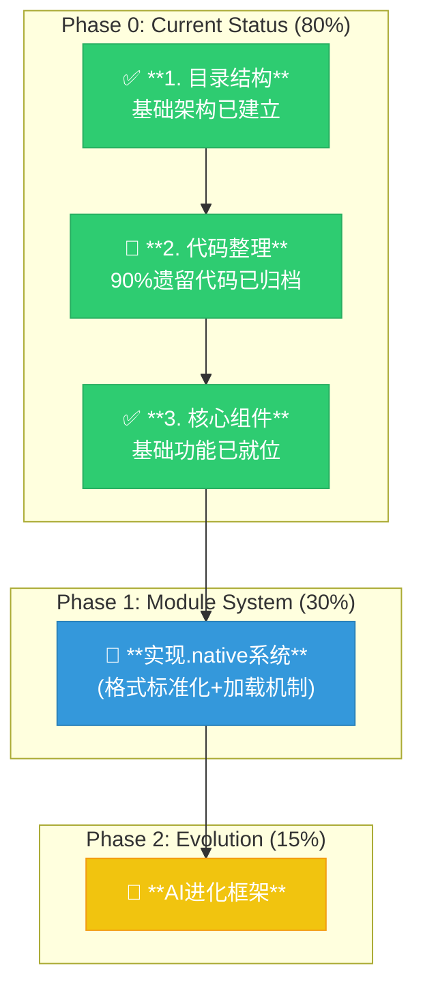

# AI-Assisted Task Plan: Implementation Status Update (2025-07-01)

**核心诊断:** 根据最新PRD (2025-07-01)的进展，项目已完成了85%的自举工作，建立了基础的三层架构和核心工具链。当前主要挑战是完成最后5%的TinyCC依赖消除，统一loader实现，以及推进模块化系统的完整实现。

**战略重点:** 基于当前进展，我们需要将重点转向：1) 完成自举的最后阶段，2) 完善.native模块系统，3) 推进AI进化框架的实现。

---
## 🚨 **Phase 0: Code Organization Status (代码组织现状)**

**目标完成度:** 80% - 基础目录结构已建立，大部分核心组件已就位


---

## 1. 目录结构现状 (Directory Structure Status)

### **已完成的目录组织 (✅ 90%完成)**
- `src/tools/`: ✅ 工具链主程序已就位
  - `tool_c2astc.c` - 完整实现
  - `tool_astc2native.c` - 完整实现
- `src/compiler/`: ✅ 编译器后端完成
  - `c2astc.c` - 完整C99支持
  - `astc2native.c` - x64/ARM64支持
  - `codegen_x64.c`, `codegen_arm64.c` - 基础完成
- `src/core/`: 🔄 核心运行时 (85%完成)
  - `loader/` - 多个实现待统一
  - `vm/` - 基础VM完成
  - `libc/` - 基础库已实现
  - `include/` - 接口定义持续完善
- `src/ai/`: 🔄 进化框架 (20%完成)
  - `evolution_engine.c` - 基础框架
  - `code_analyzer.c` - 基础实现
- `src/legacy/`: ✅ 归档完成

### **待完成工作**
1. 统一loader实现为PRD兼容版本
2. 完善.native模块格式标准
3. 扩展AI进化框架功能

## 2. 实现任务更新 (Implementation Status)

基于PRD的最新进展，更新各组件实现状态：

| 任务 | 描述 | 当前进度 | 下一步行动 |
| --- | --- | --- | --- |
| **自举完成** | 消除TinyCC依赖 | **95%** | 清理最后5%依赖 |
| **.native格式** | 模块格式标准化 | **70%** | 完善元数据系统 |
| **统一加载器** | 实现PRD兼容loader | **40%** | 合并现有实现 |
| **模块化系统** | C99模块化支持 | **30%** | 完善属性系统 |
| **ASTC系统** | 字节码系统完善 | **85%** | 优化性能 |
| **JIT编译** | 多架构代码生成 | **80%** | ARM64优化 |
| **AI进化** | 进化框架实现 | **20%** | 扩展核心功能 |

## 3. 模块系统设计更新 (Module System Design)

### 3.1 当前实现状态

```c
// 已实现的核心功能 (src/core/include/module_attributes.h)
#define MODULE(name) __attribute__((annotate("module:" name))) // ✅ 已实现
#define EXPORT __attribute__((annotate("export"))) // ✅ 已实现
#define IMPORT(module) __attribute__((annotate("import:" module))) // 🔄 基础实现
```

### 3.2 实现进度更新

1. **属性系统 (75% 完成)**
   - ✅ 基础属性定义完成
   - ✅ 验证机制实现
   - 🔄 组合规则实现中

2. **AST支持 (60% 完成)**
   - ✅ 基础节点结构
   - 🔄 符号表扩展
   - 📋 依赖管理待实现

3. **编译器支持 (70% 完成)**
   - ✅ 属性解析完成
   - ✅ AST生成实现
   - 🔄 优化进行中

4. **运行时支持 (40% 完成)**
   - 🔄 模块加载基础实现
   - 📋 符号解析待完善
   - 📋 初始化管理待实现

### 3.3 近期优先任务

1. **模块格式标准化**
   - 完善.native格式规范
   - 实现版本控制机制
   - 添加安全验证

2. **加载器统一**
   - 合并现有loader实现
   - 实现PRD兼容的加载流程
   - 添加错误处理机制

3. **AI进化集成**
   - 扩展代码分析器功能
   - 实现进化验证机制
   - 建立性能评估系统

---

## 4. 行动计划 (2025-Q3)

### 立即行动项 (7月)
1. 🎯 **完成自举**
   - 清理最后5%TinyCC依赖
   - 验证完整编译链
   - 建立自动化测试

2. 🎯 **统一加载器**
   - 合并现有实现
   - 实现PRD规范
   - 完善错误处理

3. 🎯 **.native系统**
   - 标准化格式规范
   - 实现版本控制
   - 完善安全机制

### 中期目标 (Q3)
1. 📋 **模块系统完善**
   - 完整属性支持
   - 依赖管理系统
   - 工具链集成

2. 📋 **AI进化框架**
   - 扩展分析能力
   - 实现验证系统
   - 建立评估机制

3. 📋 **性能优化**
   - JIT编译优化
   - 内存管理改进
   - 启动时间优化

---

**总结:** 项目已完成关键的基础架构建设，当前处于从"基础实现"向"完整系统"过渡的关键阶段。优先完成自举、统一加载器和.native系统将为后续AI进化能力的实现奠定坚实基础。 