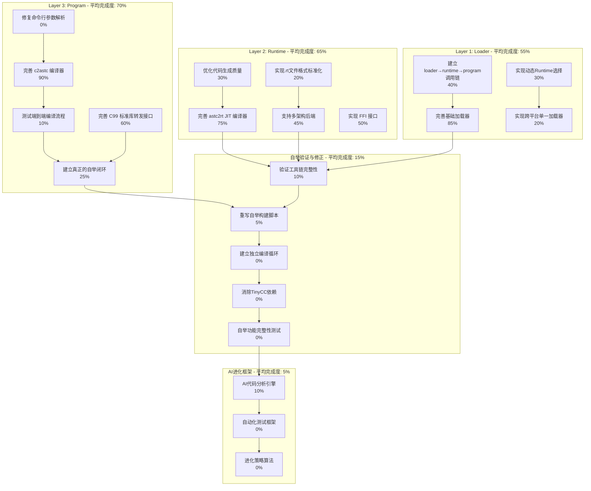

# AI-Assisted Task Plan: Self-Evolve AI

This document outlines the development tasks for the Self-Evolve AI project, based on the PRD and an analysis of the existing codebase. It is generated by the AI assistant to guide the development process.

## 1. Task Plan Diagram



## 2. 立即可执行任务清单

### 🔥 高优先级 - 本周完成

#### 2.1 修复命令行参数解析 (A4 - 0% → 100%)
**问题**: `bin\tool_c2astc.exe --version` 报错，参数解析有问题
**任务**:
- [ ] 检查`tool_c2astc.c`的main函数参数处理
- [ ] 实现标准的命令行选项支持 (--help, --version, -o)
- [ ] 测试基本命令行功能
- [ ] 修复编码问题导致的错误信息显示

#### 2.2 验证工具链完整性 (D1 - 10% → 80%)
**目标**: 测试c2astc→astc2rt→loader完整流程
**任务**:
- [ ] 创建简单测试用例 (`tests/toolchain_test.c`)
- [ ] 测试: `tool_c2astc.exe test.c → test.astc`
- [ ] 测试: `tool_astc2rt.exe test.astc → test_x64_64.rt`  
- [ ] 测试: `enhanced_loader.exe test_x64_64.rt tests/simple_test.astc`
- [ ] 记录每个步骤的成功/失败状态
- [ ] 识别缺失的功能和集成问题

#### 2.3 建立loader→runtime→program调用链 (C3 - 40% → 90%)
**问题**: 三层架构调用链可能不完整
**任务**:
- [ ] 验证loader能正确加载.rt文件
- [ ] 验证runtime能正确执行.astc程序
- [ ] 测试参数传递和返回值处理
- [ ] 完善错误处理和状态传递

### 🔶 中优先级 - 下周完成

#### 2.4 重写自举构建脚本 (D2 - 5% → 100%)
**问题**: 现有`build_true_self_hosted.bat`仍依赖TinyCC
**任务**:
- [ ] 分析现有脚本的TinyCC依赖点
- [ ] 设计新的自举序列：已有工具编译自身
- [ ] 实现`build_bootstrap_independent.bat`
- [ ] 测试完全独立的编译循环
- [ ] 验证生成的工具能编译自身

#### 2.5 实现.rt文件格式标准化 (B5 - 20% → 80%)
**问题**: .rt文件格式可能不统一
**任务**:
- [ ] 定义标准的.rt文件头格式
- [ ] 实现架构检测和选择机制
- [ ] 建立.rt文件版本兼容性
- [ ] 优化.rt文件大小和加载速度

#### 2.6 优化代码生成质量 (B4 - 30% → 70%)
**任务**:
- [ ] 分析当前JIT生成的机器码质量
- [ ] 实现基本的寄存器分配优化
- [ ] 添加死代码消除
- [ ] 优化函数调用约定

### 🔹 低优先级 - 后续迭代

#### 2.7 建立独立编译循环 (D3 - 0% → 100%)
**前置条件**: D1, D2完成
**任务**:
- [ ] 使用自己的工具编译`compiler_c2astc.c`
- [ ] 使用自己的工具编译`compiler_astc2rt.c`
- [ ] 使用自己的工具编译`core_loader.c`
- [ ] 验证生成的新工具功能完整
- [ ] 实现完全自举的循环验证

#### 2.8 消除TinyCC依赖 (D4 - 0% → 100%)
**前置条件**: D3完成
**任务**:
- [ ] 识别所有脚本中的TinyCC调用
- [ ] 替换为自己的工具调用
- [ ] 移除external/tcc-win目录依赖
- [ ] 验证系统完全独立运行

## 3. 具体执行步骤 - 本周行动

### 今天立即执行:

#### 步骤1: 修复tool_c2astc命令行 (30分钟)
```bash
# 检查当前问题
bin\tool_c2astc.exe --help
# 预期: 应该显示帮助信息，而不是报错

# 查看源码
# 修复 src/tool_c2astc.c 中的参数解析
# 重新编译测试
```

#### 步骤2: 创建工具链测试 (1小时)
```bash
# 创建简单测试
echo "int main() { return 42; }" > tests/simple_test.c

# 测试完整流程
bin\tool_c2astc.exe tests/simple_test.c -o tests/simple_test.astc
bin\tool_astc2rt.exe tests/simple_test.astc -o tests/simple_test_x64_64.rt
bin\enhanced_loader.exe tests/simple_test_x64_64.rt tests/simple_test.astc
```

#### 步骤3: 验证loader调用链 (1小时)
```bash
# 检查loader是否正确调用runtime
# 检查runtime是否正确执行program
# 测试参数传递和返回值
```

### 明天执行:

#### 步骤4: 分析自举脚本依赖 (2小时)
- 逐行分析`build_true_self_hosted.bat`
- 识别每个TinyCC调用点
- 设计替换方案

#### 步骤5: 设计新自举序列 (2小时)
- 规划使用现有工具编译自身的步骤
- 处理循环依赖问题
- 设计增量验证方法

## 4. 成功标准

### 短期目标 (本周)
- [ ] tool_c2astc命令行参数正常工作
- [ ] 能完成一个简单C程序的端到端编译
- [ ] loader能正确调用runtime执行program

### 中期目标 (2周内)  
- [ ] 新的自举脚本完全不依赖TinyCC
- [ ] 系统能使用自己的工具编译自身
- [ ] 生成的新工具功能完整

### 长期目标 (1个月内)
- [ ] 完全独立的自举循环建立
- [ ] AI进化框架开始运行
- [ ] 系统开始真正的自我进化

## 5. 风险与应对

### 高风险
- **工具链不完整**: 可能某些关键功能缺失
  - *应对*: 逐步验证，及时补充缺失功能
- **循环依赖**: 自举过程可能存在死锁
  - *应对*: 设计增量自举策略

### 中风险  
- **性能问题**: JIT生成的代码可能效率低
  - *应对*: 优先保证功能，后续优化性能
- **兼容性问题**: 不同架构支持可能不完整
  - *应对*: 先专注x64，其他架构后续添加 