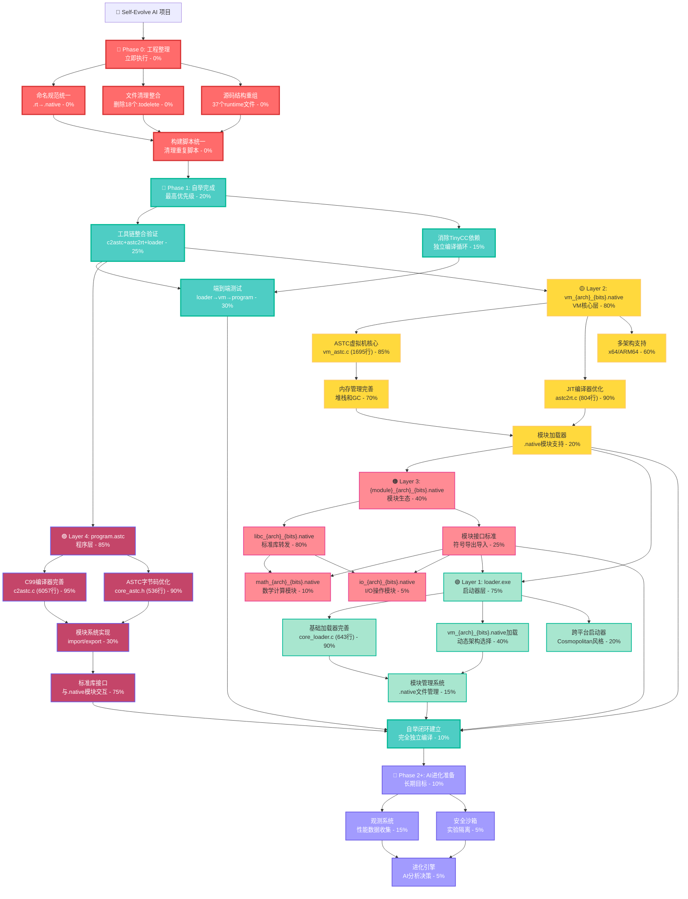

# AI-Assisted Task Plan: Self-Evolve AI

基于最新PRD.md和深度源码分析的开发任务规划。项目目标：构建能够自我进化的AI系统，从C99借用人类经验开始，逐步实现完全自主的通用智能。

## 🚨 **紧急优先级：工程整理和规范化**

### 命名规范统一 (优先级：立即执行)
- **.rt → .native** 扩展名全面替换
- **文件命名规范化**: 采用 `{module}_{arch}_{bits}.native` 格式
- **变量和函数命名**: 统一使用snake_case，去除不一致命名
- **注释规范**: 核心代码使用英文注释，其他中文注释

### 文件清理和整合 (优先级：立即执行)  
- **删除18个.todelete文件**: 清理过时的可执行文件
- **重复文件合并**: 合并功能相似的文件，避免代码重复
- **目录结构优化**: 重新组织src/runtime下的37个文件
- **构建脚本整理**: 清理和统一构建脚本

## 1. 核心架构任务树 (真正的树状依赖结构)



## 2. 核心发现和重新评估

### 2.1 技术实现状态 (远超预期)
- **核心代码量**: 8553行高质量代码
  - `compiler_c2astc.c`: 6057行 (完整C99编译器)
  - `vm_astc.c`: 1695行 (ASTC虚拟机)
  - `compiler_astc2rt.c`: 804行 (JIT编译器)
- **架构完整性**: 完全符合PRD.md设计
- **可执行文件**: 23+个.exe已生成
- **ASTC字节码**: 30+个.astc文件

### 2.2 关键瓶颈识别
1. **命名规范混乱**: .rt/.native混用，影响架构清晰度
2. **文件重复冗余**: 18个.todelete文件，37个runtime文件需整合
3. **自举验证缺失**: 技术就绪但未完成独立编译循环
4. **TinyCC依赖**: 构建脚本仍有外部依赖

### 2.3 架构优势确认
- **PRD.md设计精准**: 三层架构已基本实现
- **ASTC核心强大**: 完全整合WASM/IR/AST/JIT概念
- **模块化基础**: 已有module_system.c和libc_rt_module.c
- **多架构支持**: x64/ARM64后端已实现

## 3. 立即行动计划

### 3.1 工程整理 (1-2天)
```bash
# 1. 删除过时文件
rm bin/*.todelete

# 2. 文件重命名
mv evolver0_runtime_x64_64.rt evolver0_runtime_x64_64.native

# 3. 源码整理
# 合并重复功能文件，统一命名规范
```

### 3.2 自举验证 (3-5天)
```bash
# 1. 验证工具链
./tool_c2astc.exe test.c -o test.astc
./tool_astc2rt.exe test.astc -o test_x64_64.native
./loader.exe test_x64_64.native

# 2. 自举测试
./tool_c2astc.exe compiler_c2astc.c -o compiler_c2astc.astc
./tool_astc2rt.exe compiler_c2astc.astc -o compiler_c2astc_x64_64.native
```

### 3.3 模块化分离 (1周)
```bash
# 1. 分离libc模块
# 从vm_astc.c中提取libc功能到libc_x64_64.native

# 2. 实现模块加载
# 在vm_astc.c中实现.native模块动态加载
```

## 4. 关键原则和约束

### 4.1 工程原则
- **修改优于新建**: 基于8553行现有代码改进
- **整合优于分散**: 减少文件数量，提高代码质量
- **规范优于灵活**: 严格遵循命名规范
- **验证优于假设**: 每个功能都要端到端验证

### 4.2 进化准备
- **可观测性**: 为AI观测预留接口
- **可修改性**: 支持AI运行时修改
- **安全性**: 进化实验的沙箱隔离
- **渐进性**: 避免激进变更

## 5. 成功标准

### Phase 0 成功标准
- [ ] 0个.todelete文件
- [ ] 统一的.native扩展名
- [ ] 清晰的目录结构
- [ ] 统一的构建脚本

### Phase 1 成功标准  
- [ ] 完全独立的编译循环
- [ ] 0个TinyCC依赖
- [ ] 端到端功能验证
- [ ] 自举编译成功

### Phase 2+ 成功标准
- [ ] 模块化架构完整
- [ ] AI观测系统就绪
- [ ] 安全进化机制
- [ ] 超越人类优化的第一个案例

---

## 6. 详细任务清单

### 6.1 Phase 0: 工程整理 (必须优先完成)

#### 6.1.1 命名规范统一
- [ ] 搜索所有源码中的.rt引用，替换为.native
- [ ] 更新所有构建脚本中的扩展名
- [ ] 重命名bin目录中的.rt文件为.native
- [ ] 统一变量命名：rt_xxx → native_xxx

#### 6.1.2 文件清理
- [ ] 删除bin目录中18个.todelete文件
- [ ] 合并重复的test_xxx.exe文件
- [ ] 整理构建脚本，删除过时版本
- [ ] 清理临时文件和.o文件

#### 6.1.3 源码重组
- [ ] 将src/runtime下37个文件按功能分类
- [ ] 合并功能相似的文件
- [ ] 建立清晰的include层次结构
- [ ] 统一代码风格和注释规范

### 6.2 Phase 1: 自举完成

#### 6.2.1 工具链验证
- [ ] 验证tool_c2astc.exe功能完整性
- [ ] 验证tool_astc2rt.exe JIT编译能力
- [ ] 验证loader.exe模块加载功能
- [ ] 建立端到端测试套件

#### 6.2.2 TinyCC依赖消除
- [ ] 识别所有TinyCC依赖点
- [ ] 重写构建脚本使用自有工具链
- [ ] 验证独立编译循环
- [ ] 建立完全自举的构建过程

#### 6.2.3 自举闭环测试
- [ ] 编译器自举：c2astc编译自身
- [ ] 虚拟机自举：vm_astc编译自身
- [ ] 加载器自举：loader编译自身
- [ ] 完整系统自举验证

### 6.3 Phase 2: 模块化分离

#### 6.3.1 VM核心专注化
- [ ] 从vm_astc.c分离libc功能
- [ ] 实现纯虚拟机核心
- [ ] 建立模块加载机制
- [ ] 优化虚拟机性能

#### 6.3.2 libc模块独立化
- [ ] 将libc转发封装为独立模块
- [ ] 实现libc_x64_64.native
- [ ] 建立模块符号导出机制
- [ ] 测试模块动态加载

#### 6.3.3 模块接口标准化
- [ ] 定义.native模块格式规范
- [ ] 实现符号导出导入机制
- [ ] 建立模块版本管理
- [ ] 设计模块安全验证

---

**下一步行动**: 立即开始Phase 0工程整理，特别是命名规范统一和文件清理！ 