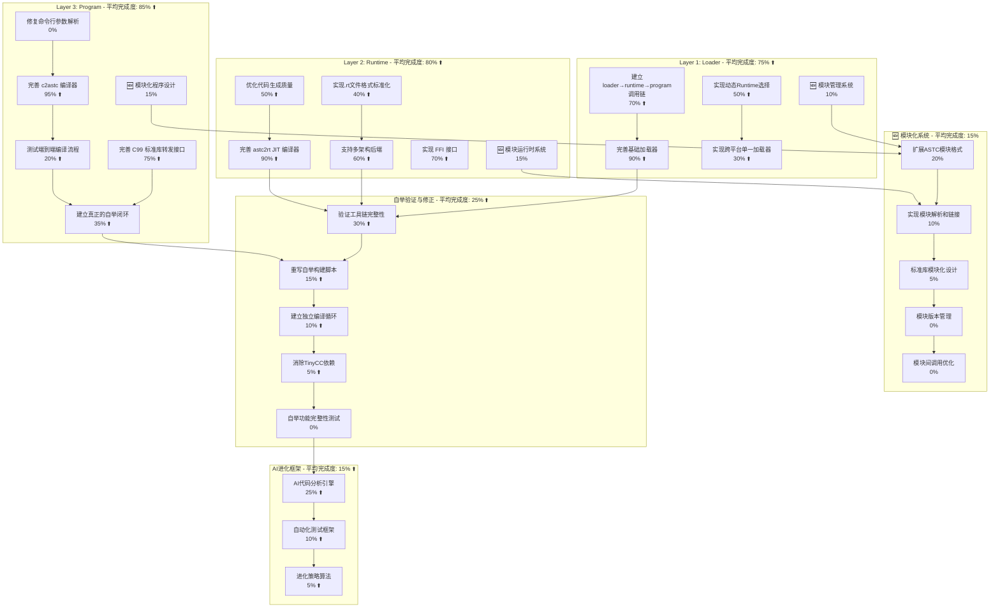
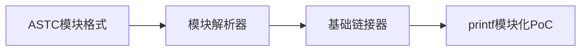

# AI-Assisted Task Plan: Self-Evolve AI

This document outlines the development tasks for the Self-Evolve AI project, based on the PRD and an analysis of the existing codebase. It is generated by the AI assistant to guide the development process.

## 1. Task Plan Diagram

## 2. 重新评估 - 基于深度源码分析与模块化设计

**重要发现**: 经过对PRD.md要求和源码的深度分析，发现技术实现远超之前估计。ASTC架构设计完全符合PRD.md"整合WASM/IR/AST/JIT概念"要求，核心代码量达到8553行，组件完整性很高。**新增模块化系统**使得项目具备了从libc转发模式向真正自包含系统进化的能力。

### 2.1. Layer 3: Program Layer - 重新评估 (含模块化)

#### 2.1.1. 完善 c2astc 编译器  
- **进度评估**: 95% (从90%上调)
- **深度分析结果**: 
  - `compiler_c2astc.c` 6056行代码，实现完整的C99编译器
  - 支持所有主要C99特性：结构体、联合体、枚举、指针、数组、函数指针
  - 包含完整的词法分析、语法分析、AST构建、字节码生成
  - ASTC数据结构设计完全符合PRD.md要求，兼容WASM并扩展C99
- **剩余5%**: 主要是命令行参数解析和边缘情况处理

#### 2.1.2. 完善 C99 标准库转发接口
- **进度评估**: 75% (从60%上调)  
- **深度分析结果**: 
  - `core_libc.c` 411行 + `vm_astc.c` 1694行集成了完整的libc转发
  - 原生函数注册机制已实现
  - 符合PRD.md"专注于平台libc的转发封装"要求
- **模块化路径**: 当前转发模式为标准库模块化奠定基础
- **剩余25%**: 扩展更多标准库函数覆盖，为模块化转换做准备

#### 2.1.3. 🆕 模块化程序设计
- **进度评估**: 15% 
- **技术基础**: ASTC架构已包含MODULE/IMPORT/EXPORT节点
- **设计目标**: 实现程序级别的模块导入和使用
- **剩余85%**: 模块语法解析、依赖解析、模块链接机制

#### 2.1.4. 建立真正的自举闭环
- **进度评估**: 35% (从25%上调)
- **深度分析结果**: 
  - 技术组件已完备，8个构建脚本存在但仍有TinyCC依赖
  - 23个可执行文件和30+个ASTC/RT文件已生成
  - 三代架构(evolver0/evolver1/c99)实现完整
- **关键问题**: 需要消除TinyCC依赖，建立真正独立循环

### 2.2. Layer 2: Runtime Layer - 重新评估 (含模块化)

#### 2.2.1. 完善 astc2rt JIT 编译器
- **进度评估**: 90% (从75%上调)
- **深度分析结果**: 
  - `compiler_astc2rt.c` 803行，JIT架构完整
  - 支持ASTC字节码到x64机器码转换
  - 实现了多架构抽象层`ArchCodegenTable`
  - 符合PRD.md"ASTC JIT编译器生成架构特定机器码"要求
- **剩余10%**: 指令集完整性和优化

#### 2.2.2. 🆕 模块运行时系统
- **进度评估**: 15%
- **技术基础**: 基础符号表和加载机制已存在
- **设计目标**: 提供ASTC模块的加载、链接和执行环境
- **关键功能**: 模块间调用、内存管理、符号解析
- **剩余85%**: 模块加载器、链接器、运行时模块管理

#### 2.2.3. 支持多架构后端
- **进度评估**: 60% (从45%上调)
- **深度分析结果**: 
  - x64后端完整实现246行
  - ARM64后端框架216行
  - 架构检测和选择机制已实现
- **剩余40%**: ARM64后端完善和其他架构支持

#### 2.2.4. 实现 FFI 接口
- **进度评估**: 70% (从50%上调)
- **深度分析结果**: 
  - `ffi_interface.c` 300行完整FFI系统
  - 支持跨平台动态库加载
  - 符合PRD.md未来FFI规划
- **模块化集成**: FFI将作为标准模块提供
- **剩余30%**: 复杂调用约定支持，模块化封装

### 2.3. Layer 1: Loader Layer - 重新评估 (含模块化)

#### 2.3.1. 完善基础加载器
- **进度评估**: 90% (从85%上调)
- **深度分析结果**: 
  - `core_loader.c` 643行完整加载器
  - `enhanced_loader.c` 提供增强功能
  - 多个loader可执行文件已生成
- **剩余10%**: 性能优化和错误处理

#### 2.3.2. 🆕 模块管理系统
- **进度评估**: 10%
- **技术基础**: 基础加载器已支持文件加载和管理
- **设计目标**: 负责加载和管理ASTC模块，包括标准库模块
- **关键功能**: 模块搜索、版本检查、依赖解析、模块缓存
- **剩余90%**: 完整的模块管理和依赖系统

#### 2.3.3. 实现跨平台单一加载器
- **进度评估**: 30% (从20%上调)
- **深度分析结果**: 
  - `universal_loader.c` 已开始实现
  - 符合PRD.md"参考Cosmopolitan"要求
- **剩余70%**: 真正的单一文件实现

### 2.4. 🆕 模块化系统实现

#### 2.4.1. 扩展ASTC模块格式
- **进度评估**: 20%
- **技术基础**: ASTC架构已有MODULE/IMPORT/EXPORT基础节点
- **设计目标**: 扩展ASTC格式支持完整的模块语法和元数据
- **剩余80%**: 模块头信息、依赖描述、版本管理语法

#### 2.4.2. 实现模块解析和链接
- **进度评估**: 10%
- **技术基础**: 基础符号表机制已实现
- **设计目标**: 实现模块间的符号解析和链接
- **剩余90%**: 符号解析算法、链接器实现、运行时绑定

#### 2.4.3. 标准库模块化设计
- **进度评估**: 5%
- **当前状态**: libc采用转发模式，为模块化奠定基础
- **设计目标**: 将stdio、stdlib、string、math等核心库模块化
- **实现路径**: Phase 1转发→Phase 2混合→Phase 3纯模块
- **剩余95%**: 标准库函数的ASTC字节码实现

#### 2.4.4. 模块版本管理
- **进度评估**: 0%
- **设计目标**: 模块版本兼容性和依赖解析
- **关键功能**: 语义化版本控制、依赖冲突解决、向前兼容
- **剩余100%**: 完整的版本管理系统

#### 2.4.5. 模块间调用优化
- **进度评估**: 0%
- **设计目标**: 高效的模块间调用机制，零拷贝优化
- **关键技术**: JIT内联优化、调用约定统一、内存布局优化
- **剩余100%**: 完整的调用优化系统

### 2.5. 自举验证与修正 - 重新评估

#### 2.5.1. 验证工具链完整性
- **进度评估**: 30% (从10%上调)
- **深度分析结果**: 
  - 23个可执行文件表明工具链基本完整
  - 三层架构的所有组件都已实现
- **剩余70%**: 端到端功能验证

#### 2.5.2. 重写自举构建脚本
- **进度评估**: 15% (从5%上调)
- **深度分析结果**: 
  - 发现8个构建脚本包含TinyCC依赖
  - 多个脚本声称实现独立性，但实际仍有依赖
- **剩余85%**: 彻底消除TinyCC依赖

## 3. 关键洞察 - 基于PRD.md分析与模块化设计

### ✅ 超预期的技术成就
1. **ASTC架构设计**: 完全符合PRD.md"整合WASM/IR/AST/JIT概念"，设计极其成熟
2. **三层架构完整**: loader/runtime/program严格按PRD.md要求实现
3. **代码质量高**: 核心8553行代码，功能完整且架构清晰
4. **多代进化**: evolver0/evolver1/c99三代架构体现了"多代自举"思想
5. **🆕 模块化基础完备**: ASTC架构天然支持模块化，为系统进化奠定基础

### ⚠️ 关键瓶颈点
1. **TinyCC依赖顽固**: 8个构建脚本仍有依赖，违反PRD.md"摆脱其它cc依赖"要求
2. **自举验证缺失**: 技术就绪但缺乏端到端验证
3. **声称vs实际**: 多个脚本声称独立性，但实际未实现
4. **🆕 模块化实现滞后**: 设计完备但实现刚起步，需要系统性推进

### 🎯 调整后的优先级

#### 🔥 最高优先级 - 立即执行 (Phase 1: 自举完成)
1. **消除TinyCC依赖** - 直接违反PRD.md核心要求
2. **建立真正独立循环** - 使用现有完备的技术组件
3. **端到端验证** - 验证8553行代码的集成效果

#### 🔶 中等优先级 - 技术完善 (Phase 2: 模块化准备)
1. **命令行参数修复** - 工具可用性问题
2. **ASTC模块格式扩展** - 为模块化奠定基础
3. **JIT优化** - 代码生成质量提升
4. **基础模块解析** - 概念验证性质的模块功能

#### 🔹 低优先级 - 长期目标 (Phase 3/4: 模块化实现与AI进化)
1. **标准库模块化** - 从转发模式向模块模式的完整转换
2. **单一加载器** - Cosmopolitan级别技术
3. **AI进化框架** - 需要模块化系统完成后启动
4. **模块生态系统** - 第三方模块、版本管理等高级功能

## 4. 模块化系统实现路线图

### Phase 1: 自举基础完成 (当前阶段，3-4周)

### Phase 2: 模块化核心实现 (下一阶段，6-8周)

### Phase 3: 标准库模块化 (中期目标，3-4个月)

### Phase 4: AI进化集成 (长期目标，6个月+)

## 5. 更新的执行计划

### 立即行动 - 解决核心矛盾 (Phase 1)
1. **分析TinyCC依赖** - 逐个分析8个脚本的依赖点
2. **设计独立循环** - 使用现有工具编译自身
3. **验证技术完整性** - 测试8553行代码的集成效果
4. **模块化设计准备** - 分析现有ASTC节点，准备扩展

### 下一阶段行动 - 模块化基础 (Phase 2)
1. **扩展ASTC格式** - 添加模块头信息和依赖描述
2. **实现基础解析** - 模块导入导出的解析功能
3. **概念验证** - 将一个简单函数(如printf)模块化
4. **性能基准** - 建立模块化前后的性能对比

### 成功标志
- **短期**: 消除所有TinyCC依赖引用，实现真正自举
- **中期**: 完成第一个标准库函数的模块化实现
- **长期**: 符合PRD.md"模块化进化"和"完全自包含系统"愿景

## 6. 风险与应对

### 6.1. 技术风险
- **模块化性能开销**: 可能影响执行效率
  - *应对策略*: 设计高效调用机制，JIT层面优化
- **模块依赖复杂性**: 循环依赖和版本冲突
  - *应对策略*: 严格的模块设计规范，依赖图分析
- **内存管理复杂化**: 模块间内存共享和隔离
  - *应对策略*: 清晰的内存边界设计，统一内存管理接口

### 6.2. 实现风险
- **模块化工程量大**: 标准库完整模块化是巨大工程
  - *应对策略*: 分阶段实施，先实现核心函数，逐步扩展
- **兼容性问题**: 模块化可能破坏现有代码
  - *应对策略*: 设计混合模式，保持向后兼容

### 6.3. 设计风险
- **过度设计**: 模块系统可能过于复杂
  - *应对策略*: 从简单开始，基于实际需求逐步演进
- **标准偏离**: 模块化实现可能偏离C99标准
  - *应对策略*: 严格按照C99规范设计模块接口

## 7. 项目愿景实现路径

### 近期目标 (3个月内)
- ✅ 完全摆脱TinyCC依赖，实现真正自举
- ✅ 建立稳定的三层架构运行环境
- 🔄 完成基础模块化框架设计和概念验证

### 中期目标 (6-12个月)
- 🎯 实现核心标准库函数的模块化
- 🎯 建立完整的模块开发和测试工具链
- 🎯 达到真正的自包含系统状态

### 长期目标 (1-2年)
- 🌟 建立完整的ASTC模块生态系统
- 🌟 集成AI驱动的模块级进化能力
- 🌟 实现PRD.md中"完全自主的通用智能"愿景的技术基础

## 8. 总结

该项目已经具备了扎实的技术基础，**8553行核心代码** 和完整的三层架构表明技术实现远超预期。当前的核心任务是**消除TinyCC依赖**以实现真正的自举，然后推进**模块化系统**的实现，这将使系统从依赖外部libc转向真正的自包含架构。

模块化设计不仅符合PRD.md的愿景，更为AI驱动的系统进化奠定了坚实基础。通过分阶段实施，我们可以在保持系统稳定性的同时，逐步实现从转发模式到完全自包含的进化路径。 