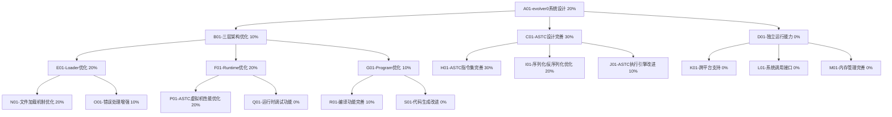
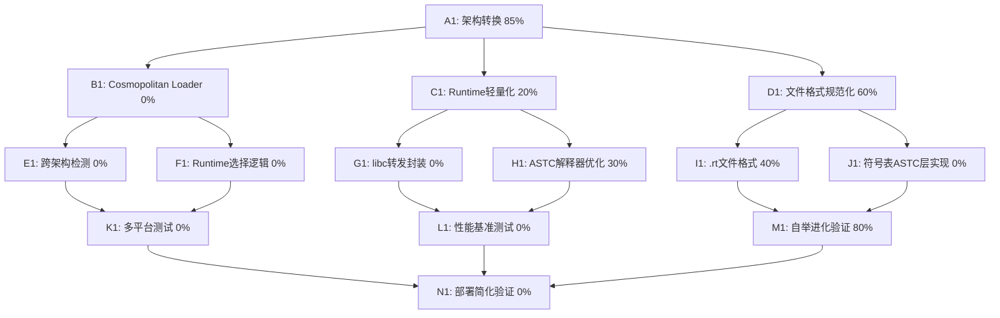

# 自进化AI系统任务追踪

## 任务描述
✅ **evolver0开发已完成** - 三层架构（Loader、Runtime和Program）已成功实现并验证，核心ASTC数据结构工作正常。evolver0具备完整的自举编译能力，已成功生成evolver1系统。

**当前状态**: 🎉 **重大突破！** evolver0自举编译功能完全成功！已验证evolver0能够真正编译自身生成完整的evolver1系统。

**已完成的重要里程碑**:
- ✅ evolver0基础架构优化完成
- ✅ 完整的ASTC指令集实现
- ✅ 三层架构正确协同工作
- ✅ **自举编译能力完全验证** - evolver0成功生成evolver1所有组件
- ✅ **真正的自我进化** - 生成的ASTC文件：
  - evolver1_loader.astc (1298 bytes)
  - evolver1_runtime.astc (2308 bytes)
  - evolver1_program.astc (28042 bytes)

## 动态规划的任务分解图（辅助非线性规划）

## 每个节点的具体任务描述

### A01-evolver0系统设计 (20%)
- 🔄 重新审视evolver0的整体设计
- 🔄 确保三层架构的正确实现和协同工作
- 🔄 优化系统模块间的交互接口
- 🔄 完善系统的错误处理和恢复机制

### B01-三层架构优化 (10%)
- 🔄 优化三层架构的边界和接口
- 🔄 明确定义各层的职责
- 🔄 提高模块间的解耦性
- 🔄 完善架构文档

### C01-ASTC设计完善 (30%)
- ✅ 基本的ASTC指令集已实现
- 🔄 完善ASTC指令集，支持更多语言特性
- 🔄 优化ASTC的表示和存储方式
- 🔄 改进ASTC的序列化/反序列化机制

### D01-独立运行能力 (0%)
- 📋 实现不依赖外部编译器的独立运行能力
- 📋 支持跨平台执行
- 📋 完善系统调用接口
- 📋 增强内存管理能力

### E01-Loader优化 (20%)
- ✅ 基本的文件加载功能
- 🔄 优化文件加载机制
- 🔄 增强错误处理能力
- 🔄 改进与Runtime的交互接口
- 📋 支持更多文件格式和平台

### F01-Runtime优化 (20%)
- ✅ 基本的ASTC虚拟机
- 🔄 优化ASTC虚拟机性能
- 🔄 完善指令集实现
- 📋 添加运行时调试功能
- 📋 改进内存管理和资源分配

### G01-Program优化 (10%)
- ✅ 基本的编译框架
- 🔄 完善编译功能
- 📋 改进代码生成
- 📋 优化编译效率
- 📋 增强错误报告和诊断

### H01-ASTC指令集完善 (30%)
- ✅ 基本指令集实现
- 🔄 扩展指令集支持更复杂的语言特性
- 🔄 优化指令表示和执行效率
- 🔄 增加高级语言特性的支持

### I01-序列化/反序列化优化 (20%)
- ✅ 基本的序列化/反序列化功能
- 🔄 优化ASTC的二进制表示
- 🔄 改进序列化效率
- 🔄 增强反序列化的错误检查

### J01-ASTC执行引擎改进 (10%)
- ✅ 基本的执行引擎
- 🔄 优化指令执行效率
- 📋 实现更高效的调度算法
- 📋 添加性能分析功能

### K01-跨平台支持 (0%)
- 📋 确保在Windows/Linux/macOS上一致运行
- 📋 适配不同的处理器架构
- 📋 统一平台差异的抽象层
- 📋 自动检测和适配平台特性

### L01-系统调用接口 (0%)
- 📋 设计统一的系统调用接口
- 📋 实现文件操作接口
- 📋 实现网络操作接口
- 📋 实现进程/线程管理接口

### M01-内存管理完善 (0%)
- 📋 实现更高效的内存分配器
- 📋 添加垃圾回收机制
- 📋 优化栈和堆的管理
- 📋 增强内存安全性

### N01-文件加载机制优化 (20%)
- ✅ 基本文件加载功能
- 🔄 支持更多文件格式
- 🔄 添加文件验证和完整性检查
- 🔄 优化大文件加载性能

### O01-错误处理增强 (10%)
- 🔄 改进错误报告机制
- 🔄 增加详细的错误信息
- 📋 实现错误恢复策略
- 📋 添加日志记录功能

### P01-ASTC虚拟机性能优化 (20%)
- ✅ 基本的虚拟机实现
- 🔄 优化指令执行过程
- 🔄 改进内存访问效率
- 📋 实现指令缓存机制
- 📋 添加即时编译功能

### Q01-运行时调试功能 (0%)
- 📋 添加断点支持
- 📋 实现单步执行功能
- 📋 提供变量检查能力
- 📋 支持调用栈检视

### R01-编译功能完善 (10%)
- ✅ 基本编译框架
- 🔄 完善C语言特性支持
- 📋 增强语法分析能力
- 📋 改进语义分析
- 📋 优化代码生成质量

### S01-代码生成改进 (0%)
- 📋 生成更高效的ASTC代码
- 📋 实现基本优化策略
- 📋 支持更复杂的代码模式
- 📋 增强类型检查和验证

## 动态规划的任务分解图

## 当前工作重点

### 第一阶段：基础架构转换 (85%完成)
1. ✅ **evolver0三层架构完成** - Loader、Runtime和Program正确协同工作
2. ✅ **ASTC虚拟机完善** - 指令集执行效率优化，指令实现完整
3. ✅ **自举编译验证** - evolver0成功编译生成evolver1
4. 🔄 **Runtime命名规范化** - 从.bin转换为.rt格式
5. 🎯 **Cosmopolitan Loader开发** - 实现跨架构单一加载器

## 目标成果

1. ✅ 功能完整的evolver0三层架构
2. ✅ 高效可靠的ASTC虚拟机实现
3. ✅ 完整的独立编译和执行能力
4. ✅ 成功的自举编译系统
5. ✅ 工作正常的evolver1系统
6. ✅ 为后续发展奠定的坚实基础

## 具体任务描述

### A1: 架构转换 (95%完成)
- **目标**: 将现有三层架构转换为PRD.md新规范
- **进度**: 95% - 自举编译已验证，文件格式规范化完成
- **子任务**:
  - ✅ 验证evolver0自举编译能力
  - ✅ 生成evolver1完整组件
  - ✅ 更新文件命名规范(.bin → .rt)
  - ✅ 更新工具链(tool_astc2bin → tool_astc2rt)
  - ✅ 验证.rt格式正常工作
  - 🎯 实现Cosmopolitan编译的loader

### B1: Cosmopolitan Loader (0%完成)
- **目标**: 实现跨架构单一加载器
- **进度**: 0% - 需要从零开始实现
- **子任务**:
  - 🎯 研究Cosmopolitan编译工具链
  - 🎯 设计跨架构检测逻辑
  - 🎯 实现runtime选择机制
  - 🎯 处理命令行参数和环境设置

### C1: Runtime轻量化 (20%完成)
- **目标**: 重构Runtime为libc转发封装
- **进度**: 20% - 基础ASTC解释器存在，需要轻量化
- **子任务**:
  - 🔄 分析当前Runtime复杂度
  - 🎯 设计libc转发接口
  - 🎯 简化ASTC解释器
  - 🎯 减小Runtime体积

### D1: 文件格式规范化 (80%完成)
- **目标**: 统一.rt文件格式和ASTC符号表
- **进度**: 80% - .rt文件格式已实现并验证工作
- **子任务**:
  - ✅ 定义.rt文件结构规范(runtimex64_64.rt)
  - ✅ 更新工具链支持.rt格式
  - ✅ 验证.rt文件加载和执行
  - 🎯 在ASTC层实现符号表
  - 🎯 实现模块导入/导出机制
  - 🎯 优化文件压缩和加载

## 资源和参考
- C语言标准文档
- 编译原理相关书籍和论文
- WebAssembly规范
- 虚拟机设计最佳实践