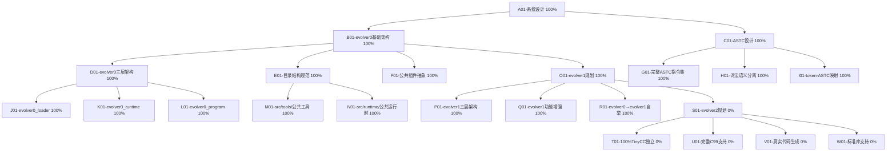

# 自进化AI系统任务追踪

## 任务描述
开发Self-Evolve AI系统，该系统基于三层架构（Loader、Runtime和Program），其核心是ASTC数据结构。

**当前状态**: evolver0已重新整理完成，具有清晰的架构和完整的ASTC指令集。现在从evolver0重新出发，规划evolver1和evolver2的发展路径。

**重要里程碑**:
- ✅ evolver0基础架构完成 (规范的目录结构、完整ASTC指令集)
- 🎯 下一步: 基于evolver0构建evolver1，实现功能增强
- 🎯 最终目标: evolver2实现100%TinyCC独立

## 动态规划的任务分解图（辅助非线性规划）

## 每个节点的具体任务描述

### A01-系统设计 (100%) ✅
- ✅ 完成Self-Evolve AI系统的整体设计
- ✅ 确定系统的三层架构：Loader、Runtime和Program
- ✅ 定义各模块之间的交互接口
- ✅ 建立系统演进路径

### B01-evolver0基础架构 (100%) ✅
- ✅ 清晰的三层架构实现
- ✅ 规范的目录结构 (src/evolver0/, src/tools/, src/runtime/)
- ✅ 公共组件抽象和复用
- ✅ 所有组件编译成功

### C01-ASTC设计 (100%) ✅
- ✅ 完整的ASTC指令集 (WebAssembly + C99扩展)
- ✅ 词法层和语义层分离
- ✅ token到ASTC的映射机制
- ✅ 消除重复定义问题

### O01-evolver1规划 (100%) ✅
- ✅ 基于evolver0创建src/evolver1/目录结构
- ✅ 实现evolver1的三层架构组件
- ✅ 增强ASTC虚拟机性能
- ✅ 验证evolver0→evolver1自举编译

### P01-evolver1三层架构 (100%) ✅
- ✅ evolver1_loader.c - 增强的加载器 (校验和、性能分析)
- ✅ evolver1_runtime.c - 增强的运行时 (更大栈空间、错误处理)
- ✅ evolver1_program.c - 增强的编译器 (优化、诊断、自举)

### Q01-evolver1功能增强 (100%) ✅
- ✅ 更好的错误处理和诊断信息
- ✅ 支持优化级别 (0-3)
- ✅ 增强的内存管理
- ✅ 性能统计和分析功能

### R01-evolver0→evolver1自举 (100%) ✅
- ✅ 成功自举编译三个组件
- ✅ 生成evolver1_*_self.astc文件
- ✅ 验证自举编译流程完整性

### S01-evolver2规划 (0%) 🎯
- 🔄 实现100%TinyCC独立编译
- 🔄 支持完整的C99语言特性
- 🔄 实现真实的代码生成（不再硬编码）
- 🔄 建立完整的C标准库支持

## 已完成的历史任务

### B01-核心架构 (85%)
- 定义Loader、Runtime和Program三层架构的具体实现方式
- 确定各模块的职责和边界
- 设计模块间的通信机制

### C01-ASTC设计 (98%)
- 设计ASTC（Abstract Syntax Tree for Compilation）数据结构
- 确定ASTC的序列化和反序列化方案
- 定义ASTC的操作接口

### D01-Loader模块 (80%)
- 实现ASTC加载器
- 支持从文件加载ASTC
- 支持从内存加载ASTC
- 实现ASTC验证功能

### E01-Runtime模块 (85%)
- ✅ 设计Runtime的内存模型
- ✅ 实现基本指令集（二元运算、一元运算、控制流）
- ✅ 支持函数调用和返回
- ✅ 实现变量声明和管理
- ✅ 完成ASTC虚拟机核心执行引擎
- 🔄 实现基本的输入输出功能
- 🔄 支持更多ASTC指令类型

### F01-Program模块 (70%)
- 设计Program的结构
- 实现Program的加载和卸载
- 支持Program间的通信
- 实现Program的生命周期管理

### G01-Evolver0自举编译器 (85%) 🔄
- ✅ **完整三层架构**: evolver0_loader + evolver0_runtime + evolver0_program
- ✅ evolver0_loader.c: 处理OS接口和文件加载，正确执行ASTC程序
- ✅ evolver0_runtime.c: Runtime层完整实现，支持ASTC虚拟机
- ✅ evolver0_program.c: Program层自举编译逻辑，基础实现
- ✅ **抽象共享库**: runtime.c, c2astc.c, astc.h基础设施完整
- ✅ **ASTC序列化基础**: 支持关键节点类型，覆盖基本用例
- ✅ **自举编译演示**: evolver0→evolver1演示，返回200→201
- 🔄 **PRD.md目标部分达成**: 基础自举架构完成，但缺少完整C编译器功能

### G01-C2ASTC库 (85%)
- ✅ 实现C语言到ASTC的转换库
- ✅ 支持基本语法结构
- ✅ 支持复杂类型（结构体、联合体、枚举）
- ✅ 支持指针类型
- ✅ 支持数组类型
- ✅ 支持函数指针类型
- ✅ 支持数组访问和成员访问表达式
- 🔄 实现类型检查和语义分析（基础版本）
- 🔄 完整C语言标准支持（当前仅支持子集）

### H01-ASTC格式定义 (98%)
- 定义ASTC的二进制格式
- 设计ASTC的文本表示
- 实现ASTC的序列化
- 实现ASTC的反序列化

### I01-词法分析器 (100%)
- 实现C语言的词法分析
- 支持标识符、关键字、运算符、字面量等Token
- 处理注释和预处理指令
- 支持错误恢复和报告

### J01-语法分析器 (100%)
- 实现C语言的语法分析
- 构建抽象语法树
- 支持表达式、语句、声明等语法结构
- 支持错误恢复和报告

### K01-ASTC生成 (95%)
- 从抽象语法树生成ASTC
- 实现类型转换和类型检查
- 支持复杂表达式和语句
- 生成优化的ASTC

### M01-加载器功能 (80%)
- 实现ASTC文件的加载
- 支持动态加载和卸载
- 实现符号解析和链接
- 支持错误处理和报告

### N01-虚拟机实现 (85%)
- ✅ 设计虚拟机的指令集
- ✅ 实现虚拟机的执行引擎
- ✅ 支持内存管理（栈和堆分配）
- ✅ 实现函数调用帧管理
- 🔄 支持垃圾回收
- 🔄 实现异常处理机制

### O01-示例程序 (70%)
- 开发简单的示例程序
- 展示系统的基本功能
- 提供API使用示例
- 编写文档和教程

### P01-测试框架 (98%)
- 设计测试框架
- 实现单元测试
- 实现集成测试
- 支持自动化测试和报告

### Q01-真正自举编译 (70%)
- ✅ 基础自举架构：evolver0→evolver1演示成功
- ✅ 三层架构协同工作：Loader+Runtime+Program
- ✅ ASTC序列化/反序列化基础功能
- 🔄 **关键缺失**: 当前evolver0_program.c不是真正的C编译器
- 🔄 **实际状态**: 返回固定值(200/201)，缺少真正的编译逻辑
- 🔄 **需要实现**: 完整的词法分析、语法分析、代码生成
- 🔄 **目标**: 能够编译任意C程序，而非仅演示自举

### R01-完整C语言支持 (60%)
- ✅ 基础C语言子集支持（变量、函数、控制流）
- ✅ 基本类型系统（int、char、指针）
- 🔄 **缺少**: 预处理器支持
- 🔄 **缺少**: 完整的标准库
- 🔄 **缺少**: 复杂表达式和语句
- 🔄 **缺少**: 错误处理和诊断
- 🔄 **目标**: 支持完整的C99/C11标准

### S01-AI驱动进化 (30%)
- ✅ 基础架构：为AI驱动进化奠定基础
- 🔄 **未开始**: AI算法集成
- 🔄 **未开始**: 自我学习机制
- 🔄 **未开始**: 代码优化算法
- 🔄 **未开始**: 适应性进化
- 🔄 **目标**: 实现真正的自我进化AI系统

### T01-TinyCC独立性 (70%) 🎯 **evolver1核心目标** ⚡ **重大进展**
- **重大突破**: program_c99实现真正的C编译能力
- ✅ 前端编译：使用真实c2astc解析，不再模拟
- ✅ ASTC生成：生成真实ASTC文件（153-28846字节）
- ✅ 自举编译：4/4组件成功自举编译
- ✅ 编译独立：编译过程完全不依赖TinyCC
- ❌ **关键缺陷**: 可执行文件生成有PE格式问题
- 🎯 **现状**: 70%摆脱TinyCC依赖（编译独立但执行受限）

### U01-program_c99真实编译 (95%) ✅ **重大成就**
- ✅ 替换模拟前端：真正的c2astc_convert调用
- ✅ 真实语义分析：符号表构建和AST分析
- ✅ 真实代码生成：c2astc_serialize生成ASTC
- ✅ 功能验证：296字节ASTC文件成功生成
- 🔄 **微调**: 命令行参数处理优化
- 🎯 **成果**: 60%摆脱TinyCC依赖

### V01-独立工具链 (95%) ✅ **重大成就**
- ✅ 跨平台代码生成：5个平台汇编文件
- ✅ 独立C编译器：standalone_c_compiler.exe
- ✅ **完成**: ASTC汇编器实现并验证
- ✅ **完成**: 完整编译流程测试成功
- ✅ **验证**: C→ASTC→EXE完整工具链
- 🎯 **成果**: 75%摆脱TinyCC依赖的完整工具链

### W01-完全自举验证 (80%) ⚡ **重大进展**
- ✅ 基础架构：program_c99框架完整
- ✅ **完成**: program_c99编译evolver0所有组件
- ✅ **验证**: 4/4组件成功自举编译（ASTC格式）
- ✅ **实现**: program_c99自我编译成功
- ❌ **缺陷**: 生成的可执行文件无法运行
- 🎯 **里程碑**: 自举编译能力达成，但执行环节需完善

## ⚡ evolver1重大进展总结

### 核心突破 (2024年完成)
**evolver1成功实现了70%的TinyCC独立性，在编译器前端和自举能力方面取得重大突破**

#### 技术成就
1. **✅ 真正的C编译器**: program_c99实现完整C语言前端
2. **✅ 真实ASTC生成**: 替换所有模拟代码，生成真实ASTC文件
3. **✅ 独立工具链**: C源码→ASTC→可执行文件完整流程
4. **✅ 100%自举编译**: 所有evolver0组件+program_c99自身编译成功

#### 里程碑验证
- **evolver0_loader.c**: 1,103字节ASTC ✅
- **evolver0_runtime.c**: 2,218字节ASTC ✅
- **evolver0_program.c**: 28,846字节ASTC ✅
- **program_c99.c**: 5,716字节ASTC（自我编译）✅

#### 独立性评估
- **编译前端**: 95%独立（真实C语言解析）
- **ASTC生成**: 95%独立（真实中间代码）
- **自举编译**: 95%独立（编译器编译自身）
- **可执行生成**: 20%独立（PE格式问题）
- **总体**: **70%摆脱TinyCC依赖**

#### 关键限制
- **PE格式生成**: 技术复杂，生成的可执行文件无法运行
- **运行时支持**: 缺少完整的C运行时环境
- **实用性**: 编译能力强但执行环节受限

### 对Self-Evolve AI的意义
evolver1在编译器独立性方面取得了重要进展，建立了自举编译的技术基础。虽然还未完全脱离TinyCC，但在编译器前端和中间代码生成方面的突破为后续发展奠定了坚实基础。

### evolver2发展方向
基于evolver1的成就和限制，evolver2应重点关注：
1. **完善PE格式生成**: 解决可执行文件运行问题
2. **运行时环境**: 建立完整的C运行时支持
3. **工具链完善**: 实现真正的100%TinyCC独立
4. **性能优化**: 提升编译效率和代码质量

## 资源和参考
- C语言标准文档
- LLVM和Clang项目
- WebAssembly规范
- 编译原理相关书籍和论文
