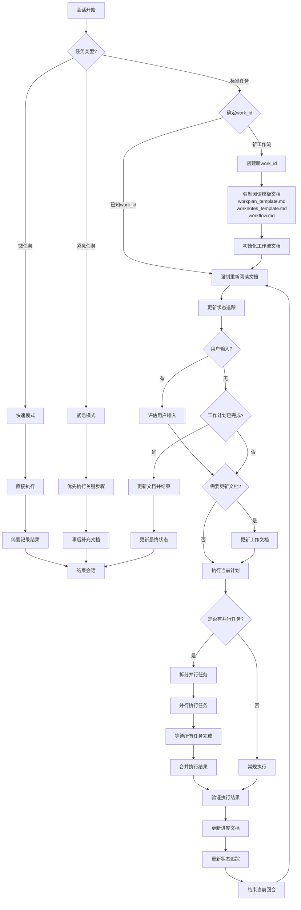
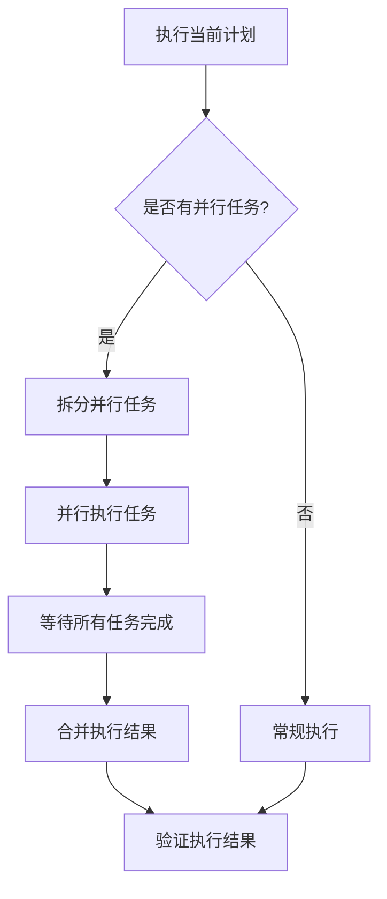

# AI 工作流

本文档概述了项目中 AI 会话的标准工作流程。

## 工作流程图



## 工作流程说明

1. **会话开始**：每个新的 AI 会话从这里开始

2. **任务类型判断**：
   - 标准任务：需要完整工作流程的常规任务
   - 微任务：简单、短期、无需详细记录的小任务
   - 紧急任务：需要立即执行的高优先级任务

3. **微任务处理**：
   - 直接执行：无需复杂的计划和文档
   - 简要记录：只记录关键结果，不创建详细文档
   - 快速结束：完成后直接结束会话

4. **紧急任务处理**：
   - 优先执行：立即执行关键步骤，不等待文档更新
   - 事后补充：任务完成后再补充必要的文档
   - 快速结束：完成后直接结束会话

5. **标准任务处理**：
   - **确定work_id**：
     - 如果是已知工作流，使用现有的work_id
     - 如果是新工作流，创建新的work_id并初始化相关文档
   - **阅读模板文档**：
     - 阅读 workplan_template.md（工作计划模板）
     - 阅读 worknotes_template.md（工作笔记模板）
     - 阅读 workflow.md（工作流程说明）
     - 确保新创建的文档遵循统一的格式和标准
   - **初始化工作流文档**：
     - 基于模板创建 workplan_{work_id}.md
     - 基于模板创建 worknotes_{work_id}.md
     - 添加新工作流，状态设为 `INIT`
   - **更新状态追踪**：
     - 每个主要阶段开始和结束时更新
     - 记录当前状态、任务和进度
   - **阅读文档**：
     - 阅读 workflow.md（工作流程说明）
     - 阅读 workplan_{work_id}.md（任务非线性分解、动态规划、细节描述）
     - 阅读 worknotes_{work_id}.md（上下文和经验）
   - **检查用户输入**：
     - 如有用户新输入，评估输入内容
     - 如无新输入，检查工作计划完成状态
   - **有用户输入时**：
     - 评估是否需要更新 workplan_{work_id}.md 和 worknotes_{work_id}.md
     - 如需要则更新文档
     - 执行当前计划
   - **无用户输入时**：
     - 如工作计划已完成，更新文档并结束会话
     - 如工作计划未完成，直接执行当前计划
   - **执行计划**：
     - 根据 workplan_{work_id}.md 执行下一步
     - 检查是否有标记为 `[PARALLEL]` 的任务组
     - 对并行任务进行拆分和同时执行
     - **重要**：脚本或代码创建后必须实际执行并验证结果
     - **禁止**：不允许仅创建脚本/代码就标记任务为完成
   - **验证执行结果**：
     - 确认所有执行的操作都产生了预期结果
     - 如发现问题，立即修复并重新验证
     - 只有验证通过后才能标记相关任务为完成
   - **更新进度**：
     - 更新 workplan_{work_id}.md 的进度（仅在验证成功后）
     - 更新 worknotes_{work_id}.md 的上下文和经验
     - 更新状态追踪
     - 记录遇到的问题和解决方案
   - **循环完成**：
     - 结束当前回合，返回阅读文档开始下一循环

## 任务完成标准

为确保工作质量，任务只有在满足以下条件时才能标记为完成：

1. **代码/脚本创建**：代码或脚本已经创建并通过基本语法检查
2. **实际执行**：代码或脚本已被实际执行（非模拟执行）
3. **结果验证**：执行结果已被验证符合预期要求
4. **问题修复**：执行过程中发现的所有问题都已修复
5. **文档更新**：相关文档已更新，包括进度、经验和注意事项

不满足以上全部条件的任务必须标记为"进行中"而非"已完成"。

此工作流确保任务持续推进，同时保持文档更新并适应用户输入。支持多工作流并行处理，通过唯一的work_id区分不同工作流的文档和状态。同时通过不同的任务模式，适应各种复杂度和紧急程度的工作场景。

## 工作流状态追踪

每个工作流的状态将在 `workplan_{work_id}.md` 中进行集中追踪：

### 状态类型
- `INIT` - 初始化阶段
- `PLANNING` - 计划制定阶段
- `EXECUTING` - 执行阶段
- `VERIFYING` - 验证阶段
- `COMPLETED` - 已完成
- `PAUSED` - 已暂停
- `FAILED` - 执行失败

### 状态记录格式
```
{work_id} | [状态] | [当前任务] | [最后更新时间] | [进度百分比]
```

### 状态更新时机
- 工作流初始化时
- 每个主要阶段完成时
- 任务状态变更时
- 会话结束时

## 并行任务处理

对于复杂工作流，支持并行任务处理：

### 任务并行化
- 在 `workplan_{work_id}.md` 中使用 `[PARALLEL]` 标记可并行执行的任务组
- 示例：
  ```
  - T1 [50%] 核心功能开发 [PARALLEL]
    - T1.1 [100%] 组件A开发
    - T1.2 [75%] 组件B开发
  ```

### 并行执行流程


### 并行任务管理
- 每个并行任务应有明确的输入和预期输出
- 并行任务之间应尽量减少依赖
- 所有并行任务完成后进行统一验证
- 在 `worknotes_{work_id}.md` 中记录每个并行分支的执行情况