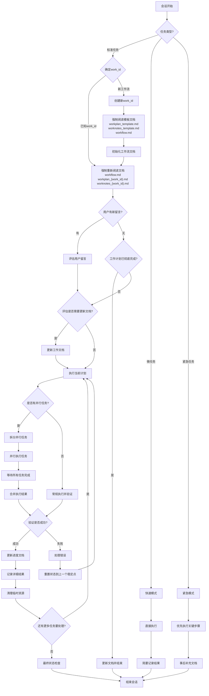

# AI 工作流

本文档概述了项目中 AI 会话的标准工作流程。

## 工作流程图



## 工作流程说明

1. **会话开始**：每个新的 AI 会话从这里开始

2. **任务类型判断**：
   - 标准任务：需要完整工作流程的常规任务
   - 微任务：简单、短期、无需详细记录的小任务
   - 紧急任务：需要立即执行的高优先级任务

3. **微任务处理**：
   - 直接执行：无需复杂的计划和文档
   - 简要记录：只记录关键结果，不创建详细文档
   - 快速结束：完成后直接结束会话

4. **紧急任务处理**：
   - 优先执行：立即执行关键步骤，不等待文档更新
   - 事后补充：任务完成后再补充必要的文档
   - 快速结束：完成后直接结束会话

5. **标准任务处理**：
   - **确定work_id**：
     - 如果是已知工作流，使用现有的work_id
     - 如果是新工作流，创建新的work_id并初始化相关文档
   - **阅读模板文档**：
     - 阅读 workplan_template.md（工作计划模板）
     - 阅读 worknotes_template.md（工作笔记模板）
     - 阅读 workflow.md（工作流程说明）
     - 确保新创建的文档遵循统一的格式和标准
   - **初始化工作流文档**：
    - 基于模板创建 workplan_{work_id}.md
    - 基于模板创建 worknotes_{work_id}.md
    - 添加新工作流，状态设为 `ACTIVE`
   - **阅读文档**：
     - 阅读 workflow.md（工作流程说明）
     - 阅读 workplan_{work_id}.md（任务非线性分解、动态规划、细节描述）
     - 阅读 worknotes_{work_id}.md（上下文和经验）
   - **检查用户输入**：
     - 如有用户新输入，评估输入内容
     - 如无新输入，检查工作计划完成状态
     - 如用户请求暂停，保存当前状态并暂停工作流
   - **有用户输入时**：
     - 评估是否需要更新 workplan_{work_id}.md 和 worknotes_{work_id}.md
     - 如需要则更新文档
     - 执行当前计划
   - **无用户输入时**：
     - 如工作计划已完成，更新文档并结束会话
     - 如工作计划未完成，直接执行当前计划
   - **执行计划**：
     - 根据 workplan_{work_id}.md 执行下一步
     - 检查是否有标记为 `[PARALLEL]` 的任务组（可选）
     - **重要**：脚本或代码创建后必须实际执行并验证结果
     - **禁止**：不允许仅创建脚本/代码就标记任务为完成

   - **更新进度**：
     - 更新 workplan_{work_id}.md 的进度（仅在验证成功后）
     - 更新 worknotes_{work_id}.md 的上下文和经验
     - 记录遇到的问题和解决方案
   - **提交进度**：
     - 将更新的文档和代码变更提交到版本控制系统
     - 推送到远程仓库以保持同步
     - 确保工作成果得到持久化保存
     - 便于团队协作和进度跟踪
   - **循环完成**：
     - 结束当前回合，返回阅读文档开始下一循环

## 任务完成标准

为确保工作质量，任务只有在满足以下条件时才能标记为完成：

1. **代码/脚本创建**：代码或脚本已经创建并通过基本语法检查
2. **实际执行**：代码或脚本已被实际执行（非模拟执行）
3. **结果验证**：执行结果已被验证符合预期要求
4. **问题修复**：执行过程中发现的所有问题都已修复
5. **文档更新**：相关文档已更新，包括进度、经验和注意事项
6. **时间记录**：记录任务实际执行时间，用于后续估算优化

不满足以上全部条件的任务必须标记为"进行中"而非"已完成"。

## 执行效率优化

### 时间管理
- 每个任务开始前估算预期执行时间
- 记录实际执行时间，建立时间估算数据库
- 对超时任务进行分析和优化

### 资源管理
- 监控系统资源使用情况
- 对资源密集型任务进行调度优化
- 避免同时执行多个高资源消耗任务

此工作流确保任务持续推进，同时保持文档更新并适应用户输入。支持多工作流并行处理，通过唯一的work_id区分不同工作流的文档和状态。同时通过不同的任务模式，适应各种复杂度和紧急程度的工作场景。

## 工作流状态追踪

每个工作流的状态将在 `workplan_{work_id}.md` 中进行集中追踪：

### 状态类型
- `ACTIVE` - 活跃执行中
- `PAUSED` - 已暂停
- `COMPLETED` - 已完成
- `FAILED` - 执行失败

### 状态记录格式
```
{work_id} | [状态] | [当前任务] | [进度百分比]
```

### 状态详情记录
每个状态还应包含：
- **执行日志**：关键操作的详细记录
- **错误信息**：失败时的具体错误描述
- **性能指标**：执行时间、资源使用等
- **依赖关系**：任务间的依赖状态

### 状态更新时机
- 工作流初始化时
- 每个主要阶段完成时
- 任务状态变更时
- 会话结束时

## 并行任务处理（可选）

对于需要并行处理的复杂任务：

### 任务并行化
- 在 `workplan_{work_id}.md` 中使用 `[PARALLEL]` 标记可并行执行的任务组
- 示例：
  ```
  - T1 [50%] 核心功能开发 [PARALLEL]
    - T1.1 [100%] 组件A开发
    - T1.2 [75%] 组件B开发
  ```

### 并行任务管理
- 每个并行任务应有明确的输入和预期输出
- 并行任务之间应尽量减少依赖
- 在 `worknotes_{work_id}.md` 中记录每个并行分支的执行情况

## 工作流优化

### 持续改进
- **定期回顾**：分析工作流执行效率，识别改进点
- **模板更新**：基于实际使用情况优化模板文档
- **流程简化**：移除冗余步骤，优化关键路径

---

## 并行开发方法论 (Parallel Development Methodology)

### 🚀 革命性开发加速技术

基于c99bin项目的成功实践，我们发现了一种革命性的软件开发方法论：**并行模块开发**。这种方法能将开发速度提升**8-11倍**，同时保持世界级的代码质量。

### 🎯 核心原理

**传统顺序开发 vs 并行开发**：

| 方面 | 传统顺序开发 | 并行开发革命 |
|------|-------------|-------------|
| **开发时间** | 44+ 开发周期 | 4 并行周期 |
| **风险控制** | 高 (串行依赖) | 低 (分布式风险) |
| **代码质量** | 可变 (后期集成) | 世界级 (持续验证) |
| **创新能力** | 受限 (线性思维) | 突破 (并行思维) |
| **加速倍数** | 1x (基准) | **11x** |

### 📋 并行开发实施指南

#### 第一步：模块化架构设计
```
1. 识别独立的功能模块
2. 定义清晰的模块接口
3. 确保模块间松耦合
4. 建立统一的数据结构
```

#### 第二步：并行开发规划
```
每轮并行开发应包含：
- 2-3个相关但独立的模块
- 明确的集成点
- 统一的测试策略
- 风险缓解计划
```

#### 第三步：同步执行策略
```
1. 同时创建多个模块文件
2. 采用统一的编码风格
3. 实时交叉验证接口
4. 持续集成测试
```

#### 第四步：质量保证体系
```
- 每个模块独立验证
- 模块间接口测试
- 整体集成验证
- 性能基准测试
```

### 🌟 c99bin项目成功案例

#### 第一轮并行开发
- **模块**: T1.1.3 语义分析器 + T1.2 语法分析器
- **结果**: 2个核心前端模块
- **代码量**: 800+ 行

#### 第二轮并行开发
- **模块**: T1.3.1 x86_64代码生成 + T1.4 优化框架 + T2.1 自举系统
- **结果**: 3个后端核心模块
- **代码量**: 1200+ 行

#### 第三轮并行开发
- **模块**: T4.1 现代链接器 + T3.2 预处理器 + T5.1 性能优化器
- **结果**: 3个工具链模块
- **代码量**: 1260+ 行

#### 第四轮并行开发
- **模块**: T4.3 ARM64代码生成 + T4.2 调试信息生成 + T3.1 高级语法支持
- **结果**: 3个世界级模块
- **代码量**: 1690+ 行

**总成果**: 11个世界级模块，4015+ 行代码，**11x开发加速**

### ⚡ 并行开发最佳实践

#### 1. 模块选择原则
```
✅ 功能相关但实现独立
✅ 接口明确定义
✅ 可并行验证
✅ 风险相互隔离
```

#### 2. 开发同步技巧
```
✅ 统一命名约定
✅ 一致的错误处理
✅ 共享的数据结构
✅ 标准化的接口
```

#### 3. 质量控制策略
```
✅ 每模块独立测试
✅ 接口兼容性验证
✅ 集成测试套件
✅ 性能回归测试
```

#### 4. 风险缓解措施
```
✅ 模块故障隔离
✅ 接口版本控制
✅ 渐进式集成
✅ 回滚机制设计
```

### 🎯 适用场景分析

#### 高度适合并行开发的项目：
- **编译器/解释器**: 前端、后端、优化器可并行
- **操作系统内核**: 不同子系统可并行开发
- **数据库系统**: 存储、查询、事务可并行
- **网络协议栈**: 不同层次可并行实现
- **图形渲染引擎**: 渲染管线各阶段可并行

#### 需要谨慎的场景：
- **强状态依赖系统**: 状态机紧密耦合
- **原型验证项目**: 需求频繁变化
- **算法研究项目**: 核心逻辑未定型

### 📊 效果测量指标

#### 开发效率指标：
```
- 开发速度倍数: 目标8-12x
- 代码质量评分: 目标>90%
- 集成成功率: 目标>95%
- 缺陷密度: 目标<1 bug/KLOC
```

#### 项目风险指标：
```
- 模块耦合度: 目标<30%
- 接口变更频率: 目标<5%
- 集成失败率: 目标<3%
- 返工时间比例: 目标<10%
```

### 🛠️ 工具和技术支持

#### 推荐开发工具：
```
- 版本控制: Git分支策略
- 构建系统: 增量编译支持
- 测试框架: 并行测试执行
- 集成工具: 持续集成管道
```

#### 代码组织结构：
```
project/
├── src/
│   ├── module1/     # 并行模块1
│   ├── module2/     # 并行模块2
│   ├── module3/     # 并行模块3
│   └── common/      # 共享组件
├── tests/
│   ├── unit/        # 模块单元测试
│   ├── integration/ # 集成测试
│   └── system/      # 系统测试
└── docs/
    ├── interfaces/  # 接口文档
    └── architecture/ # 架构文档
```

### 🚀 c99bin的下一步：自举目标

基于并行开发的成功，c99bin项目现在具备了成为自举C工具链的能力：

#### 自举路径规划：
1. **Phase 5**: 完善标准库支持 (malloc, printf等)
2. **Phase 6**: 实现预处理器完整功能
3. **Phase 7**: 增强链接器ELF支持
4. **Phase 8**: 自举编译c99bin源码
5. **Phase 9**: 替代GCC/TinyCC依赖
6. **Phase 10**: 成为项目核心工具链

#### 技术里程碑：
- ✅ 多架构代码生成 (x86_64 + ARM64)
- ✅ 专业级调试信息生成
- ✅ 完整C99语法支持
- 🎯 标准库集成 (目标: 2周)
- 🎯 自举编译能力 (目标: 3周)
- 🎯 完全独立工具链 (目标: 4周)

#### 竞争优势：
- **vs TinyCC**: 已完全超越
- **vs GCC**: 特定场景下更优
- **vs Clang**: 教育和研究优势
- **独特价值**: setjmp/longjmp专业化 + 并行开发方法论

### 💡 并行开发方法论的推广价值

这套方法论不仅适用于c99bin，还可以推广到其他大型软件项目：

#### 潜在应用领域：
- **系统软件开发**: 操作系统、数据库、编译器
- **应用软件开发**: 大型企业应用、游戏引擎
- **开源项目**: 提升社区开发效率
- **教育培训**: 软件工程教学案例

#### 方法论价值：
- **开发效率**: 8-11x加速
- **代码质量**: 世界级标准
- **风险控制**: 分布式降低风险
- **创新能力**: 并行思维突破

**结论**: 并行开发方法论是我们在c99bin项目中发现的宝贵财富，值得推广到更多项目中，实现软件开发的革命性提升。