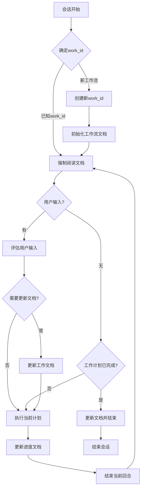

# AI 工作流

本文档概述了项目中 AI 会话的标准工作流程。

## 工作流程图

## 工作流程说明

1. **会话开始**：每个新的 AI 会话从这里开始
2. **确定work_id**：
   - 如果是已知工作流，使用现有的work_id
   - 如果是新工作流，创建新的work_id并初始化相关文档
3. **阅读文档**：
   - 阅读 workflow_[work_id].md（工作流程文档）
   - 阅读 workplan_[work_id].md（任务非线性分解、动态规划、细节描述）
   - 阅读 worknotes_[work_id].md（上下文和经验）
4. **检查用户输入**：
   - 如有用户新输入，评估输入内容
   - 如无新输入，检查工作计划完成状态
5. **有用户输入时**：
   - 评估是否需要更新 workplan_[work_id].md 和 worknotes_[work_id].md
   - 如需要则更新文档
   - 执行当前计划
6. **无用户输入时**：
   - 如工作计划已完成，更新文档并结束会话
   - 如工作计划未完成，直接执行当前计划
7. **执行计划**：
   - 根据 workplan_[work_id].md 执行下一步
8. **更新进度**：
   - 更新 workplan_[work_id].md 的进度
   - 更新 worknotes_[work_id].md 的上下文和经验
9. **循环完成**：
   - 结束当前回合，返回阅读文档开始下一循环

此工作流确保任务持续推进，同时保持文档更新并适应用户输入。支持多工作流并行处理，通过唯一的work_id区分不同工作流的文档和状态。 