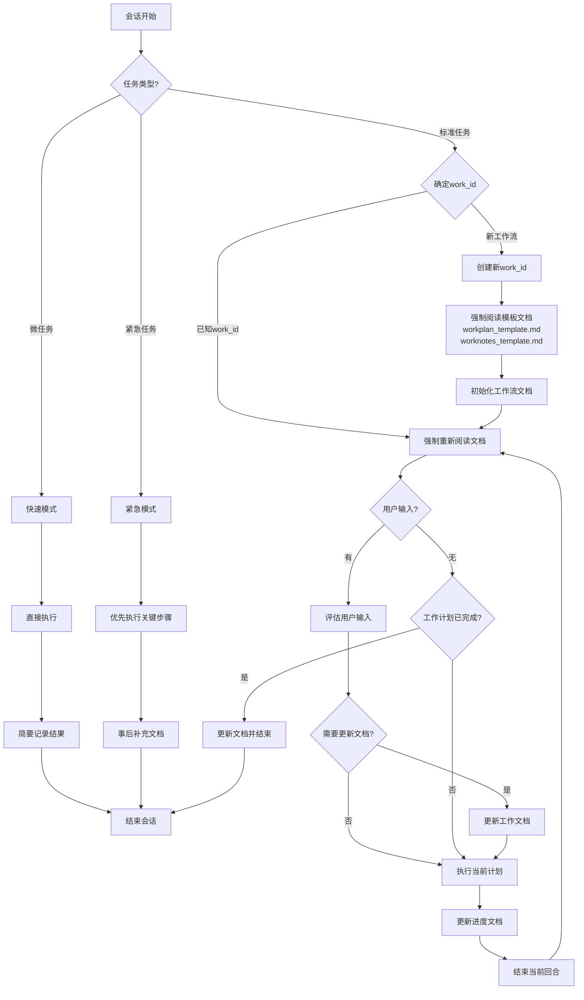

# AI 工作流

本文档概述了项目中 AI 会话的标准工作流程。

## 工作流程图

## 工作流程说明

1. **会话开始**：每个新的 AI 会话从这里开始

2. **任务类型判断**：
   - 标准任务：需要完整工作流程的常规任务
   - 微任务：简单、短期、无需详细记录的小任务
   - 紧急任务：需要立即执行的高优先级任务

3. **微任务处理**：
   - 直接执行：无需复杂的计划和文档
   - 简要记录：只记录关键结果，不创建详细文档
   - 快速结束：完成后直接结束会话

4. **紧急任务处理**：
   - 优先执行：立即执行关键步骤，不等待文档更新
   - 事后补充：任务完成后再补充必要的文档
   - 快速结束：完成后直接结束会话

5. **标准任务处理**：
   - **确定work_id**：
     - 如果是已知工作流，使用现有的work_id
     - 如果是新工作流，创建新的work_id并初始化相关文档
   - **阅读模板文档**（新工作流）：
     - 阅读 workplan_template.md（工作计划模板）
     - 阅读 worknotes_template.md（工作笔记模板）
     - 确保新创建的文档遵循统一的格式和标准
   - **初始化工作流文档**：
     - 基于模板创建 workplan_[work_id].md
     - 基于模板创建 worknotes_[work_id].md
     - 更新 cursor_running.md 添加新工作流
   - **阅读文档**：
     - 阅读 workflow_[work_id].md（工作流程文档）
     - 阅读 workplan_[work_id].md（任务非线性分解、动态规划、细节描述）
     - 阅读 worknotes_[work_id].md（上下文和经验）
   - **检查用户输入**：
     - 如有用户新输入，评估输入内容
     - 如无新输入，检查工作计划完成状态
   - **有用户输入时**：
     - 评估是否需要更新 workplan_[work_id].md 和 worknotes_[work_id].md
     - 如需要则更新文档
     - 执行当前计划
   - **无用户输入时**：
     - 如工作计划已完成，更新文档并结束会话
     - 如工作计划未完成，直接执行当前计划
   - **执行计划**：
     - 根据 workplan_[work_id].md 执行下一步
   - **更新进度**：
     - 更新 workplan_[work_id].md 的进度
     - 更新 worknotes_[work_id].md 的上下文和经验
   - **循环完成**：
     - 结束当前回合，返回阅读文档开始下一循环

此工作流确保任务持续推进，同时保持文档更新并适应用户输入。支持多工作流并行处理，通过唯一的work_id区分不同工作流的文档和状态。同时通过不同的任务模式，适应各种复杂度和紧急程度的工作场景。 